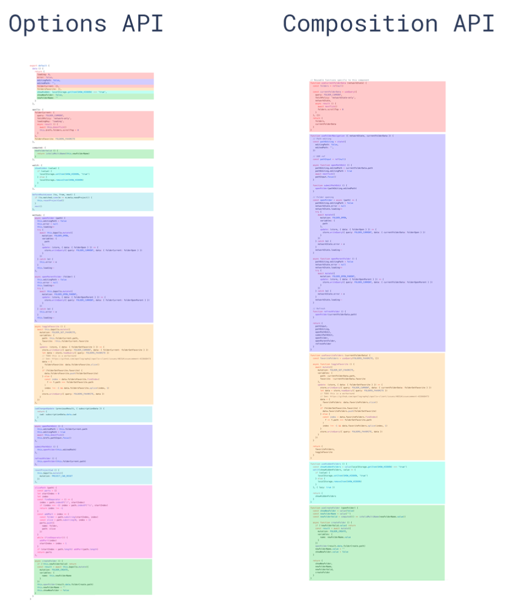

## 为啥需要Composition API

### Vue2.x的缺陷

#### 代码太过分散

在 Vue2 中，组织是以 **选项** 的角度进行划分的，这导致一个逻辑与功能的实现可能分散在单文件组件中的各个地方，不够内聚，且不同逻辑与功能的代码会混杂在选项中

随着项目的发展，代码越来越多，代码之间的混合程度越来越大，导致越来越难以阅读和维护

#### 代码复用不够好

在 Vue2 中，最好的代码复用方式就是 **Mixin**，但 Mixin 存在下列问题

* 可能会发生不同 Mixin 之间命名冲突的问题
* Mixin进来的属性难以分辨来自于哪个 Mixin，如果存在多个 Mixin，则维护起来较为困难

### Vue3.x的改进

Vue3推出了 Composition API，顾名思义，组合 API，它能够将代码以**功能、逻辑** 的角度进行划分，从而实现良好的代码组织形式，让代码更加内聚

Compostion API 支持自定义函数，从而更加良好地实现代码复用

此外，Composition API将更好地与 TypeScript 进行结合，以获得良好的类型检查和开发体验

### 对比图

一种色块表示一个功能




## setup

### 功能

`setup` 函数是 `Composition API` 的入口

### 调用时机

创建组件实例 ==> `beforeCreated` ==> 初始化 `props` ==> 调用 `setup` 函数 ==> `created` 生命周期函数

### 参数

```js
setup(props, context)
setup(props, { attrs, slots, emit })
```

### 注意事项

1. 在setup中无法使用`this`，因为setup函数执行时，组件实例还没有创建完全

```js
setup(props, context) {
    return {
        name: "mneumi"
    }
}
```

2. 不要手动执行`setup`函数

   虽然可以通过`this.$option`来手动调用，但千万别这么做，因为`setup`只应该执行一次，且由 Vue.js 框架自动执行


## props

### 功能

由于setup函数执行时，组件未创建完毕，无法使用`this`，所以需要使用参数`props`来获取传入组件的属性值

### 注意事项

可以将 `props` 参数看做一个响应式对象，所以不能直接解构

方式1：直接使用 `props` 对象

```js
setup(props) {
    console.log(props.inputValue);
};
```

方式2：使用 toRefs 进行解构

```js
setup(props) {
    const { inputValue } = toRefs(props);
}
```


## context

### 功能

由于setup函数执行时，组件未创建完毕，无法使用`this`，所以需要借助`context`来获取`attrs`，`slots`和`emit`函数

### 示例代码

```js
const app = Vue.createApp({
    methods: {
        handleChange() {
            console.log("change")
        }
    },
    template: "<child app='app' @handle='handleClick'>parent</child>"
})

app.component("child", {
    template: "<div @click='handleClick'>child</div>",
    setup(props, context) {
        const { h } = Vue;
        const { attrs, slots, emit } = context;
        
        console.log(attrs); // app
        
        console.log(slots.default()); // vdom 
        
        function handleClick() {
       		emit("change")
        }
        
        return () => h("div", {}, slots.default())
    }
})
```


## ref

### 功能

`ref`函数接收一个参数值并返回一个响应式且可改变的 ref 对象，一般用于基础类型

### 原理

因为 Proxy 只能代理对象，不能直接代理基础值，所以ref在接收到基础值后，会进行一层对象封装，然后再实现代理

```js
ref("mneumi");

// 底层为

new Proxy({ value: "mneumi" });
```

### 使用心得

在setup中使用：需要写`.value`以访问内部值

在模板中使用：自动解套，无需额外写`.value`

当 ref 作为 reactive 对象的 property 被访问或修改时，也将自动解套 value 值，其行为类似普通属性

使用 ref 获取 dom 节点时，最好在 `mounted` 生命周期中获取，因为`mounted`时才能保证 dom 已生成

### 使用示例

```js
// proxy, "mneumi" 变为 proxy({value: "mneumi"}) 这样的响应式引用
setup(props, context) {
    const { ref } = vue;
    
    const name = ref("mneumi");
    setTimeout(() => {
        name.value = "new name"
    })
    
    return {
        name // 不能 name.value
    }
}
```


## reactive

### 功能

`reactive`函数接收一个普通对象然后返回该普通对象的响应式代理，一般用于复杂类型

等同于 2.x 的 `Vue.observable()`

### 原理

`reactive`基于 ES2015 的 Proxy 实现，返回的代理对象**不等于**原始对象

```js
{ name: "mneumi" } 
// 会变为 
new Proxy({ name: "mneumi" })
```

### 注意事项

响应式转换是“深层的”：会影响对象内部所有嵌套的属性；建议仅使用代理对象而避免依赖原始对象

### 使用示例

```js
setup(props, context) {
    const { reactive } = vue;
    
    const nameObj = reactive({ name: "mneumi" });
    
    setTimeout(() => {
        nameObj.name = "new name"
    }, 2000)
    
    return {
        nameObj
    }
}
```


## readonly

### 功能

功能类似于 reactive，区别在于 readonly 返回的对象是不可变的

常用于传递给子组件时进行限制，避免子组件直接修改对象，从而保证单向数据流

### 示例代码

```js
setup(props, context) {
    const { readonly } = vue;
    
    const nameObj = readonly({ name: "mneumi" });
    
    setTimeout(() => {
        nameObj.name = "new name"
    }, 2000)
    
    return {
        nameObj
    }
}
```


## toRefs

### 功能

解构reactive对象，转为多个ref对象

### 原理

```js
Proxy({ name: "mneumi", age: 23 })
// 经过 toRefs 转为
{ name: new Proxy({ value: "mneumi" }), age: new Proxy({ value: 23 })}
```

### 示例代码

```js
setup(props, context) {
    const { reactive, toRefs } = vue;
    
    const obj = reactive({ name: "mneumi", age: 23 });
    
    setTimeout(() => {
        obj.name = "new name";
        obj.age = 24;
    }, 2000)
    
    // toRefs proxy({name: "mneumi"}) ==> { name: proxy({value: "mneumi"})}
    const nameObj = toRefs(obj);
    
    return {
        ...nameObj
    }
}
```


## toRef

### 功能

将reactive中特定的键转为ref对象，如果没有则创建（不推荐使用）

### 示例代码

```js
setup(props, context) {
    const { reactive, toRef } = Vue;
    const data = reactive({name: "mneumi"});
    const name = toRef(data, "name");
    const age = toRef(data, "age"); // 没有则创建
    setTimeout(() => {
        name.value = "lee"
        age.value = 20
    }, 2000)
    
    return {
        name,
        age
    }
}
```


## isRef

### 功能

`isRef()` 用来判断某个值是否为 `ref()` 创建出来的对象

### 示例代码

```js
import { isRef } from 'vue';

const innerValue = isRef(foo) ? foo.value : foo;
```


## computed

### 功能

用于实现计算属性

### 参数

可以传入函数或对象，分别对应`get函数`和`get/set函数`

### 注意事项

* computed返回值是一个**被ref包裹**的响应式对象，使用时注意**.value**属性
* computed中依赖的东西必须是响应式的，而不能是普通的变量

* computed 中返回的最好是基础值，而不是 Object，因为如果返回的是Object，那么**响应的是它的指向**，而不是它具体的值

### 使用心得

对于 computed 函数，如果参数是回调函数形式，则返回的响应式对象是只读的，不能对该响应式对象进行赋值操作，但是如果参数是对象形式，则返回的响应式对象是可读写的

```js
const val = computed({
    get: () => props.modelValue || "",
    set: val => {
        context.emit("update:modelValue", val);
    }
})
```

### 使用示例

```js
setup() {
    const { ref, computed } = vue;
    
    const count = ref(0);
    
    const countAddFive = computed(() => {
        return count.value + 5;
    })
    
    const countAddFiveAdvance = computed({
        get: () => {
            return count.value + 5;
        },
        set: (v) => {
            count.value = v * 10
        }
    })
    
    return { count, countAddFive, countAddFiveAdvance }
}
```


## watch

### 功能

`watch`函数用于监视某些数据项的变化，然后触发某些特定的操作，用于实现监听器

### 基础使用

定义 watch，传入回调函数，只要回调函数中依赖项值变化，就会触发 watch 回调

 watch 会在创建时会自动调用一次（适合用于获取网络数据）

```js
const { ref, watch } = vue;

const count = ref(0);

watch(() => console.log(count.value)) // 输出 0

setTimeout(() => {
    count.value++ // 输出 1
}, 1000);
```

### 监听单个`ref`类型数据源

```ts
// 定义数据源
const count = ref(0)

// 指定要监视的数据源
watch(count, (newCount, prevCount) => {
  /* ... */
});
```

### 监听多个`ref`类型数据源

```ts
const count = ref(0);
const name = ref('alice');

watch([count, name],
  ([newCount, newName], [prevCount, prevName]) => {
    console.log(newCount);
    console.log(newName);
    
    console.log('-------------');
    
    console.log(prevCount);
    console.log(prevName);
  },
  {
    lazy: true, // 在 watch 被创建的时候，不执行回调函数中的代码
    immediate: true // 改为非惰性
  }
)

setTimeout(() => {
  count.value++;
  name.value = 'tom';
}, 1000);
```

### 监听单个`reactive`类型数据源

```ts
// 定义数据源
const state = reactive({ count: 0 });

// 监视 state.count 这个数据节点的变化
watch(() => state.count, (newCount, prevCount) => {
	/* ... */
});
```

### 监听多个`reactive`类型数据源

```ts
const state = reactive({ count: 0, name: 'alice' });

watch([() => state.count, () => state.name],
  ([newCount, newName], [prevCount, prevName]) => {
    console.log(newCount); // 新的 count 值
    console.log(newName); // 新的 name 值
    
    console.log('------------');
    
    console.log(prevCount); // 旧的 count 值
    console.log(prevName); // 新的 name 值
  },
  {
    lazy: true, // 在 watch 被创建的时候，不执行回调函数中的代码
    immediate: true // 改为非惰性
  }
);

setTimeout(() => {
  state.count++;
  state.name = 'tom';
}, 3000);
```

### 清除watch

watch函数的返回值是`cancel`函数，可以用来清除watch

```ts
// 创建监视，并得到 停止函数
const stop = watch(() => {
  /* ... */
});

// 调用停止函数，清除对应的监视
stop();
```


## watchEffect

### 功能

watchEffect 类似于 watch，区别在于不需要指定监听的值，而是自动分析依赖项（类似于computed）

### 参数与返回值

参数：一个无参数的回调函数

返回值：一个用于停止监听的函数

### 特点

* 立即执行，不惰性
* 不需要传递要监听的内容，会自动检查依赖
* 不需要很多参数，只需要一个回调函数
* 只能获取当前值，不能获取之前值

### 使用场景

常用于进行网络请求获取数据

### 示例代码

```js
setup() {
    const stop = watchEffect(() => {
        nameObj.name = "new Name"
    })
    
    stop();
}
```


## provide & inject

### 功能

`provide`函数和 `inject` 函数可以实现嵌套组件之间的数据传递，这两个函数只能在`setup`函数中调用

级组件中使用 `provide` 函数向下传递数据，子级组件中使用 `inject` 获取上层传递过来的数据

### 示例代码

配合readonly和回调函数实现单向数据流

```js
// 父组件
setup() {
    const { provide, readonly } = vue;
    
    const name = ref("mneumi");
    provide("name", readonly(name));
    
    provide("changeName", (value) => {name.value = value})
}

// 子组件
setup() {
    const { inject } = vue;
    
    const name = inject("name", ref("default Value")) // 设置默认值
    const changeName = inject("changeName");
    
    const handleClick = () => {
        changeName("new Name")
    }
    
    return { name, handleClick }
}
```


## dom ref

### 功能

获取dom节点对象或组件对象

### 注意事项

需要保证 dom-ref 变量名与ref属性值同名

### 示例代码

```js
setup() {
    const { ref, onMounted } = vue;
    const hello = ref(null); // dom-ref 变量名为 hello
    
    onMounted(() => {
        console.log(hello)
    })
    
    return { hello }
}

```

```html
<div>
    <div ref="hello"> <!-- dom-ref与ref属性值同名 -->
        Hello World
    </div>
</div>
```

### dom-ref 对循环使用

原理：ref属性除了可以是普通值，也可以是回调函数，回调函数的参数就是节点对象本身，使用回调函数存储节点对象即可

```html
<template>
  <div v-for="(item, index) in list" :ref="el => { if (el) divs[index] = el }">
    {{ item }}
  </div>
</template>

<script>
  import { ref, reactive, onBeforeUpdate } from 'vue'

  export default {
    setup() {
      const list = reactive([1, 2, 3])
      const divs = ref([])

      // 保证每次更新前，divs数组都被重置
      // 这是因为循环的数组可能会改变，要清除旧值，重新获取
      onBeforeUpdate(() => {
        divs.value = []
      })

      return { list, divs }
    }
  }
</script>
```


## 生命周期函数

### 生命周期改动

为了更好的语义化：

* beforeDestory ==> beforeUnmount

* destroyed ==> unmounted

新增用于调试API：

* onRenderTracked
* onRenderTriggered

### 使用生命周期函数

在生命周期函数前加上**on**即可

| 生命周期                      | 在Composition API中使用 |
| ----------------------------- | ----------------------- |
| beforeCreate                  | use setup()             |
| created                       | use setup()             |
| beforeMount                   | onBeforeMount           |
| mounted                       | onMounted               |
| beforeUpdate                  | onBeforeUpdate          |
| updated                       | onUpdated               |
| beforeUnmount (beforeDestory) | onBeforeUnmount         |
| unmount (destoryed)           | onUnmounted             |
| activated                     | onActivated             |
| deactivated                   | onDeactivated           |
| errorCaptured                 | onErrorCaptured         |
| renderTracked                 | onRenderTracked         |
| renderTriggered               | onRenderTriggered       |

### onErrorCaptured

```js
setup() {
    const error = ref(null);

    onErrorCaptured((e) => {
        error.value = e;
        return true; // 表示错误是否向上传播
    });
    
    return { error };
}
```

### renderTracked

### renderTriggered


## Composition API 实例

### 定义

能够将 `Composition API` 抽离到独立函数中，从而实现逻辑的复用

### 示例

点击鼠标左键，显示鼠标位置

```ts
import { ref, onMounted, onUnmounted } from 'vue';

function useMousePosition() {
    const x = ref(0);
    const y = ref(0);
    
    const updateMouse = (e: MouseEvent) => {
        x.value = e.pageX;
        y.value = e.pageY;
    }
    onMounted(() => {
        document.addEventListener('click', updateMouse)
    });

    onUnmounted(() => {
        document.removeEventListener('click', updateMouse)
    })

    return {
        x,
        y
    };
}

export default useMousePosition;
```

显式 Loading

```ts
import { ref } from 'vue';
import axios from 'axios';

function useURLLoader(url: string) {
    const result = ref(null);
    const loading = ref(true);
    const loaded = ref(false);
    const error = ref(null);
    
    axios.get(url).then(rawData => {
        loading.value = false;
        loaded.value = true;
        result.value = rawData;
    }).catch(e => {
        error.value = e;
        loading.value = false;
    });
    
    return {
        result,
        loading,
        loaded,
        error
    }
}

export default useURLLoader;
```


## 总结

* setup：流程调度
  * data
    * reactive
      * toRefs
      * toRef
    * ref ( dom ref )
      * isRef
    * readonly
  * computed
  * watch + watchEffect
  * provide+inject
  * context
    * emit
    * slots
    * attrs
  * 生命周期
    * onBeforeMount
    * onMounted
    * onBeforeUpdate
    * onUpdated
    * onBeforeUnmount
    * onUnmounted
    * 注意：没有onBeforeCreate和onCreated，因为写在setup就好了
    * onRenderTracked：收集依赖时执行（首次渲染也执行）
    * onRenderTriggered：重新渲染时才执行（首次渲染不执行）


## 对响应式的理解

响应式本质上就是**发布订阅模式**，响应式对象本质就是**发布者**

* 使用 ref / reactive 创建的对象是**发布者**，它们的值一旦修改，就会进行发布
* computed中作为参数的回调函数是**订阅者**，它订阅了回调函数中的**发布者（记作A）**，同时返回了一个新的**发布者（记作B）**，**订阅者**监听到内部**发布者（A）**的发布后，会通知外部**发布者（B）**进行发布
* watch和watchEffect是一个**订阅者**，它监听到**发布者**的发布后，会进行相应的改变
* 模板是**订阅者**，它会监听`setup`函数提供的**发布者**，当监听到**发布者**的发布后，会重新渲染视图

