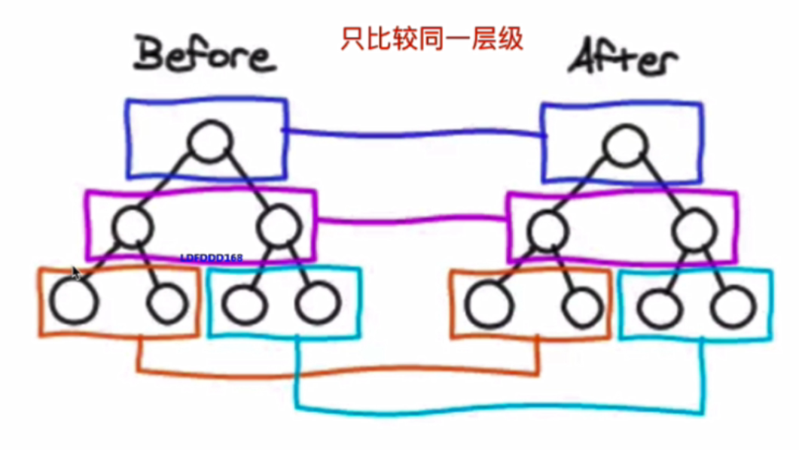
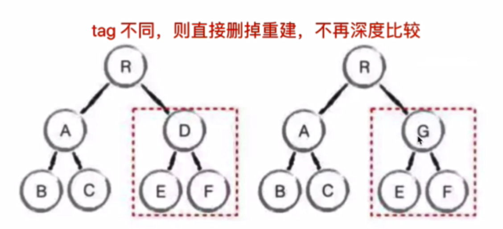
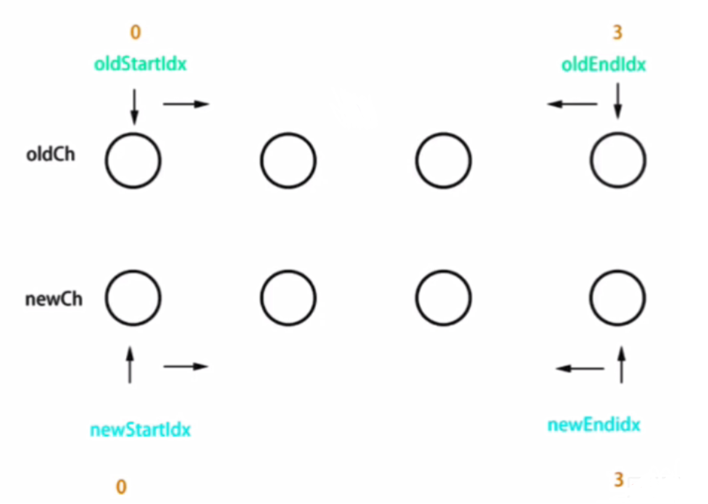
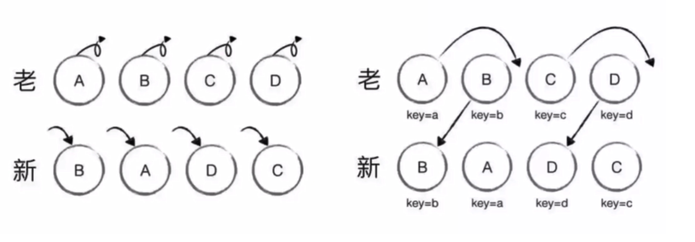

## 概述

虚拟DOM是实现 vue 和 react 的重要基石

diff算法是 vdom 中最核心，最关键的部分


## 虚拟DOM意义

* DOM操作非常耗费性能和耗时
* 解决方法：把DOM对象计算切换为JS对象计算，因为JS对象计算速度很快
* 虚拟DOM：使用 JS 模拟DOM结构，计算出最小变更，操作DOM


## JS对象描述DOM

### DOM结构

```html
<div id="div1" class="container">
	<p>vdom</p>
    <ul style="font-size: 20px">
        <li>a</li>
    </ul>
</div>
```

### JS对象描述

```js
const vdom = {
	tag: "div",
  props: {
    className: "container",
    id: "div1"
  },
  children: [
    {
      tag: "p",
      children: "vdom"
    },
    {
      tag: "ul",
      props: { 
        style: "font-size: 20px" 
      },
      children: [
        {
          tag: "li",
          children: "a"
        }
        // ...
      ]
    }
  ]
}
```


## diff算法

### 概述

diff算法是vdom中最核心，最关键的部分

diff即对比，找出差异

### 算法1

树diff的复杂度是 O(n^3)
* 第一，遍历tree1
* 第二，遍历tree2
* 第三，排序
* 1000个节点，要计算1亿次，算法不可用

### 算法2

优化到时间复杂度 O(n)
* 只对比同一层级，不跨级对比
* tag不同，则直接删掉，不再深度对比
* tag和key，如果都相同，则认为是相同节点，不再深度对比
* tag相同，key不同，进行深度对比









