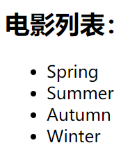
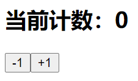

## 案例1

### 目标

1. 默认显示一段文字`Hello World` 与一个按钮
2. 点击按钮后，`Hello World` 改变为 `Hello React`

### 最终实现效果


### 第一步

引入依赖，并在页面上通过 React 显示一个 Hello World

#### 示例代码

```html
<html lang="en">
  <head>
    <meta charset="UTF-8" />
    <title>React体验</title>
    <script src="https://unpkg.com/react@16/umd/react.development.js"></script>
    <script src="https://unpkg.com/react-dom@16/umd/react-dom.development.js"></script>
    <script src="https://unpkg.com/babel-standalone@6/babel.min.js"></script>
  </head>
  <body>
    <div id="app">这里写的内容会被忽略</div>
    <script type="text/babel">
      ReactDOM.render(<h1>Hello World</h1>, document.getElementById("app"));
    </script>
  </body>
</html>
```

#### 解析

1. 使用React前通过CDN引入三个依赖库

2. 编写的代码的script标签，必须添加 type="text/babel"，作用是可以让 babel 解析 jsx 的语法

3. `ReactDOM.render`是将 JSX 对应的视图挂载到指定的DOM节点上

   ```js
   reactDOM.render(渲染的内容[本质为ReactElement类型对象]，挂载的对象)
   ```

   参数1：要渲染的内容，这个值一般写`JSX`语法，但**本质为ReactElement类型对象**

   参数2：将渲染的内容，挂载到哪一个 DOM 节点上

4. `ReactDOM.render`时会替换掉挂载目标的整个DOM节点，所以挂载目标中原有内容会被忽略

   ```html
   <div id="app">这里写的内容会被忽略</div>
   ```

### 第二步

可以通过数据控制显示内容

#### 示例代码

```html
<html lang="en">
  <head>
    <meta charset="UTF-8" />
    <title>React体验</title>
    <script src="https://unpkg.com/react@16/umd/react.development.js"></script>
    <script src="https://unpkg.com/react-dom@16/umd/react-dom.development.js"></script>
    <script src="https://unpkg.com/babel-standalone@6/babel.min.js"></script>
  </head>
  <body>
    <div id="app"></div>
    <script type="text/babel">
      let message = "Hello World";

      ReactDOM.render(<h1>{message}</h1>, document.getElementById("app"));
    </script>
  </body>
</html>
```

#### 解析

1. JSX中标签属性和标签内容的值可以用表达式计算出来
2. 表达式包裹在`{}`中即可，这是`JSX`的语法

#### 注意

React中写表达式的地方与Vue不同

| 框架/库 | 标签属性 | 标签内容 |
| ------- | -------- | -------- |
| react   | `{}`中   | `{}`中   |
| vue     | `""`中   | `{{}}`中 |

React示例

```jsx
let titleMessage = "这是提示信息";
let contentMessage = "Hello!";

<div title={titleMessage}>{contentMessage}</div>
```

Vue示例

```jsx
let titleMessage = "这是提示信息";
let contentMessage = "Hello!";

<div title="titleMessage">{{contentMessage}}</div>
```

### 第三步

显示按钮

#### 示例代码

```html
<html lang="en">
  <head>
    <meta charset="UTF-8" />
    <title>React体验</title>
    <script src="https://unpkg.com/react@16/umd/react.development.js"></script>
    <script src="https://unpkg.com/react-dom@16/umd/react-dom.development.js"></script>
    <script src="https://unpkg.com/babel-standalone@6/babel.min.js"></script>
  </head>
  <body>
    <div id="app"></div>
    <script type="text/babel">
      let message = "Hello World";

      ReactDOM.render(
        <div>
          <h1>{message}</h1>
          <button>改变文本</button>
        </div>,
        document.getElementById("app")
      );
    </script>
  </body>
</html>
```

#### 解析

1. jsx 特点：多个标签(组件)在最外层(root)，只能有一个标签，所以示例代码中用了一个`div`标签进行包裹
2. 使用`()`包裹，可以进行多行写法

### 第四步

为按钮绑定事件

#### 示例代码

```html
<html lang="en">
  <head>
    <meta charset="UTF-8" />
    <title>React体验</title>
    <script src="https://unpkg.com/react@16/umd/react.development.js"></script>
    <script src="https://unpkg.com/react-dom@16/umd/react-dom.development.js"></script>
    <script src="https://unpkg.com/babel-standalone@6/babel.min.js"></script>
  </head>
  <body>
    <div id="app"></div>
    <script type="text/babel">
      let message = "Hello World"; // 定义数据

      function render() { // 定义渲染函数
        ReactDOM.render(
          <div>
            <h1>{message}</h1>
            <button onClick={changeText}>改变文本</button>
          </div>,
          document.getElementById("app")
        );
      }

      function changeText() { // 定义按钮事件回调函数
        message = "Hello React";
        render();
      }
      
      render(); // 第一次渲染
    </script>
  </body>
</html>
```

#### 解析

1. 每次渲染都需要调用 `ReactDOM.render`，为了复用，将其封装到一个名为`render`的函数中

2. 流程：定义好数据=>定义好渲染函数=>定义好按钮事件回调函数=>第一次渲染=>点击按钮=>触发事件，改变数据，调用render函数，实现重新渲染

3. JSX中绑定事件与传统HTML事件名称不同

   * 传统HTML中事件名为全小写，如 onclick
   * JSX中事件名为驼峰式命名，如 onClick

4. JSX绑定事件，只需要将函数对象赋值给对应事件属性即可

   ```jsx
   function changeText() { // 定义按钮事件回调函数
       message = "Hello React";
       render();
   }
   
   // 进行事件绑定
   <button onClick={changeText}>改变文本</button>
   ```


## 类形式写法

除了上述那种面向过程式的代码组织方式，React支持面向对象式的代码组织方式，使用ES6中的类写法

### 示例代码

```jsx
<html lang="en">
  <head>
    <meta charset="UTF-8" />
    <title>React体验</title>
    <script src="https://unpkg.com/react@16/umd/react.development.js"></script>
    <script src="https://unpkg.com/react-dom@16/umd/react-dom.development.js"></script>
    <script src="https://unpkg.com/babel-standalone@6/babel.min.js"></script>
  </head>
  <body>
    <div id="app"></div>
    <script type="text/babel">
      // 定义类
      class App extends React.Component {
        constructor() {
          super();
          this.state = {
            message: "Hello World",
          };
        }

        render() {
          return (
            <div>
              <h2>{this.state.message}</h2>
              <button onClick={this.btnClick.bind(this)}>改变文本</button>
            </div>
          );
        }

        btnClick() {
          this.setState({
            message: "Hello React",
          });
        }
      }

      // 渲染
      ReactDOM.render(<App />, document.getElementById("app"));
    </script>
  </body>
</html>
```

### 解析

1. 使用类形式写法时，类必须继承 `React.Compnent`

2. 数据需要定义在`this.state`对象中，这是一个约定的属性命名，不能改变

3. 不能直接修改`this.state`对象中的数据，原因是如果直接修改，react将不能感知到这次修改，所以无法重新render页面，如果要修改`this.state`中的数据，则必须调用`this.setState`方法，这个方法继承于`React.Component`

4. 永远不要手动调用 render，React库将在数据`this.state`发生改变时，自动调用render函数

5. React中的事件并不是JavaScript原生事件，而是React库自己合成模拟的事件

6. React中的事件回调函数是由React内部触发执行的

   即函数的调用者为React库内部的对象，而不是类对应的实例对象

   所以要非常注意事件回调函数中的`this`指向问题

   ```js
   // 假设事件回调函数为 fn
   // 则 react 中调用 fn 的形式为
   fn.apply(undefined);
   ```

7. `this`指向问题解决方法

   * 在赋值回调函数时，进行`bind`绑定

     ```js
     <button onClick={this.btnClick.bind(this)}>改变文本</button>
     ```

   * 在构造函数中，进行`bind`绑定

     ```js
     constructor() {
         super();
         
         this.state = {
             message: "Hello World",
         };
         
         this.btnClick = this.btnClick.bind(this);
     }
     ```

   * 使用箭头函数，由箭头函数的特性：在定义时进行this静态绑定

     ```js
     <button onClick={() => this.btnClick()}>改变文本</button>
     ```

8. 与事件回调函数不同，render函数始终由类实例对象调用，即render函数中的`this`始终指向实例对象本身，所以在render函数可以放心使用`this`


## 案例2

### 目标

实现季节列表

### 最终实现效果



### 示例代码

```html
<!DOCTYPE html>
<html lang="en">
  <head>
    <meta charset="UTF-8" />
    <meta name="viewport" content="width=device-width, initial-scale=1.0" />
    <title>React体验</title>
    <script src="https://unpkg.com/react@16/umd/react.development.js"></script>
    <script src="https://unpkg.com/react-dom@16/umd/react-dom.development.js"></script>
    <script src="https://unpkg.com/babel-standalone@6/babel.min.js"></script>
  </head>
  <body>
    <div id="app"></div>
    <script type="text/babel">
      // 定义类
      class App extends React.Component {
        constructor() {
          super();
          this.state = {
            seasons: ["Spring", "Summer", "Autumn", "Winter"],
          };
        }

        render() {
          return (
            <div>
              <h2>电影列表：</h2>
              <ul>
                {
                  this.state.seasons.map(item => <li key={item}>{item}</li>)
                }
              </ul>
            </div>
          );
        }
      }

      // 渲染
      ReactDOM.render(<App />, document.getElementById("app"));
    </script>
  </body>
</html>
```

### 解析

1. 如果`{}`写的是数组，则 JSX 会将元素取出来渲染
2. React中数组常用的遍历方法是`map`函数，因为它可以遍历数组，然后返回新数组，JSX将新数组的内容取出来渲染
3. `key`属性的作用是提供性能，这个知识点会在之后的文章中具体说明，现在只要知道它的值不能重复即可（注意：**不要使用数组下标**）


## 案例3

### 目标

实现简单计数器

### 最终实现效果



### 示例代码

```html
<!DOCTYPE html>
<html lang="en">
  <head>
    <meta charset="UTF-8" />
    <meta name="viewport" content="width=device-width, initial-scale=1.0" />
    <title>React体验</title>
    <script src="https://unpkg.com/react@16/umd/react.development.js"></script>
    <script src="https://unpkg.com/react-dom@16/umd/react-dom.development.js"></script>
    <script src="https://unpkg.com/babel-standalone@6/babel.min.js"></script>
  </head>
  <body>
    <div id="app"></div>
    <script type="text/babel">
      // 定义类
      class App extends React.Component {
        constructor() {
          super();
          this.state = {
            counter: 0,
          };
        }

        render() {
          return (
            <div>
              <h2>当前计数：{this.state.counter}</h2>
              <button onClick={() => this.decrement()}>-1</button>
              <button onClick={() => this.increment()}>+1</button>
            </div>
          );
        }

        decrement() {
          this.setState({
            counter: this.state.counter - 1,
          });
        }

        increment() {
          this.setState({
            counter: this.state.counter + 1,
          });
        }
      }

      // 渲染
      ReactDOM.render(<App />, document.getElementById("app"));
    </script>
  </body>
</html>
```

### 解析

无补充内容


## 总结

1. 使用React前通过CDN引入三个依赖库

2. 编写的代码的script标签，必须添加 type="text/babel"，作用是可以让 babel 解析 jsx 的语法

3. `ReactDOM.render`是将 JSX 对应的视图挂载到指定的DOM节点上

   ```js
   reactDOM.render(渲染的内容，挂载的对象)
   ```

   参数1：传递要渲染的内容，这个内容可以是 HTML 元素，也可以是 React 的组件

   参数2：将渲染的内容，挂载到哪一个 HTML 元素上

4. `ReactDOM.render`时会替换掉挂载目标的整个DOM节点，所以挂载目标中原有内容会被忽略

   ```html
   <div id="app">这里写的内容会被忽略</div>
   ```

5. JSX中标签属性和标签内容的值可以用表达式计算出来

6. 表达式包裹在`{}`中即可，这是`JSX`的语法

7. 每次渲染都需要调用 `ReactDOM.render`，为了复用，将其封装到一个名为`render`的函数中

8. JSX中绑定事件与传统HTML事件名称不同

   * 传统HTML中事件名为全小写，如 onclick
   * JSX中事件名为驼峰式命名，如 onClick

9. JSX绑定事件，只需要将函数对象赋值给对应事件属性即可

   ```jsx
   // 定义按钮事件回调函数
   function changeText() { 
       message = "Hello React";
       render();
   }
   
   // 进行事件绑定
   <button onClick={changeText}>改变文本</button>
   ```

10. 使用类形式写法时，类必须继承 `React.Compnent`

11. 数据需要定义在`this.state`对象中，这是一个约定的属性命名，不能改变

12. 不能直接修改`this.state`对象中的数据，原因是如果直接修改，React将不能感知到这次修改，所以无法重新render页面，如果要修改`this.state`中的数据，则必须调用`this.setState`方法，这个方法继承于`React.Component`

13. 永远不要手动调用 render，React库将在数据`this.state`发生改变时，自动调用render函数

14. React中的事件并不是JavaScript原生事件，而是React自己合成模拟的事件，React内部进行事件的监听

15. React中的事件回调函数是由React内部监听触发的，即函数的调用者为React库内部的对象，而不是类对应的实例对象，所以要非常注意事件回调函数中的`this`指向问题

    ```js
    // 假设事件回调函数为 fn
    // 则 react 中调用 fn 的形式为
    fn.apply(undefined);
    ```

16. `this`指向问题解决方法

    方法1：在赋值回调函数时，进行`bind`绑定

    ```js
    <button onClick={this.btnClick.bind(this)}>改变文本</button>
    ```

    方法2：在构造函数中，进行`bind`绑定

    ```js
    constructor() {
        super();
        
        this.state = {
            message: "Hello World",
        };
        
        this.btnClick = this.btnClick.bind(this);
    }
    ```

    方法3：使用箭头函数，由箭头函数的特性：在定义时进行this静态绑定

    ```js
    <button onClick={() => this.btnClick()}>改变文本</button>
    ```

17. 与事件回调函数不同，render函数始终由类实例对象调用，即render函数中的`this`始终指向实例对象本身，所以在render函数可以放心使用`this`

18. 如果`{}`写的是数组，则 JSX 会将元素取出来渲染

19. React中数组常用的遍历方法是`map`函数，因为它可以遍历数组，然后返回新数组，JSX将新数组的内容取出来渲染

20. `key`属性的作用是提供性能，这个知识点会在之后的文章中具体说明，现在只要知道它的值不能重复即可（注意：**不要使用数组下标**）


