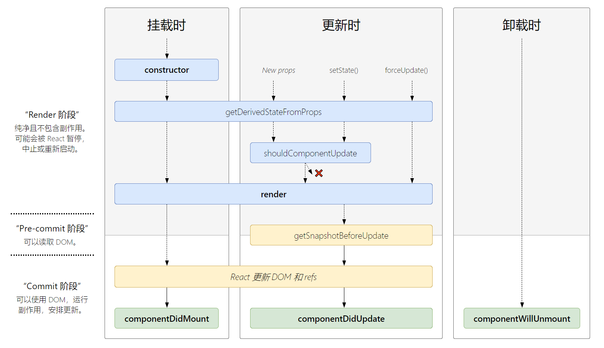

## 类组件

### 概念

类组件就是指用类的方式（Class）实现组件

### 要求

* 组件的名称是大写字符开头
* 类组件需要继承自 React.Component或React.PureComponent
* 类组件必须实现render函数，也是唯一必须实现的方法
* this.state中维护的就是组件内部的数据，这个名字`state`是固定好的，不能更改
* constructor是可选的，我们通常在constructor中初始化一些数据

### 示例

```jsx
import React from "react";

class 类名[Pascal命名法] extends React.Component {
    // 构造函数
    constructor(props) {
        super(props)
    }
    
    // render生命周期函数
    render() {
        return <div></div>;
    }
}
```

### 区分大小写

`html`中标签不区分大小写，但`jsx`中是区分大小写的，只要是大写字母开头，就会当成是组件

这也是为什么组件的名字必须是大写字母开头


## 生命周期

### 概念

生命周期是一个抽象的概念，在生命周期的整个过程，分成了很多个阶段

* 装载阶段（Mount）：组件第一次在DOM树中被渲染的过程；
* 更新过程（Update）：组件状态发生变化，重新更新渲染的过程；
* 卸载过程（Unmount）：组件从DOM树中被移除的过程；

React内部会对我们组件内部实现的某些函数进行回调，这些函数就是生命周期函数

### 特点

React生命周期指的是类的生命周期，因为函数式组件是没有生命周期函数的

虽然我们可以通过hooks来模拟一些生命周期的回调

### 生命周期图




## 装载阶段

### constructor

| 参数           | 说明               |
| -------------- | ------------------ |
| 参数1：props   | 父组件传入的 props |
| 参数2：context | Context            |

作用：constructor中通常只做两件事情

* 通过给 this.state 赋值对象来初始化内部的state
* 为组件的事件绑定实例 bind(this)

说明：constructor不属于React内置的生命周期函数，它是ES6中Class的功能

注意：如果不初始化 state 或不进行方法绑定，则不需要为 React 组件实现构造函数，默认的实现为

```jsx
constructor(props) {
    super(props);
}
```

### componentDidMount

参数：无

说明：componentDidMount会在组件挂载后（插入 DOM 树后）立即调用

作用：componentDidMount中通常进行下列操作

* 依赖于DOM的操作可以在这里进行；
* 在此处发送网络请求就最好的地方（官方建议）
* 可以在此处添加一些订阅（需要在componentWillUnmount取消订阅）


## 更新阶段

### shouldComponentUpdate

| 参数             | 说明                        |
| ---------------- | --------------------------- |
| 参数1：nextProps | 修改后，最新的props属性对象 |
| 参数2：nextState | 修改后，最新的state属性对象 |

作用：进行性能优化，如果返回false，则不执行render函数，用于性能优化中

返回值：boolean

### getSnapshotBeforeUpdate

参数：无

作用：在React更新DOM之前回调的一个函数，可以获取DOM更新前的一些信息（比如说滚动位置）

返回值：该函数可以返回值，称为snapshot，该值会传给 `ComponentDidUpdate` 函数

### componentDidUpdate

| 参数      | 说明                                              |
| --------- | ------------------------------------------------- |
| prevProps | 更新前的 props                                    |
| prevState | 更新前的 state                                    |
| snapshot  | snapshot从`getSnapshotBeforeUpdate`生命周期中获取 |

说明：componentDidUpdate会在更新后会被立即调用，**首次渲染不会执行此方法**

作用：

* 当组件更新后，可以在此处对 DOM 进行操作

* 如果对更新前后的 props 进行了比较，也可以选择在此处进行网络请求，例如，当 props 未发生变化时，不执行网络请求


## 卸载阶段

### componentWillUnmount

参数：无

说明：会在组件卸载及销毁之前直接调用

作用：在此方法中执行必要的清理操作，例如，清除定时器，取消网络请求、取消订阅或解除事件绑定等


## 跨阶段

### render

参数：无

作用：用于描述UI

返回值：JSX

### componentDidCatch

| 参数      | 说明     |
| --------- | -------- |
| error     | 错误对象 |
| errorInfo | 错误信息 |

作用：当触发错误边界后，用于打印和统计错误信息

说明：具体看**错误边界**一文

### static getDerivedStateFromProps

| 参数      | 说明          |
| --------- | ------------- |
| nextProps | 更新后的props |
| prevState | 更新前的state |

作用：该生命周期函数用于获取新的props和旧的state，通过这两个对象，返回一个新的对象作为更新后的 state，即用来更新 state

说明：因为组件更新时不会再调用 `Constructor`了，所以需要`getDerivedStateFromProps` 来更新 `state`

### static getDerivedStateFromError

参数：error对象

作用：捕获后代组件发生的错误，然后更新组件的state，以**渲染后备UI**

说明：具体看**错误边界**一文