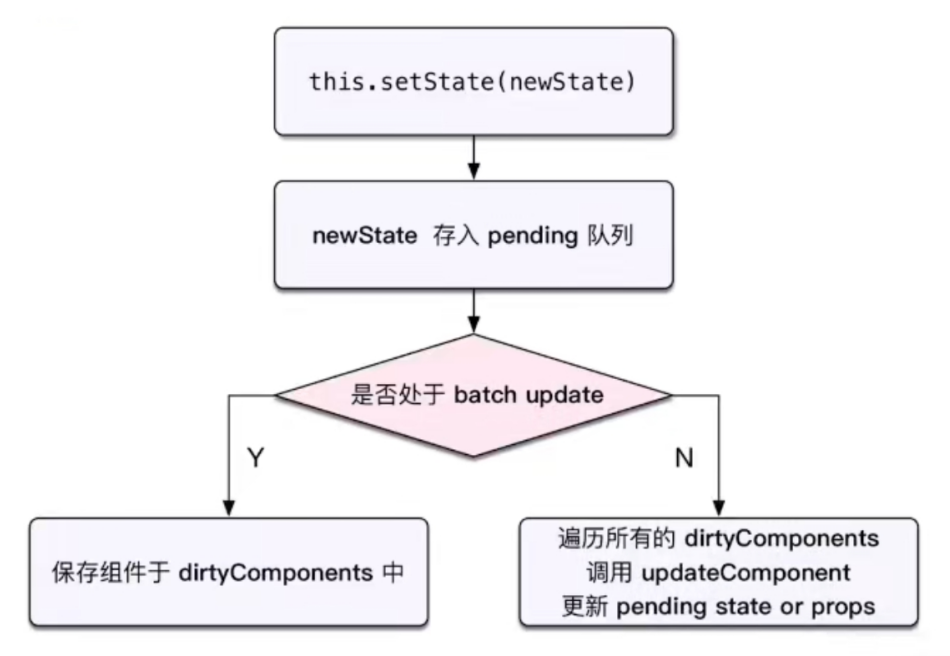

## 初识setState

### setState是什么

setState是一个函数

### setState来自哪里

对于类组件：setState方法是从Component中继承过来的，通过super方法继承的

对于函数式组件：因为函数式组件中没state，也就不存在setState了

### setState作用

setState用于更新组件的state，并通知React进行重新渲染，即执行render函数

### 为什么一定要通过setState

不能直接修改`this.state`
* 修改后，React并不知道发生了改变，也就不会重新渲染
* 而Vue中可以直接修改数据，因为Vue会感应到并自动重新渲染

开发中我们并不能直接通过修改state的值来让界面发生更新： 
* 因为我们修改了state之后，希望React根据最新的State来重新渲染界面，但是这种方式的修改React并不知道数据发生了变化
* React并没有实现类似于Vue2中的Object.defineProperty或者Vue3中的Proxy的方式来监听数据的变化
* 我们必须通过setState来告知React数据已经发生了变化

如果直接更新state值，可能会使 SCU优化或PureComponent 浅层比较失效


## setState异步问题

### setState默认是异步

调用结果是 `初始值`，而不是 `更新值`

说明setState是异步的，并不能在执行完setState之后立马拿到最新的state的结果

```jsx
import React, { Component } from "react";

export default class App extends Component {
  constructor(props) {
    super(props);
    this.state = {
      message: "初始值",
    };
  }

  render() {
    return (
      <div>
        <button onClick={() => this.changeText()}>调用setState</button>
      </div>
    );
  }

  changeText() {
    this.setState({
      message: "更新值",
    });
    console.log(this.state.message); // 调用结果是初始值，而不是更新值
  }
}
```

### 为什么要设计为异步

#### 性能优化

* 如果每次调用 setState都进行一次更新，那么意味着render函数会被频繁调用，界面重新渲染，这样效率是很低的
* 最好的办法应该是获取到多个更新，之后进行批量更新，即进行浅合并
* 例子：假设有一个聊天应用，你正在使用inpput组件进行输入，此时收到一条消息，假设setState是同步，则会立即渲染message组件阻塞线程，导致你输入的抖动和延迟，所以更好的方式是setState为异步，延迟message组件的渲染，从而让你的输入更加流畅顺滑

#### 保持内部一致性

* 如果setState是同步的，则state和子组件的props不能保持一致性，会在开发中产生很多的问题
* 假设父组件中有一个值，叫做data，父组件将data传递给子组件，且提供了一个方法给子组件，子组件可以用这个方法更新父组件的data，同时子组件通过`this.props.data`使用了父组件传来的data
* 那么子组件通过方法通知父组件更新data时，由于setState是同步的，所以父组件中的data立即就更新了，但此时`this.props.data`并没有更新
* 这就是state和子组件的props之间不能保持一致性的现象，如果要求setState完就必须render，则又回到了**性能优化**的问题中

### 获取异步结果

#### 方式一：使用setState的回调函数

setState接受两个参数：

* 第一个参数：新的state

* 第二个参数是一个回调函数，这个回调函数会在更新后会执行
* 格式如下：setState(partialState, callback)

#### 方式二：使用componentDidUpdate

```jsx
componentDidUpdate(prevProps, prevState, snapshot) {
    console.log(this.prevState)
}
```

### setState一定是异步吗？

情况1：在组件生命周期或React合成事件中，setState是异步

情况2：在setTimeout或者原生DOM事件中，setState是同步，因为事件循环

```jsx
changeText() {
    setTimeout(()=>{
        this.setState({
            message: "更新值"
        });
        console.log(this.state.message); // 更新值
    }, 0)
}
```


## setState参数

### 参数要求

setState中的对象必须是`immutable`的对象，即新对象，不能直接修改原`state`

不能修改原`state`的原因是：React中的SCU和memo优化都使用到了**浅层比较**技术，如果直接修改`state`，则**浅层比较**的结果是**没有改变**，即不会进行刷新

这也是为什么SCU的返回值默认情况下为`true`，这是为了避免开发者不清楚`不可变对象`的用法，而直接修改了`state`，从而导致无法更新组件

### 参数为对象

React在进行setState对象时，用的是`Object.assign`方法，即进行的是**合并**，而不是**替换**，所以不会影响别的值

```jsx
import React, { Component } from "react";

export default class App extends Component {
  constructor(props) {
    super(props);
    this.state = {
      name: "初始值",
      age: 18
    };
  }

  render() {
    return (
      <div>
        <button onClick={() => this.changeState()}>调用setState</button>
      </div>
    );
  }

  changeState() {
    this.setState({
      name: "更新值"
    },()=>{
        console.log(this.state.name); // 更新值
        console.log(this.state.age); // 18
    });
  }
}
```

上述代码中，通过setState改变了name的值，但age并没有受到影响

### 参数为函数

setState中可以传入函数，形式为

```js
(prevState, prevProps) => {
    return {} // 该对象就是要进行合并的对象
}
```

作用：使用函数参数，能实现类似同步的setState效果

### 多个state的合并问题

对于写列的代码，执行increment后，`this.state.counter`为多少？

```jsx
import React, { Component } from "react";

export default class App extends Component {
  constructor(props) {
    super(props);
    this.state = {
      counter: 0,
    };
  }

  render() {
    return (
      <div>
        <div>counter: {this.state.counter}</div>
        <button onClick={() => this.increment()}>调用setState</button>
      </div>
    );
  }

  increment() {
    this.setState({
      counter: this.state.counter + 1,
    });

    this.setState({
      counter: this.state.counter + 1,
    });

    this.setState({
      counter: this.state.counter + 1,
    });
  }
}
```

答案是1，而不是3，因为是因为React内部使用的是Object.assgin的合并方式，所以内部执行的过程如下

```jsx
Object.assign(this.state, {counter: 1}, {counter: 1}, {counter: 1})
```

即后面覆盖前面，所以counter的值为1

#### 如何实现累加为3的效果？

使用函数作为setState的参数即可

```js
import React, { Component } from "react";

export default class App extends Component {
  constructor(props) {
    super(props);
    this.state = {
      counter: 0,
    };
  }

  render() {
    return (
      <div>
        <div>counter: {this.state.counter}</div>
        <button onClick={() => this.increment()}>调用setState</button>
      </div>
    );
  }

  increment() {
    this.setState((prevState, prevProps) => {
      return {
        counter: prevState.counter + 1,
      };
    });

    this.setState((prevState, prevProps) => {
      return {
        counter: prevState.counter + 1,
      };
    });

    this.setState((prevState, prevProps) => {
      return {
        counter: prevState.counter + 1,
      };
    });
  }
}
```


## setState原理

### setState主流程



### batchUpdate机制

#### 机制说明

`setState`时是同步还是异步执行，取决于React内部的`isBatchingUpdate`的值

* 为true：异步执行
* 为false：同步执行

React理念是尽可能用异步执行，所以在一开始会设置为true，然后再将其设置为false

#### 例子

```js
increase = () => {
    // 开始：处于 batchUpdate
    // isBatchingUpdates = true
    this.setState({ // 此时，isBatchingUpdate 为 true，所以异步执行
        count: this.state.count + 1
    });
    // 结束
    // isBatchingUpdates = false
}
```

```js
increase = () => {
    // 开始：处于 batchUpdate
    // isBatchingUpdates = true
    setTimeout(() => {
        // 此时，isBatchingUpdate 为 false，所以同步执行
        this.setState({
            count: this.state.count + 1
        });
    })
    // 结束
    // isBatchingUpdates = false
}
```

```js
componentDidMount() {
    // 开始：处于 batchUpdate
    // isBatchingUpdates = true
    document.body.addEventListener('click', () => {
       // 此时，isBatchingUpdates为false，所以同步执行
        this.setState({
            count: this.state.count + 1
        });
    });
    // 结束
    // isBatchingUpdates = false
}
```

### 总结

`setState`是异步还是同步执行，取决于`isBatchingUpdate`的值

#### 为true的情况（异步执行）

1. 生命周期（以及它调用的函数）
2. React中注册的函数（以及它调用的函数）

#### 为false的情况（同步执行）

本质上是涉及了**事件循环**机制

1. setTimeout，setInterval（以及它调用的函数）
2. 自定义 DOM 事件

