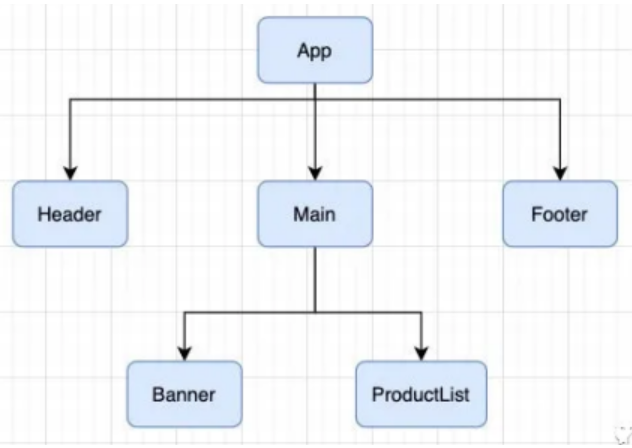
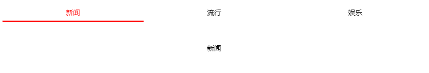

## 组件组合

### 组件组合概念

如果一个应用程序将所有的逻辑都放在一个组件中，那么这个组件就会变成非常的臃肿和难以维护

所以组件化的核心思想应该是对组件进行拆分，拆分成一个个小的组件，再将这些组件组合在一起，最终形成我们的应用程序，则组件之间不可避免地要出现层级关系，即形成父子关系的组件



### 实现组件组合

因为 React 使用的是 `JSX` 语法，这种语法天生就直接支持组合，不需要任何其他支持

### 组件组合例子

上图的组合逻辑如下，它们存在如下关系

* App组件是Header、Main、Footer组件的父组件
* Main组件是Banner、ProductList组件的父组件

```jsx
// Header
function Header() {
    return <h2>我是Header</h2>
}

// Main
function Main() {
    return (
    	<div>
        	<Banner />
            <ProductList />
        </div>
    );
}

function Banner() {
    return <h3>我是Banner</h3>
}

function ProductList() {
    return (
    	<ul>
        	<li>商品1</li>
            <li>商品2</li>
            <li>商品3</li>
        </ul>
    );
}

// Footer
function Footer() {
    return <h2>我是Footer</h2>
}

export default class App extends Component {
    render() {
        return (
        	<div>
            	<Header />
                <Main />
                <Footer />
            </div>
        );
    }
}
```

### React官方不推荐不建议使用继承

不要创建自己的组件基类：不要在定义组件时，让组件继承于自己定义的另外一个组件

> ## 如何看待继承？
>
> 在 Facebook ，我们在千万的组件中使用 React，我们还没有发现任何用例，值得我们建议你用继承层次结构来创建组件。
>
> 使用 props(属性) 和 组合已经足够灵活来明确、安全的定制一个组件的外观和行为。切记，组件可以接受任意的 props(属性) ，包括原始值、React 元素，或者函数。
>
> 如果要在组件之间重用非 U I功能，我们建议将其提取到单独的 JavaScript 模块中。组件可以导入它并使用该函数，对象或类，而不扩展它。


## 组件之间的通信

父组件在展示子组件，可能会传递一些数据给子组件，而子组件在操作时，可能要父组件改变它的值

这种行为称为组件之间的通讯


## 父传子

### 概念

父组件通过 **属性=值** 的形式来传递给子组件数据

子组件通过构造函数的 **props** 参数获取父组件传递过来的数据

**props** 是**只读**的

### props绑定

可以不写 `this.props=props`，而选择使用 super(props)

因为父组件构造函数的第一个参数就是props，构造函数会将props绑定到this上

所以使用super关键字将自身this传递到父类构造函数中，执行父类构造函数，从而完成

```js
this.props = props 的绑定
```

进一步简化：可以不写构造函数，而采用系统默认的构造函数

```jsx
// 这是默认构造函数的实现，如果你想写的构造函数就是这样子的话，可以直接不写构造函数
constructor(props) {
    super(props)
}
```

总结：一定可以通过`this.props` 访问到父组件传递过来的数据，因为React内部在创建组件时显式将props参数绑定到this上

```jsx
class ChildCpn extends Component {
    constructor(props) {
        super();
        console.log(this.props); // 一定是undefined
    }
    
    componentDidMount() {
        console.log(this.props); // 这里可以访问，因为在创建组件时，React内部帮忙绑定到this上了
    }
    
    render() {
        console.log(this.props); // 这里可以访问，因为在创建组件时，React内部帮忙绑定到this上了
    }
}
```

### 示例

```jsx
import React, { Component } from "react";

class ChildCpn extends Component {
    constructor(props) {
        super(props);
        
        // this.props = props; // 这一步可以省略
                               // 因为父类(Component)有个构造函数中会绑定props参数到this上
                               // 所以使用super就可以完成绑定了
    }
    
    render() {
        const { name, age, gender } = this.props;
        
        return (
        	<div>
            	<h2>子组件展示数据：{name + " " + age + " " + gender}</h2>
            </div>
        );
    }
}

export default class App extends Component {
    render() {
        <div>
        	<ChildCpn 
            	name="why"
                age="18"
                gender="male"
            />
        </div>
    }
}
```

### props验证

对于传递给子组件的数据，子组件有可能希望验证数据是否满足要求

* 如果项目使用了TypeScript，那么可以直接通过TypeScript进行过验证
* 如果项目中只使用JavaScript，则可以通过 PropTypes 来进行参数验证

从 React v15.5 开始，PropTypes 已经从 `react` 库中移入到 `prop-types` 库中，目的是为了减少打包体积

`create-react-app` 已经默认集成了`prop-types` 库，直接导入使用即可 

```jsx
import PropTypes from 'prop-types'; // 名字随便起

class ChildCpn extends Component {
    constructor(props) {
        super(props);
    }
    
    render() {
        const { name, age, gender } = this.props;
        
        return (
        	<div>
            	<h2>子组件展示数据：{name + " " + age + " " + gender}</h2>
            </div>
        );
    }
}

// 名字一定要是 propTypes
ChildCpn.propTypes = {
    name: PropTypes.string,
    age: PropTypes.number.isRequired, // 必须传入
    gender: PropTypes.string,
    names: PropTypes.Array
}

// 默认值，名字一定要是 defaultProps
ChildCpn.defaultProps = {
    name: "why",
    age: 18,
    names: ["111", "222"]
}
```

另外一种写法：通过静态属性

```jsx
class ChildCpn extends Component {
    static propTypes = {}
}
// 等价于
ChildCpn.propTypes = {}
```

### propTypes常用属性

| 属性                                                      | 说明                   |
| --------------------------------------------------------- | ---------------------- |
| PropTypes.string                                          | 字符串                 |
| PropTypes.bool                                            | 布尔值                 |
| PropTypes.number                                          | 数字                   |
| PropTypes.object                                          | 对象                   |
| PropTypes.func                                            | 函数                   |
| PropTypes.array                                           | 数组                   |
| PropTypes.symbol                                          | Symbol                 |
| PropTypes.element                                         | ReactElement           |
| PropTypes.node                                            | dom节点                |
| PropTypes.instanceOf(组件)                                | 是否是某个组件的实例   |
| PropTypes.oneOf(["News", "Photos"])                       | 是否是特定可选值之一   |
| PropTypes.oneOfType({PropTypes.string, PropTypes.number}) | 是否是特定可选类型之一 |
| isRequired                                                | 必传                   |


## 子传父

### 概念

由于单向数据流的设计理念，子组件是不能直接修改父组件的数据和状态

所以实现子传父的方法是：父组件传给子组件一个方法，这个方法的作用是能够改变父组件的数据和状态

那么在子组件中就可以通过 `props` 获得父组件传来的这个方法，然后子组件传参并调用这个方法，从而间接改变父组件的数据和状态

### 示例

将计数器案例进行拆解，把按钮封装到子组件中`CounterButton` ，`CounterButton`发生点击事件，将内容传递到父组件中，修改counter的值

```jsx
export default class App extends Component {
  constructor(props) {
    super(props);

    this.state = {
      counter: 0,
    };
  }

  render() {
    return (
      <div>
        <h2>当前计数：{this.state.counter}</h2>
        <CounterButton
          onClick={() => {
            this.increment();
          }}
        />
      </div>
    );
  }

  increment() {
    this.setState({
      counter: this.state.counter + 1,
    });
  }
}

class CounterButton extends Component {
  render() {
    const { onClick } = this.props;

    return <button onClick={onClick}>+1</button>;
  }
}
```


## 综合案例

### 最终效果

有三个tab按钮，点击按钮，在下方显示相应内容



### App.js

```jsx
import React from "react";

import TabControl from "./TabControl";

export default class App extends React.Component {
  constructor(props) {
    super(props);

    this.state = {
      currentTitle: "新闻",
      titles: ["新闻", "流行", "娱乐"],
    };
  }

  render() {
    const { currentTitle, titles } = this.state;

    return (
      <div>
        <TabControl
          itemClick={(index) => this.itemClick(index)}
          titles={titles}
        />
        <div className="text">
          <span>{currentTitle}</span>
        </div>
      </div>
    );
  }

  itemClick(index) {
    this.setState({
      currentTitle: this.state.titles[index],
    });
  }
}
```

### TabControl.js

```jsx
import React from "react";
import PropTypes from "prop-types";

export default class TabControl extends React.Component {
  constructor(props) {
    super(props);
    this.state = {
      currentIndex: 0,
    };
  }

  render() {
    const { titles } = this.props;
    const { currentIndex } = this.state;
    return (
      <div className="tab-control">
        {titles.map((item, index) => {
          return (
            <div
              key={item}
              className={"tab-item " + (index === currentIndex ? "active" : "")}
              onClick={(e) => this.itemClick(index)}
            >
              <span>{item}</span>
            </div>
          );
        })}
      </div>
    );
  }

  itemClick(index) {
    this.setState({
      currentIndex: index,
    });

    const { itemClick } = this.props;
    itemClick(index);
  }

  static propTypes = {
    titles: PropTypes.array.isRequired,
  };
}
```

### style.css

```css
.tab-control {
  display: flex;
  height: 44px;
  line-height: 44px;
}

.tab-item {
  flex: 1;
  text-align: center;
}

.tab-item.active {
  color: red;
  border-bottom: 3px solid red;
}

.tab-item span {
  padding: 5px 8px;
}

.text {
  text-align: center;
  margin-top: 50px;
}
```

### index.js

```jsx
import React from "react";
import ReactDOM from "react-dom";

import App from "./App";

import "./style.css";

ReactDOM.render(<App />, document.getElementById("root"));
```
