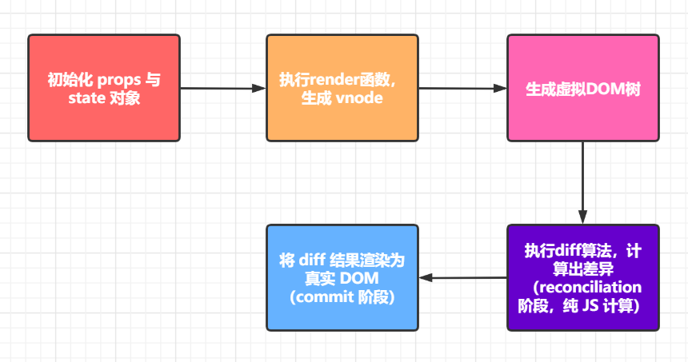
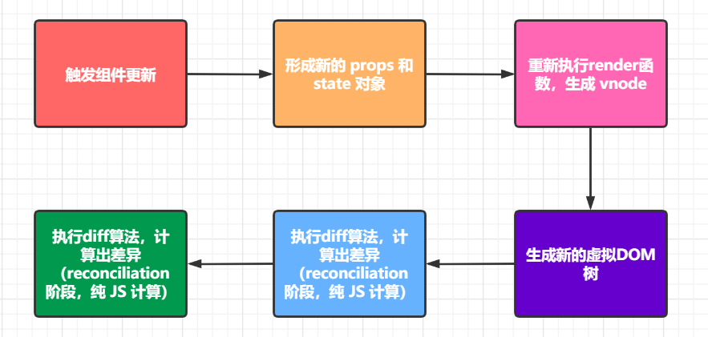
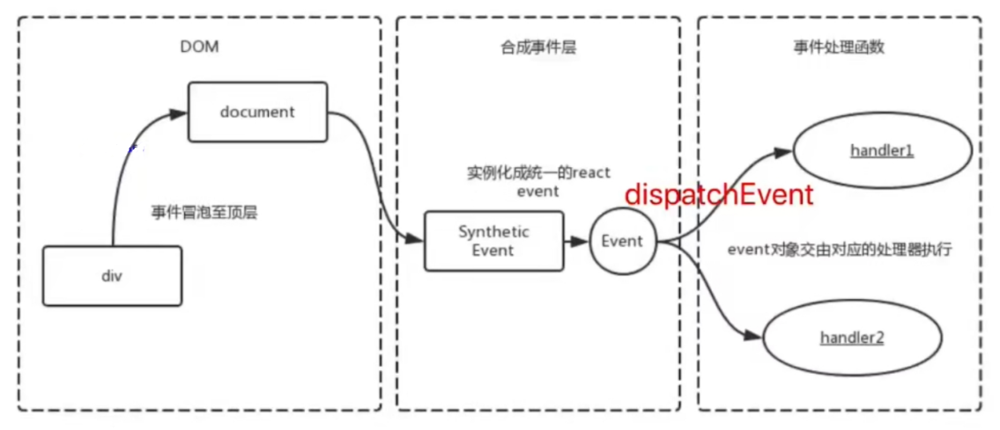

## 虚拟DOM

### 真实DOM缺点

* `document.createElement`创建出来的对象非常复杂，含有大量属性和事件
* 操作DOM消耗大量性能，且速度很慢，这是因为原生DOM中存储了太多的信息
* 对真实DOM进行操作会引起浏览器的回流和重绘，所以在开发中应该避免频繁的DOM操作
* 难以跟踪状态发生的改变，不方便对应用程序进行调试

### 虚拟DOM概述

基于上述的背景，虚拟DOM出现了，虚拟DOM的本质是JavaScript对象，用`JavaScript`对象来描述和存储DOM节点信息

### 虚拟DOM优点

* 原生的 JavaScript 对象处理起来更快，而且更简单
* 高效速度快，跨浏览器兼容
* 因为本质是 JS 对象，所以与浏览器不是强绑定，能够实现跨平台


## diff算法

### 概述

React在props或state发生改变时，会调用React的render方法，会创建一颗不同的渲染树（虚拟DOM树）

React需要基于这两颗不同的树之间的差别来判断如何有效的更新UI

如果一棵树参考另外一棵树进行完全比较更新，那么即使是最先进的算法，该算法的复杂程度为 O(n^3 )，其中 n 是树中元素的数量，所以**完全对比更新算法**不可取（**假设展示 1000 个元素所需要执行的计算量将在十亿的量级范围**）

### 实现

上述的**完全对比更新算法**不可取，React对这个算法进行了优化，将其时间复杂度优化成了O(n)，这就是**diff算法**

### 算法思路

* 只对比同一层级节点，不跨级对比
* tag不同，则直接删掉，不再深度对比，直接用新子树替换掉旧子树
* tag和key，如果都相同，则认为是相同节点，不再深度对比，直接用新子树替换掉旧子树
* tag相同，key不同，进行深度对比

### key优化

使用`key`属性能大幅度提升diff算法的性能

* 如果有key：直接根据key来判断新旧虚拟dom是否有不同
* 如果无key：需要执行双层循环做对比
* 对key要求：新旧虚拟dom的key 要保持一致，所以不建议用index作为key


## React首次渲染和更新过程

### React首次渲染过程



### React更新过程



### 触发组件更新的操作

1. 对于类组件，执行了`setState`方法
2. 对于普通函数式组件，其父组件发生了更新
3. 对于Hooks 式组件，执行了更新函数
4. 父组件更新，导致其子组件也更新


## React合成事件

### 概述

在React中，事件对象并不是浏览器原生的，而是由React内部合成的

```js
event // 不是原生事件对象，而是 SyntheticEvent 类型对象
event.native // 是原生事件对象

// 所有的事件都被挂载到document上
event.nativeEvent.target // 指向当前触发元素
event.nativeEvent.currentTarget // document，使用了事件委托
```

### 示意图



### 事件合成机制的意义

1. 更好的兼容性和跨平台性
2. 委托到`document`统一管理，减少内存消耗，避免频繁的绑定与解绑
3. 方便事件的统一管理（如事务机制）


## React Fiber

### 概述

`React Fiber`是`React v16`之后推出的机制，它能够优化渲染过程，提高用户体验

### 前置知识：协调（Reconciliation）

通过 `ReactDOM.render` 方法让**虚拟DOM** 和 **真实DOM** 实现同步，这个过程中叫做 **协调（Reconciliation）**

实现协调的核心是：虚拟DOM + diff算法 

### 前置知识：屏幕刷新率

显示屏幕都有一个参数：刷新率

| 项         | 说明                       |
| ---------- | -------------------------- |
| 刷新率定义 | 1秒内屏幕刷新的次数        |
| 刷新率单位 | 赫兹（Hz）                 |
| 刷新率例子 | 60Hz，显示屏幕一秒刷新60次 |

显示屏幕会按照刷新频去 GPU 取生成后的图像，然后显示出来

浏览器的刷新频率一般与电脑刷新率相同，因为操作系统会传递给浏览器一个 **vsync** 信号

### 前置知识：requestIdleCallback

`window.requestIdleCallback`是浏览器提供的一个API

| requestIdleCallback | 说明                                              |
| ------------------- | ------------------------------------------------- |
| 参数                | 接收一个回调函数                                  |
| 功能                | 等浏览器空闲时（DOM操作完成后）执行传入的回调函数 |

### Fiber出现之前存在的问题

在`React Fiber` 出现之前，DOM的渲染与JS代码执行会在同一个线程，称为主线程

主线程上需要执行的操作包括用户事件的响应，键盘事件处理，raf函数执行，layout布局，paint绘制等，以及所有的React处理，如diff算法，协同等

如果组件非常复杂，则组件再更新时计算和渲染压力都很大，可能会造成白屏现象，如果此时再有DOM操作（动画，鼠标拖拽等），将造成页面的卡顿

### Fiber解决方案

`React Fiber`：将`reconciliation`（可以理解为渲染任务）切分为多个 `Fiber`（可以理解为渲染任务单元碎片）

通过 `requestIdleCallback` 执行 `Fiber` 渲染任务单元碎片，这样可以避免过多的DOM操作和JS计算任务挤在同一帧执行，造成渲染卡顿和页面白屏

浏览器一帧一帧地执行，在一帧的时间段内，浏览器先完成用户事件响应，键盘响应，js代码执行，raf等操作后，再使用剩余的时间执行Fiber碎片，从而避免因为React计算占用时间过多造成在一帧内无法进行绘制（Paint），导致浏览器卡顿的情况