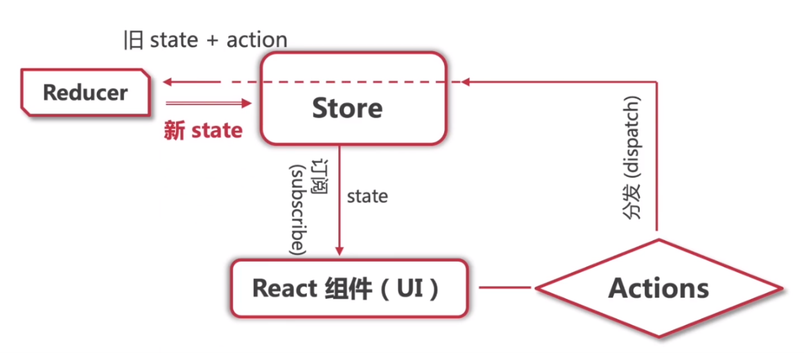

## 初识Redux

### 概念

Redux是一个**状态管理工具**，提供了**可追踪可预测**的功能

Rexdux虽然以**Re**开头，但Redux不是React技术栈专有的，并不是与Recat绑定使用的，Redux很单纯就是一个状态管理工具，它也可以和其他界面库一起使用（如Vue）

### 作用

JavaScript开发的应用程序，已经变得越来越复杂了，需要管理的状态越来越多，这些状态包括

* 服务器返回的数据
* 缓存数据
* 用户操作产生的数据
* UI的状态
* ... 

管理不断变化的状态是非常困难的
* 状态之间相互会存在依赖，一个状态的变化会引起另一个状态的变化，视图页面也可能会引起状态的变化
* 当应用程序复杂时，state在什么时候，因为什么原因而发生了变化，发生了怎么样的变化，会变得非常难以控制和追踪

React是在视图层解决了DOM的渲染过程，但是状态依然需要自己进行管理，所以需要一个专门的状态管理工具，也就是Redux


##  Redux核心概念

### store

| 项   | 说明                                             |
| ---- | ------------------------------------------------ |
| 概念 | Redux中store是存储数据state的地方                |
| 特点 | 推荐使用单一数据源，外界不能直接接触和操作 store |

### action

| 项    | 说明                                                         |
| ----- | ------------------------------------------------------------ |
| 概念  | action是一个普通的JavaScript对象，拥有`type`和`payload`两个属性，用来描述更新操作的type和payload |
| 作用  | Redux中如果想要更新数据，则必须通过派发（dispatch）action来更新 |
| 意义  | 强制使用action好处是可以清晰的知道数据到底发生了什么样的变化，使所有的数据变化都是**可跟追可预测**的 |
| 技巧1 | 每个action的type最好定义为常量，并且使用常量                 |
| 技巧2 | 可以定义action的工厂方法，用来产生相似的action，而不用每次都显式定义，方便维护和管理 |

示例代码

```js
// action的type定义为常量
const ADD_FRIEND = "ADD_FRIEND";
const INC_AGE = "INC_AGE";
const CHANGE_NAME = "CHANGE_NAME";

// 定义普通的action对象
const action1 = {
    type: ADD_FRIEND, // 使用常量，而不是直接写字符串
    payload: {
        name: "alice",
        age: 20
    }
};

const action2 = {
	type: INC_AGE, // 使用常量，而不是直接写字符串
    payload: {
        index: 0
    }
};

const action3 = {
    type: CHANGE_NAME, // 使用常量，而不是直接写字符串
    payload: {
        index: 0,
        newName: "lucy"
    }
};

// 建议创建并使用action_creator
function action1Creator() {
    return {
        type: ADD_FRIEND, // 使用常量，而不是直接写字符串
        payload: {
            name: "alice",
            age: 20
        }
    };
}

function action2Creator() {
    return {
        type: INC_AGE, // 使用常量，而不是直接写字符串
        payload: {
            index: 0
        }
    };
}

function action3Creator() {
    return {
        type: CHANGE_NAME, // 使用常量，而不是直接写字符串
        payload: {
            index: 0,
            newName: "lucy"
        }
    };
}

const actionOne = action1Creator();
const actionTwo = action2Creator();
const actionThree = action3Creator();
```

### reducer

| 项   | 说明                                                         |
| ---- | ------------------------------------------------------------ |
| 概念 | 一个定义了如何操作数据的函数                                 |
| 作用 | 派发action到Redux中，Redux根据action的type和payload，去reducer中调用相应的处理方法更新数据 |
| 特点 | Redux中的state的操作，必须通过reducer完成，**包括创建state，只不过创建state的action不是我们自己派发的，而是Redux内部派发的** |
| 要求 | Redux要求reducr必须是纯函数，即固定输入有固定输出，且无副作用 |
| 本质 | reducer实际做的就是将传入的state和action结合起来生成一个新的state，然后用它来更新Redux中的数据 |
| 技巧 | 为了保证reducer的纯函数特性，所以不能直接修改传入的state，而是要创建state的副本，这时可以使用Rest展开来实现 |

#### 初始化store

初始化时会dispath一个为`{type:"@@INIT"}`的action，dispath后会调用自己的reducer方法去处理，获得state，然后更新state

#### reducer函数要求

* 参数：(previousState，action)
* 返回值：一个新state

```js
function reducer(previousState, action) {
    return newState;
}
```

#### 示例代码

```js
function reducer(state = initialState, action) {
    switch (action.type) {
        case "ADD_FRIEND":
            return { ...state, friends: [...state.friends, action.payload.info] };
        case "INC_AGE":
            return {
                ...state, friends: state.friends.map((item, index) => {
                    if (index === action.payload.index) {
                        return { ...item, age: item.age + 1 };
                    }
                    return item;
                });
            }
        case "CHANGE_NAME":
            return {
                ...state, friends: state.friends.map((item, index) => {
                    if (index === action.index) {
                        return { ...item, name: action.newName };
                    }
                    return item;
                });
            }
        default:
            return state; // 用于创建state
    }
}
```

### 三者关系示意图


### Redux工作流




## Redux三大原则

### 单一数据源

* 整个应用程序的state被存储在一颗`Object Tree`中，并且这个`Object Tree`只存储在一个 store 中
* Redux并**没有强制**让我们不能创建多个store，但是那样做并不利于数据的维护
* 单一的数据源可以让整个应用程序的state变得方便维护、追踪、修改

### State是只读的

* 唯一更新state的方法一定是触发action，然后Redux内部通过reducer完成更新
* 不要试图在其他地方通过任何的方式来修改State
* 这样就确保了视图或网络请求都不能直接修改state，它们只能通过action来描述自己想要如何修改state
* 这样可以保证所有的修改都被集中化处理，并且Redux内部按照严格的顺序来执行，所以不需要担心race condition（竟态）的问题

### 使用纯函数来执行修改

* 通过reducer将 旧state和 actions联系在一起，并且返回一个新的State
* 随着应用程序复杂度增加，我们可以将reducer拆分成多个小的reducers，分别操作不同state tree的一部分
* 但是所有的reducer都应该是纯函数，不能产生任何的副作用


## Redux API

| API                                                     | 参数                                 | 返回值       | 说明                                                   |
| ------------------------------------------------------- | ------------------------------------ | ------------ | ------------------------------------------------------ |
| redux.createStore(reducer, initialState, storeEnhancer) | reducer, initialState, storeEnhancer | store        | 接收reducer, initialState, storeEnhancer 创建store     |
| store.subscribe(()=>{})                                 | 回调函数                             | 取消定义函数 | 订阅回调函数，当state更新时，Redux会自动执行订阅的函数 |
| store.dispatch(action)                                  | action                               | action       | 用于向Redux中派发action                                |
| store.getState()                                        | 无                                   | state        | 用于获取Redux中的state                                 |


## 使用案例

### 创建项目

```shell
npm init
# OR
yarn init -y
```

### 添加Redux依赖

```shell
npm install redux --save
# OR
yarn add redux
```

### 导入Redux

```js
const redux = require("redux");
```

### 案例1-基本使用

```js
// 导入redux库
const redux = require("redux");

// 创建数据源（state）
const initState = {
    counter: 0
}

// 定义reducer
function reducer(state = initState, action) {
    switch (action.type) {
        case "INCREMENT":
            return {...state, counter: state.counter + 1} // 技巧：后面的覆盖前面的
        case "DECREMENT":
            return {...state, counter: state.counter - 1} // 技巧：后面的覆盖前面的
        case "ADD_NUMBER":
            return {...state, counter: state.counter + action.num} // 技巧：后面的覆盖前面的
        case "SUB_NUMBER":
            return {...state, counter: state.counter - action.num} // 技巧：后面的覆盖前面的
        default:
            return state;
    }
}

// 创建store：需要使用 redcuer 来创建
const store = redux.createStore(reducer)

// 定义actions
const action1 = { 
	type: "INCREMENT",
}

const action2 = {
    type: "DECREMENT",
}

const action3 = {
    type: "ADD_NUMBER",
    num: 5
}

const action4 = {
    type: "SUB_NUMBER",
    num: 5
}

// 订阅store的修改
store.subscribe(() => {
    console.log("counter: " + store.getState().counter)
})

// 派发action
store.dispatch(action1);
store.dispatch(action2);
store.dispatch(action3);
store.dispatch(action2);
store.dispatch(action2);
store.dispatch(action4);
```

### 案例2-拆分文件

#### index.js

```js
import redux from "redux";
import reducer from "./reducer.js";

const store = redux.createStore(reducer);

export default store;
```

#### action_type.js

```js
export const ADD_NUMBER = "ADD_NUMBER";
export const SUB_NUMBER = "SUB_NUMBER";
export const INC_NUMBER = "INC_NUMBER";
export const DEC_NUMBER = "DEC_NUMBER";
```

#### action_creator.js

```js
import {
    ADD_NUMBER,
    SUB_NUMBER,
    INC_NUMBER,
    DEC_NUMBER
} from "./action_type.js"

// 箭头函数简写
export const addAction = num => ({
    type: ADD_NUMBER,
    num
})

export const subAction = num => ({
    type: SUB_NUMBER,
    num
})

export const incAction = () => ({
    type: INC_NUMBER
})

export const decAction = () => ({
    type: DEC_NUMBER
})
```

#### reducer.js

```js
import {
    ADD_NUMBER,
    SUB_NUMBER,
    INC_NUMBER,
    DEC_NUMBER
} from "./action_type.js"

const initState = {
    counter: 0
}

function reducer(state = initState, action) {
    switch (action.type) {
        case ADD_NUMBER:
            return {...state, counter: state.counter + action.num}
        case SUB_NUMBER:
            return {...state, counter: state.counter - action.num}
        case INC_NUMBER:
            return {...state, counter: state.counter + 1}
        case DEC_NUMBER:
            return {...state, counter: state.counter - 1}
        default:
            return state;
    }
}

export default reducer;
```

#### main.js

```js
import store from "./store/index.js";

const unsubscribe = store.subscribe(() => {
    console.log(store.getState());
})

store.dispatch();

unsubscribe(); // 取消订阅
```

