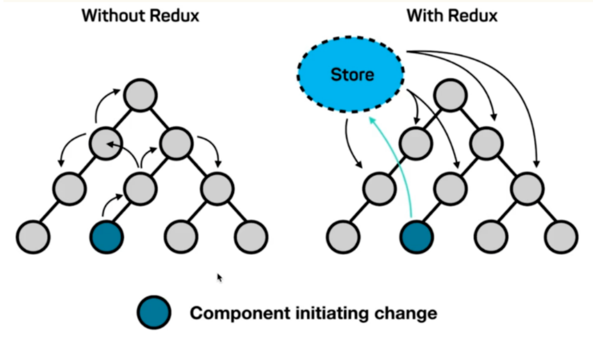
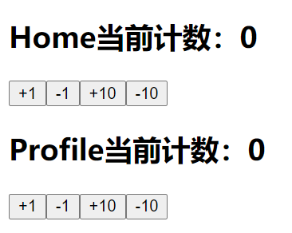

## React为啥需要Redux

### 需求

因为react是单向数据流，所以在组件树中，一个组件想要访问到组件树中另外一个组件的值，则需要在这两个组件的上层组件中都设置传值和函数，哪怕上层组件中根本不需要这个值

这会造成视图层和状态层耦合 ，状态管理失控

### 解决方案

redux的理念是创建一个唯一的全局对象(store)，应用中全部数据存储在这个对象中，且组件树中每个组件都可以直接访问到该对象




## React中使用Redux

### 目录结构

Redux在React中的目录结构一般如下

```js
|- src
  |- store
    |- index.js           // 定义和导出store
    |- reducer.js         // 用于定义reducer
    |- action_creator.js  // 用于定义action_creator
    |- action_type.js     // 用于定义action_type
  |- index.js
```

### 使用步骤

一般想在React中使用Redux，需要以下的步骤

#### 定义store

1. 定义好action_type常量
2. 使用action_type常量，定义好action_creator
3. 使用action_type常量，定义好reducer
4. 使用reducer，创建并导出store

#### 使用store

1. 组件在加载时`CompoenentDidMount`使用`store.subscribe`订阅store，获取`unscribe`函数
2. 组件在卸载时使用`unscribe`函数取消订阅store
3. 组件在使用过程中使用`store.getStore`获取state
4. 组件在使用过程中使用`store.dispatch`


## 使用案例

### 效果图

Home组件和Profile组件共享同一个Redux中的数据，一改全改



### 目录结构

```js
|- src
  |- store
    |- index.js           // 定义和导出store
    |- reducer.js         // 用于定义reducer
    |- action_creator.js  // 用于定义action_creator
    |- action_type.js     // 用于定义action_type
  |- index.js             // 根组件
  |- Home.jsx             // Home组件
  |- Profile.jsx          // Profile组件
```

### src/store/action_type.js

```js
export const ADD_NUMBER = "ADD_NUMBER";

export const SUB_NUMBER = "SUB_NUMBER";

export const ADD_TEN = "ADD_TEN";

export const SUB_TEN = "SUB_TEN";
```

### src/store/action_creator.js

```js
import {
  ADD_NUMBER,
  SUB_NUMBER,
  ADD_TEN,
  SUB_TEN
} from "./action_type.js";

export const createActionAddNumber = () => ({ type: ADD_NUMBER });

export const createActionSubNumber = () => ({ type: SUB_NUMBER });

export const createActionAddTen = () => ({ type: ADD_TEN });

export const createActionSubTen = () => ({ type: SUB_TEN });
```

### src/store/reducer.js

```js
import {
  ADD_NUMBER,
  SUB_NUMBER,
  ADD_TEN,
  SUB_TEN
} from "./action_type.js";

const initState = { num: 0 };

export default function reducer(state = initState, action) {
  switch (action.type) {
    case ADD_NUMBER:
      return { ...state, num: state.num + 1 };
    case SUB_NUMBER:
      return { ...state, num: state.num - 1 };
    case ADD_TEN:
      return { ...state, num: state.num + 10 };
    case SUB_TEN:
      return { ...state, num: state.num - 10 };
    default:
      return state;
  }
}
```

### src/store/index.js

```js
import { createStore } from "redux";
import reducer from "./reducer.js";

const store = createStore(reducer);

export {
  store
}
```

### src/index.jsx

```jsx
import React from 'react';
import ReactDOM from 'react-dom';

import Home from "./Home.jsx";
import Profile from "./Profile.jsx";

function App() {
  return [<Home />, <Profile />];
}

ReactDOM.render(
  <App />,
  document.getElementById('root')
);
```

### src/Home.jsx

```jsx
import React from "react";

import { store } from "./store/index.js";
import {
  createActionAddNumber,
  createActionSubNumber,
  createActionAddTen,
  createActionSubTen
} from "./store/action_creator.js";

export default class Home extends React.Component {
  constructor(props) {
    super(props);
    this.state = {
      num: 0
    };
  }

  render() {
    return (
      <React.Fragment>
        <h2>Home当前计数：{this.state.num}</h2>
        <button onClick={() => this.addNumber()}>+1</button>
        <button onClick={() => this.subNumber()}>-1</button>
        <button onClick={() => this.addTen()}>+10</button>
        <button onClick={() => this.subTen()}>-10</button>
      </React.Fragment>
    );
  }

  componentDidMount() {
    this.unsubscribe = store.subscribe(() => {
      this.setState({
        num: store.getState().num
      });
    });
  }

  componentWillUnmount() {
    this.unsubscribe();
  }

  addNumber() {
    store.dispatch(createActionAddNumber());
  }

  subNumber() {
    store.dispatch(createActionSubNumber());
  }

  addTen() {
    store.dispatch(createActionAddTen());
  }

  subTen() {
    store.dispatch(createActionSubTen());
  }
}
```

### src/Profile.jsx

```jsx
import React from "react";

import { store } from "./store/index.js";
import {
  createActionAddNumber,
  createActionSubNumber,
  createActionAddTen,
  createActionSubTen
} from "./store/action_creator.js";

export default class Profile extends React.Component {
  constructor(props) {
    super(props);
    this.state = {
      num: 0
    };
  }

  render() {
    return (
      <React.Fragment>
        <h2>Profile当前计数：{this.state.num}</h2>
        <button onClick={() => this.addNumber()}>+1</button>
        <button onClick={() => this.subNumber()}>-1</button>
        <button onClick={() => this.addTen()}>+10</button>
        <button onClick={() => this.subTen()}>-10</button>
      </React.Fragment>
    );
  }

  componentDidMount() {
    this.unsubscribe = store.subscribe(() => {
      this.setState({
        num: store.getState().num
      });
    });
  }

  componentWillUnmount() {
    this.unsubscribe();
  }

  addNumber() {
    store.dispatch(createActionAddNumber());
  }

  subNumber() {
    store.dispatch(createActionSubNumber());
  }

  addTen() {
    store.dispatch(createActionAddTen());
  }

  subTen() {
    store.dispatch(createActionSubTen());
  }
}
```
