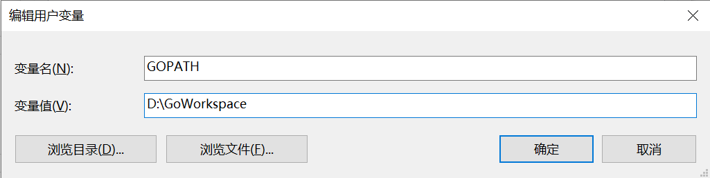
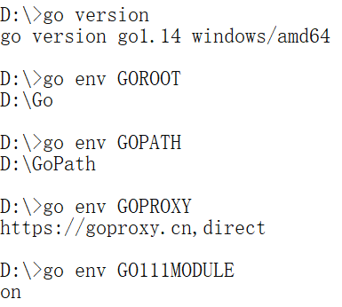

## 下载

[官方下载地址 ](https://golang.org/dl/)（需科学上网）

[镜像下载地址](https://golang.google.cn/dl/)


## 安装

### Windows平台

运行安装程序，选择好安装路径，安装即可


### Mac系统

运行安装程序，选择好安装路径，安装即可

### Linux系统

下载好`tar.gz`压缩包后，运行`tar -zxvf go1.14.linux-amd64.tar.gz`命令将其解压到合适的目录即可


## 环境变量

一共需要按顺序设置五个环境变量`GOROOT`，`GOPATH`，`PATH`，`GOPROXY` 和 `GO111MODULE`

### GOROOT

作用：让系统知道`Go`安装在哪里

设置：指定 `Go` 的安装目录路径


### GOPATH

作用：让系统知道用户自定义的工作目录在哪里

设置：指定工作区的路径，即自定义工作目录



### PATH

作用：能在任何路径下使用`Go`命令行工具

设置：添加 `$GOROOT/bin` 到 `PATH` 环境变量中


### GOPROXY

作用：设置镜像地址，加速`Go`包的下载

注意：可以同时设置多个代理地址，它们使用逗号进行分隔，其中`direct`是特殊的代理地址，表示源站，即不使用镜像地址

设置：在终端中运行下列命令即可完成设置

```shell
go env -w GOPROXY=https://goproxy.cn,direct
```

### GO111MODULE

作用：该环境变量表示`Go Module`的启用模式

设置：在终端中运行下列命令即可完成设置，推荐使用`on`模式，具体含义及其他值查看文章

```shell
go env -w GO111MODULE=on
```

### 检查

五个环境变量设置完成后，打开终端，运行下列命令检查环境变量是否设置成功

```shell
go version # 检查PATH
go env GOROOT # 检查GOROOT
go env GOPATH # 检查GOPATH
go env GOPROXY # 检查GOPROXY
go env GO111MODULE # 检查GO111MODULE
```

