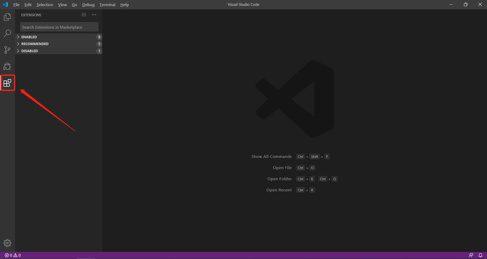
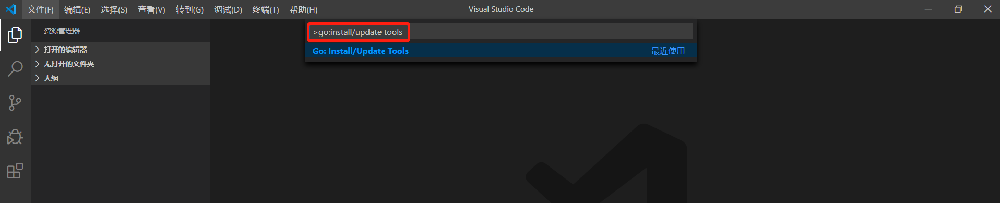
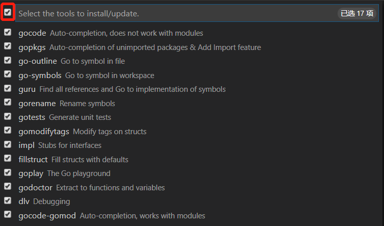
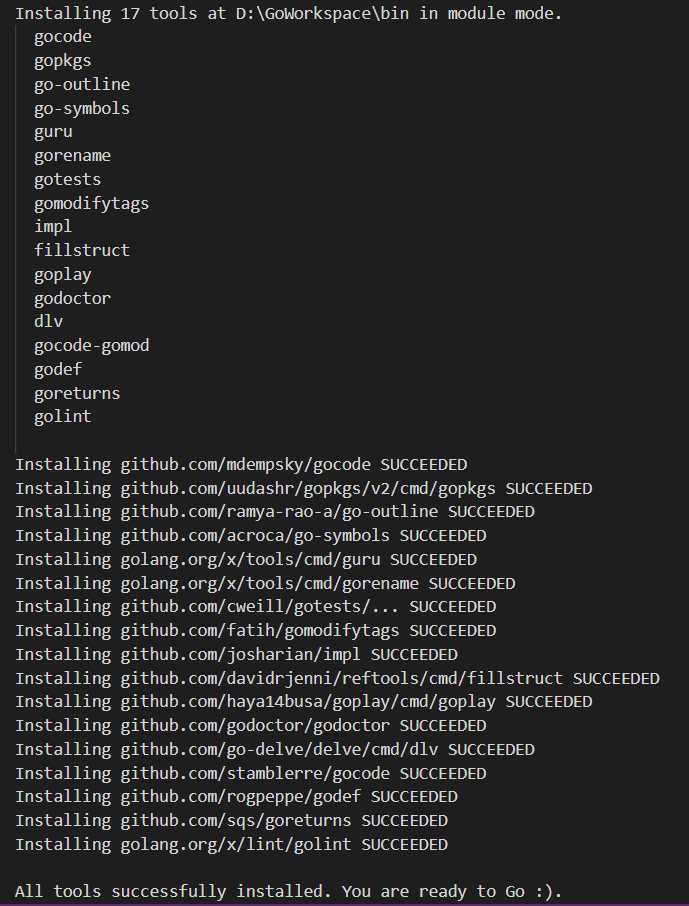
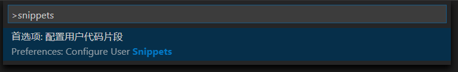

## 下载

[官方下载地址 ](https://golang.org/dl/)（需科学上网）

[镜像下载地址](https://golang.google.cn/dl/)


## 安装

### Windows平台

运行安装程序，选择好安装路径，安装即可


### Mac系统

运行安装程序，选择好安装路径，安装即可

### Linux系统

下载好`tar.gz`压缩包后，运行`tar -zxvf go1.14.linux-amd64.tar.gz`命令将其解压到合适的目录即可


## 环境变量

### 概述

一共需要按顺序设置五个环境变量`GOROOT`，`GOPATH`，`PATH`，`GOPROXY` 和 `GO111MODULE`

### GOROOT

作用：让系统知道`Go`安装在哪里

设置：指定 `Go` 的安装目录路径


更简单的方式

```shell
go env -w GOROOT=D:\Go
```

### GOPATH

作用：让系统知道用户自定义的工作目录在哪里

设置：指定工作区的路径，即自定义工作目录


更简单的方式

```shell
go env -w D:\GoWorkspace
```

### PATH

作用：能在任何路径下使用`Go`命令行工具

设置：添加 `$GOROOT/bin` 到 `PATH` 环境变量中


### GOPROXY

作用：设置镜像地址，加速`Go`包的下载

注意：可以同时设置多个代理地址，它们使用逗号进行分隔，其中`direct`是特殊的代理地址，表示源站，即不使用镜像地址

设置：在终端中运行下列命令即可完成设置

```shell
go env -w GOPROXY=https://goproxy.cn,direct
```

### GO111MODULE

作用：该环境变量表示`Go Module`的启用模式

设置：在终端中运行下列命令即可完成设置，推荐使用`on`模式，具体含义及其他值查看文章

```shell
go env -w GO111MODULE=on
```

### 检查

五个环境变量设置完成后，打开终端，运行下列命令检查环境变量是否设置成功

```shell
go version # 检查PATH
go env GOROOT # 检查GOROOT
go env GOPATH # 检查GOPATH
go env GOPROXY # 检查GOPROXY
go env GO111MODULE # 检查GO111MODULE
```


## 开发工具 VS Code

### 下载

[下载地址](https://code.visualstudio.com/)


### 安装

对于`Windows`，`Mac OS`，`Linux `都是运行安装程序即可完成安装

### 插件配置

#### 配置中文插件

打开插件面板



搜索 `chinese`，选择`中文(简体)`点击 `install`，等待插件安装完成后重启 `VSCode` 即可


#### 配置 Go 插件

点击工具栏的`查看 -> 命令面板`，打开命令面板，然后输入 `go:install/update tools` 按回车



点击左侧的按钮，选择全部工具后按回车进行安装



安装前必须配置好环境变量`GOPROXY`，否则可能会安装失败



### VSCode 代码片段配置

点击工具栏的`查看 -> 命令面板`，打开命令面板，然后输入 `snippets` 按回车



选择 `go` 选项


`键名` : 这个代码片段的名称

`prefix` : 快捷短语

`body` : 代码片段

`description` : 这个代码片段的介绍

`${number}` : 表示插入光标的位置

### 示例如下

```json
{
  "println":{
    "prefix": "pln",
    "body":"fmt.Println($0)",
    "description": "println"
  },
  "printf":{
    "prefix": "plf",
    "body": "fmt.Printf(\"$0\")",
    "description": "printf"
  }
}
```

