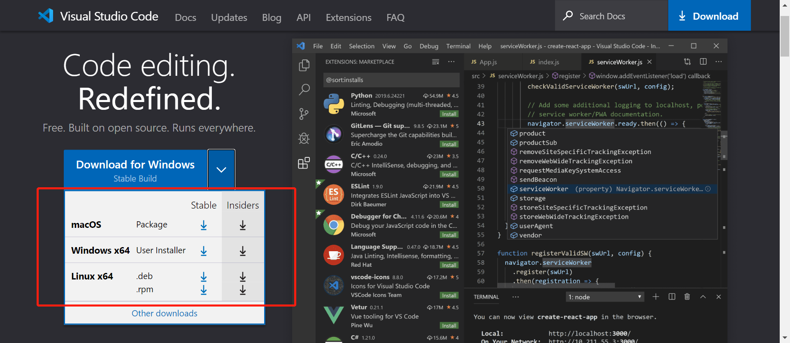
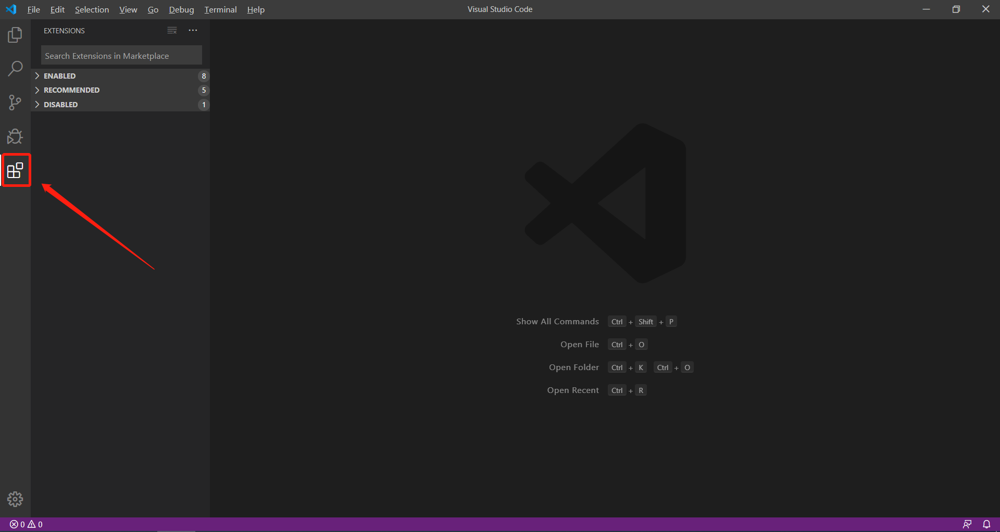
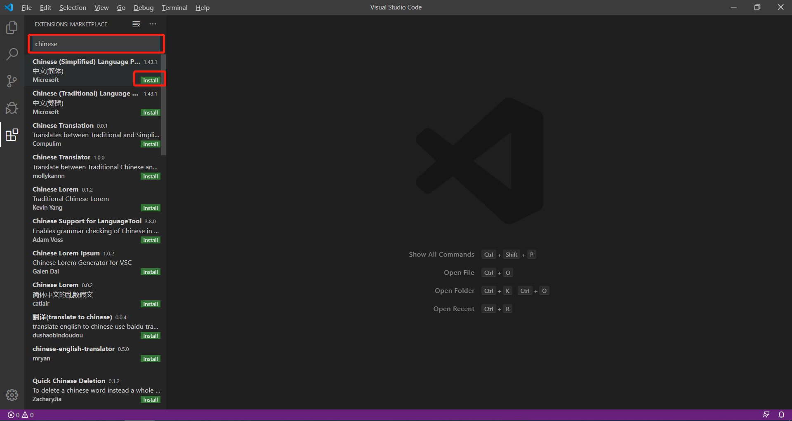
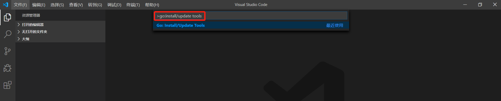
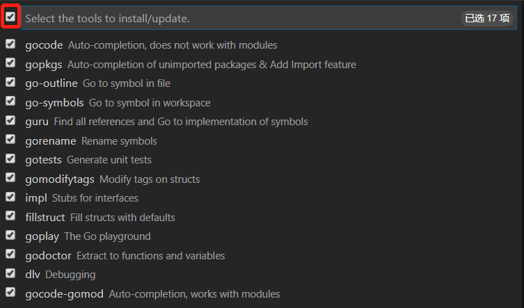
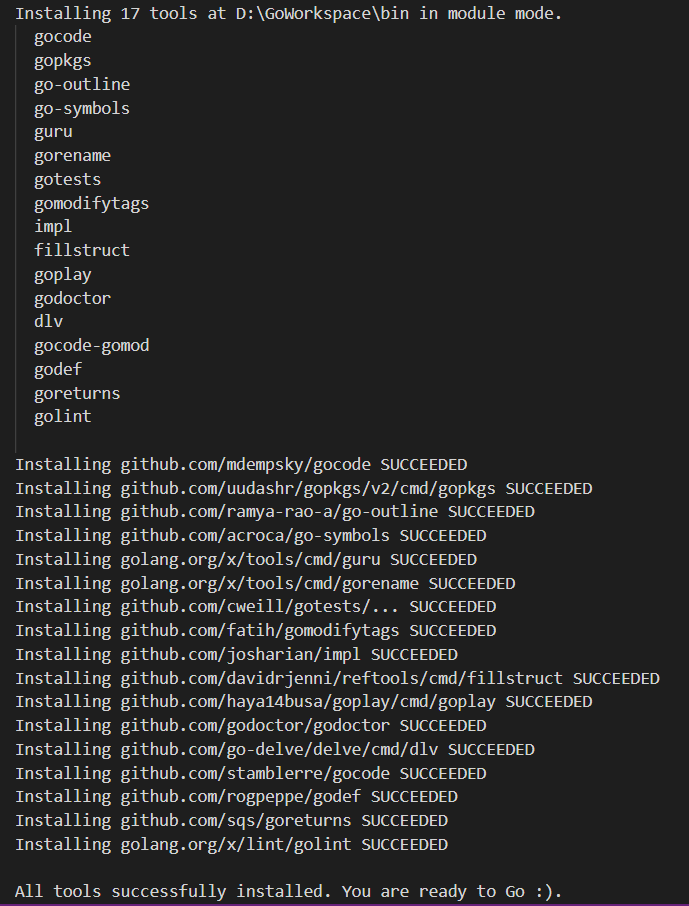
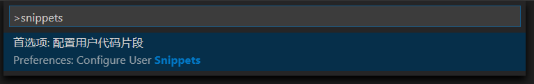
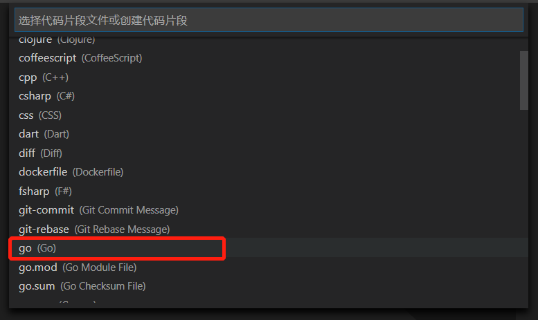
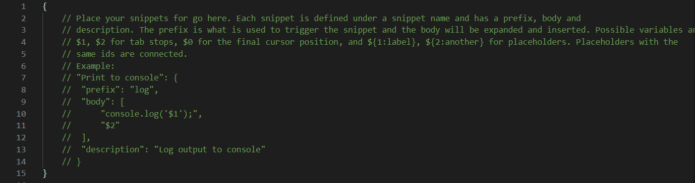

## VSCode下载与安装

### 下载

[下载地址](https://code.visualstudio.com/)



### 安装

对于`Windows`，`Mac OS`，`Linux `都是运行安装程序即可完成安装


## VSCode 插件配置

### 配置中文插件

打开插件面板



搜索 `chinese`，选择`中文(简体)`点击 `install`，等待插件安装完成后重启 `VSCode` 即可




### 配置 Go 插件

点击工具栏的`查看 -> 命令面板`，打开命令面板，然后输入 `go:install/update tools` 按回车



点击左侧的按钮，选择全部工具后按回车进行安装



安装前必须配置好环境变量`GOPROXY`，否则可能会安装失败




## VSCode 代码片段配置

点击工具栏的`查看 -> 命令面板`，打开命令面板，然后输入 `snippets` 按回车



选择 `go` 选项





`键名` : 这个代码片段的名称

`prefix` : 快捷短语

`body` : 代码片段

`description` : 这个代码片段的介绍

`${number}` : 表示插入光标的位置

### 示例如下

```json
{
  "println":{
    "prefix": "pln",
    "body":"fmt.Println($0)",
    "description": "println"
  },
  "printf":{
    "prefix": "plf",
    "body": "fmt.Printf(\"$0\")",
    "description": "printf"
  }
}
```

