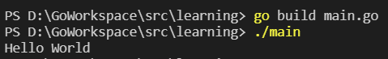

## 注释

### 行注释

```go
// 这是行注释
```

### 块注释

```go
/*
  这是块注释1
  这是块注释2
  这是块注释3
*/
```


## Go程序基础结构

> main.go

```go
// 每个go源文件都需要指定它所属的包名
// 如果包名是main，表示该文件含有main函数，编译后可以运行
// 如果包名不是main，表示该文件编译后不可直接运行，而是用作库
package main 

// 导入包
import "fmt" 

// 函数外只能是变量的声明和定义，不能是其他语句
var num int = 10
// fmt.Println(num) // error

// go程序入口函数
func main() { 
  fmt.Println("Hello World") // 在终端进行打印
}
```


## 编译

在编写好 `Go` 源文件后，需要进行编译

```shell
go build [源文件名]
```

运行可执行文件

```shell
./[源文件名]
```




## 标识符

`Go` 中标识符只能含有 `_`，数字和字母，且只能以 `_`或字母开头，不能以数字开头

单独的 `_` 是一个特殊符号，不能用过标识符

首字母大写是公有，首字母小写是私有

注意：标识符可以是完全中文的，但不推荐使用

```go
var 姓名 string // 语法上可行，但不推荐使用

func main() {
  称呼 := "小明" // 语法上可行，但不推荐使用
}
```


## 关键字

关键字是指编程语言中预先定义好的具有特殊含义的标识符，用户不能使用保留字作为标识符

```go
break        default      func         interface    select
case         defer        go           map          struct
chan         else         goto         package      switch
const        fallthrough  if           range        type
continue     for          import       return       var
```


## 保留字

保留字是指编程语言中保留的标识符，它们目前还不是关键字，但以后可能会成为关键字，所以不建议用户使用保留字作为标识符

```go
// Constants:    
true  false  iota  nil

// Types:    
int  int8  int16  int32  int64  
uint  uint8  uint16  uint32  uint64  uintptr
float32  float64  complex128  complex64
bool  byte  rune  string  error

// Functions:   
make  len  cap  new  append  copy  close  delete
complex  real  imag
panic  recover
```