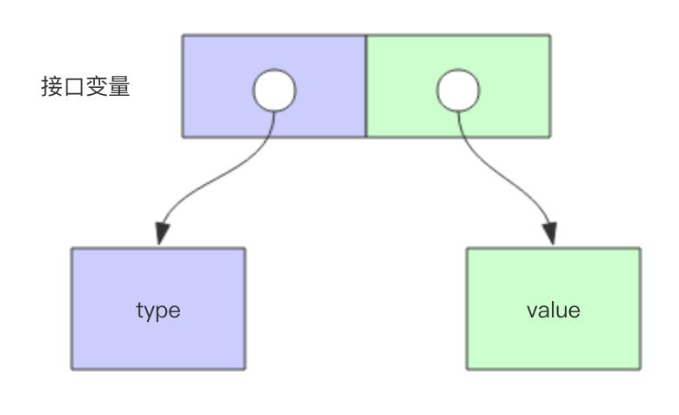
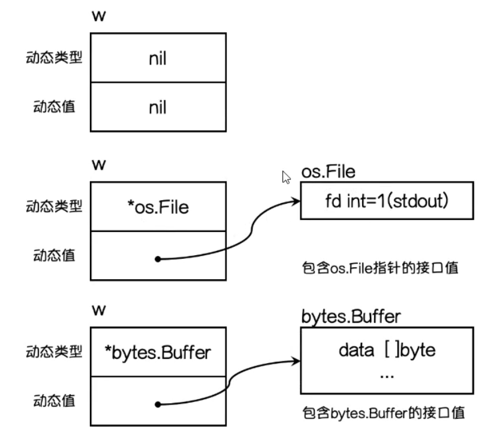

## 初识接口

### 接口是什么

接口是一种类型，其用于定义规范、协议

### 接口思考

> 鸭子类型：当看到一只鸟走起来像鸭子，游泳起来像鸭子，叫起来像鸭子，那这只鸟就可以被称为鸭子类型

Go语言的接口（proto协议）设计是参考了鸭子类型（python）和Java的接口，可以将Go的接口看作协议，更加类似Python中的鸭子类型

Go通过接口/鸭子类型实现多态，即结构体（实现封装+继承）和接口（实现多态）能够模拟出面向对象的用法

### 接口定义

```go
type 接口名 interface {
  方法名1(参数列表) (返回值列表)
  方法名2(参数列表) (返回值列表)
  ...
  方法名n(参数列表) (返回值列表)
  其他接口名1
  其他接口名2
  ...
  其他接口名n
}
```

### 实现接口

接口是隐式实现的，一个类型只要实现了接口的所有方法，则该类型实现了该接口，并不需要显式说明

### 接口嵌套(接口组合)

接口中除了可以定义方法签名外，还可以嵌套别的接口（也称为接口组合）

```go
type mover interface {
  move()
}

type eater interface {
  eat()
}
 
type animal interface {
  mover
  eater
}
```

### 空接口

`Go`存在空接口，空接口没必要起名

```go
// 写法1
func main() {
    var i interface{}
}

// 写法2
type EmptyInterface interface{}

func main() {
    var i EmptyInterface
}
```

特点：所有类型都实现了空接口，即`interface{}`类型变量能够接收任何其他类型的值

类比：空接口作用类似于`JAVA`中的`Object`类型


## 接口关系

## 接收者和接口关系

| 关系                   | 说明                                           |
| ---------------------- | ---------------------------------------------- |
| 使用值接收者实现接口   | 接口类型既能存结构体类型和也能存结构体指针类型 |
| 使用指针接收者实现接口 | 接口类型只能存结构体指针                       |

## 接口和类型的关系

一个类型可以实现多个接口

一个接口可以被多个类型实现


## 接口类型底层

### 存储结构

接口类型分为两部分：Type(动态类型) 指针和 Value(动态值)指针，这样就能够让接口变量存储不同的值





### 类型断言

类型断言用于接口的类型断言（类似于 TS 中的类型保护）

```go
func print(x interface{}) {
    v, ok := x.(int)
    
    if ok {
        fmt.Printf("%d", v)
    }
}

switch v := x.(type) {
    case string:
	case int:
}
```


## type关键字总结

| 作用                             | 说明                                |
| -------------------------------- | ----------------------------------- |
| 定义一个类型的别名               | type myByte = byte<br/>var b myByte |
| 基于一个已有类型定义一个新的类型 | type myInt int<br/>var i myInt      |
| 定义结构体                       | type Course struct {}               |
| 定义接口                         | type Callable interface {}          |

