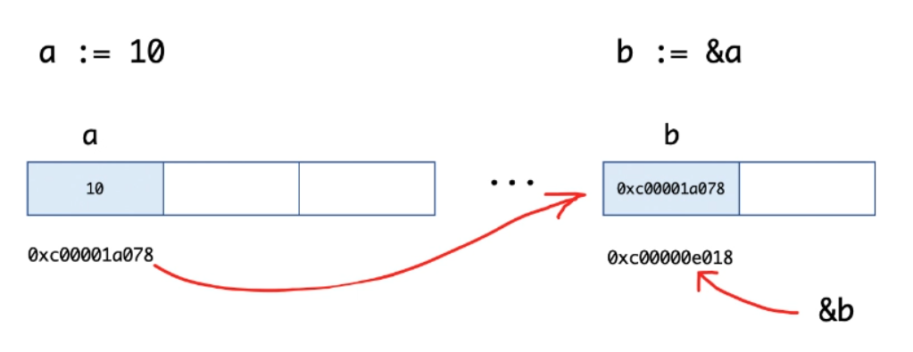

## 指针类型

### 概述

指针类型，用于存储内存地址

指针类型默认值为nil

`Go`中，指针只支持取地址和解引用两种操作，不能进行其他的操作，如指针的运算



### 获取变量的地址【取地址】

用 `&` 运算符

```go
var a int = 10
var b *int = &a
```

### 访问指针类型指向空间【解引用】

用 `*` 运算符，指针空值类型是 `nil` ，而不是 `null`

```go
fmt.Println(*b)
```

### 指针不支持

不支持 `->`，一律用 `.`

不支持指针运算，既不能相加，相减

### 语法糖

`Go`中，指针支持自动解引用和自动取地址的操作

go能够自动解指针和自动取地址的原因是因为：Go中的指针是受限的