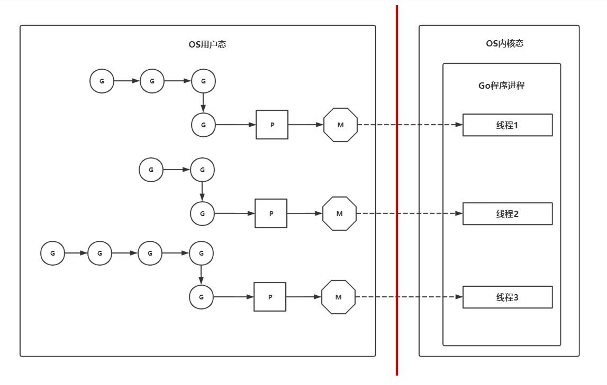
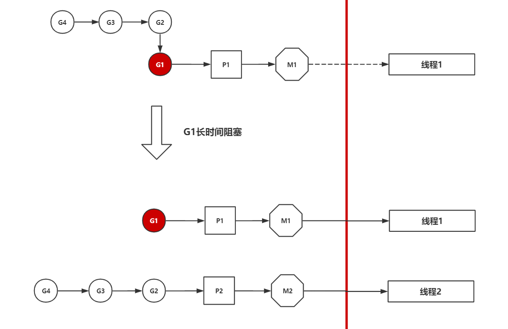

## goroutine

### 概述

`goroutine`一般称为`协程`，功能类似操作系统的线程，属于`OS`中的`用户级线程`

### 特点

#### 轻量级"线程"

因为 `goroutine` 是 `runtime` 在用户态层面创建的线程，且它的默认占用大小为`2KB`，而`OS`的线程默认占用大小大概为`2MB`，所以不同于其他的语言，`Go` 能同时创建很多个 `goroutine`

#### goroutine性能高

因为`goroutine`是用户级别的线程，所以对`goroutine`的操作（创建，切换，销毁等）属于用户态的操作，不涉及用户态与内核态转换的过程，所以 `goroutine` 性能高

#### "非"抢占式调度

在Go1.14之前，goroutine是非抢占式调度，由协程主动交出控制权，即下列代码是死循环

```go
func main() {
    var a [10]int
    
    for i := 0; i < 10; i++ {
        go func(i int) {
            for {
                a[i]++ // 由于非抢占式，所以一直卡在这里
            }
        }(i)
    }
}
```

在Go1.14之后，goroutine是抢占式调度，即上面的代码不会卡住了

非抢占式会带来了一个坑（就是上面的程序有可能死循环），不过在Go1.14之后这个坑被填了

### 使用

#### 普通使用

创建一个 `goroutine` 非常简单，只要使用关键字`go` 后跟要执行的函数（任务）即可

一个 `goroutine` 必定对应一个函数的调用

```go
package main

import (
  "fmt"
  "time"
)

func job() {
  fmt.Println("这是一个新的goroutine")
}

func main() {
  go job() // 启动一个新的 goroutine 去执行函数(任务) job
  time.Sleep(time.Second) // 之后会解释为什么需要睡眠
  fmt.Println("完成")
}
```

#### 使用匿名函数

一个`goroutine`对应一个函数，而该函数可以是`匿名函数`

```go
package main

import (
  "fmt"
  "time"
)

func main() {
  // 启动一个新的 goroutine 去执行匿名函数(任务)
  go func() {
    fmt.Println("匿名函数：这是一个新的goroutine")
  }()
  
  time.Sleep(time.Second) // 之后会解释为什么需要睡眠
  fmt.Println("完成")
}
```

#### 交出控制权

方式1：使用IO操作

```go
go func() {
    fmt.Println("Hello goroutine")
}()
```

方式2：使用runtime

```go
go func() {
    runtime.Gosched()
}()
```

### 主死随从

#### 需求场景

把示例代码中的`time.Sleep`去除后执行

```go
package main

import (
  "fmt"
  "time"
)

func main() {
  // 启动一个新的 goroutine 去执行匿名函数(任务)
  go func() {
    fmt.Println("匿名函数：这是一个新的goroutine")
  }()
  
  // time.Sleep(time.Second) // 这里去除了time.Sleep
  fmt.Println("完成")
}
```

执行后输出为

```go
完成
```

#### 问题

为什么`"匿名函数：这是一个新的goroutine"`这段话不会被打印？

#### 解释

这是因为`main`函数本身处于一个`goroutine`中，该`goroutine`称为`main goroutine`，程序在执行`main`函数时，`Go`的`runtime`会创建`main goroutine`，让`main`函数执行在这个`main goroutine`中

而`main goroutine`有一个很重要特点：**当`main goroutine`结束时，其他的`goroutine`会被销毁**

也就是说语句`fmt.Println("匿名函数：这是一个新的goroutine")` 还没执行时，`main goroutine` 就已经结束，该语句所属的`goroutine`也被销毁了，所以就不会进行打印了

#### 原理

这是因为`goroutine`是用户态的线程，它们的资源归属于程序进程的，所以当`main goroutine`结束时，程序的进程会被销毁，`OS` 会回收该程序的所有资源，所以其他的`goroutine` 也会被销毁

#### 协程同步

为了避免`main goroutine`结束导致其他`goroutine`还没执行完的问题，需要进行协程的同步

| 方式                               | 说明                                                         |
| ---------------------------------- | ------------------------------------------------------------ |
| 使用睡眠（**很不可行的方法**）     | 可以让协程进行睡眠，从而达到协程同步的问题<br />但这种方案有个很大的弊端就是无法确定需要睡眠多长时间，而且在睡眠时该goroutine无法执行任何操作，效率太低 |
| 使用`sync.WaitGroup`（**推荐方法** | 详细见文章下文                                               |
| 使用`select`多路复用语句           | 详细见下文`channel`中的内容                                  |

### 常见问题

#### 什么是 goroutine 的泄露？

`goroutine`的泄露指的是：`goroutine`一直阻塞占着系统资源却不执行任务，且因为它占用着资源，所以它不会被`GC`回收

可能发生 `goroutine` 泄露的场景

* 向没有接收者的`channel`写入信息
* 从没有发送者的`channel`中读取信息
* 向 `nil channel` 发送和接收数据

#### goroutine什么时候结束？

当 `goroutine` 封装的函数（任务）执行结束了，该 `goroutine` 就结束了

#### goroutine可能切换的时间点？

1. I/O操作、select
2. channel
3. 等待锁
4. 函数调用（有时）
5. runtime.Gosched

### GMP调度模型

`goroutine` 是用户态的线程，它是由 `Go` 的 `runtime` 来完成调度，而不是由 `OS` 进行调度

`goroutine` 的调度模型称为 `GMP` 调度模型

#### G

含义：`G` 取的是 `goroutine` 的首字母，代表一个任务

功能：`G` 它是对`goroutine`的抽象，是`goroutine`的控制结构，包含了`goroutine`的各种信息，比如下列信息

* `goroutine`的任务对象
* 执行的函数指令和参数
* 协程切换时的上下文信息
* 用于现场保护和现场恢复的寄存器的信息

#### M

含义：`M` 取的是 `Machine` 的首字母，代表一个虚拟线程

功能：`M` 是`Go` 的 `runtime` 对`OS`线程的虚拟

特点：`M` 与内核线程一般是`一一映射`的关系， 每次创建一个`M`的时候，都会有一个底层线程创建，一个 `groutine` 最终是要放到 `M` 上执行的

#### P

含义：`P` 取的是 `Processer` 的首字母，代表一个虚拟处理器

功能：`P` 用于调度 `G` 在 `M` 上的运行

特点：每个 `P`  都管理着一组本地 `G` 队列和全局 `G` 队列，`P` 会对本地`goroutine` 队列进行调度（比如把占用CPU时间较长的`goroutine`暂停，运行后续`goroutine`等等），当自己的队列消费完成后就回去全局队列中取，如果全局队列里也消费完，则会去其他的 `P` 中抢任务执行

设置：`P` 的个数可以通过 `runtime.GOMAXPROCS` 设定的，最大值为 `256`，`Go1.5`版本之后默认为CPU核心数

```go
package main

import "runtime"

func main() {
  runtime.GOMAXPROCS(4) // 设置 P 的个数为 4
  runtime.GOMAXPROCS(runtime.NumCPU()) // 设置 P 的个数为 CPU 核心数
}
```

#### P和M的关系

`P` 和 `M` 也是一一对应的，关系是：`P` 管理着一组 `G` 挂载在 `M` 上运行



#### m:n调度技术

`GMP`调度器使用了名为`m:n`的调度技术，即调度`m`个`goroutine`到`n`个`OS`线程（`m >= n`）

`goroutine` 和 `OS` 线程是多对多关系

#### G阻塞时的操作

当一个 `G` 长时间阻塞在一个 `M` 上时，`runtime` 会新建一个 `M`，阻塞 `G` 所在的 `P` 会把其他的 `G` 挂载在新建的 `M` 上，当原来的 `G` 阻塞完成或认为其已经死亡时，`runtime`会回收旧的`M`




## wait-group

### 概述

`watc-group`用于解决主goroutine在子goroutine结束后自动结束的需求

### 常用API

| API  | 说明                                                  |
| ---- | ----------------------------------------------------- |
| Add  | 添加待执行完毕的子goroutine个数                       |
| Done | 减少待执行完毕的子goroutine个数                       |
| Wati | 阻塞当前goroutine，直到待执行完毕的子goroutine个数为0 |

> Add与Done数量必须相等，否则会出现 deadlock 报错

### 示例代码

```go
package main

import (
	"fmt"
	"sync"
)

var wg sync.WaitGroup

func main() {
	for i := 0; i < 5; i++ {
		wg.Add(1)
		go func(n int) {
			defer wg.Done()
			fmt.Println(n)
		}(i)
	}
	wg.Wait()
}
```


## lock

### 概述

在多线程/协程的模式下，常常存在资源竞争问题，解决资源竞争常用的手段就是加锁解锁

虽然 Go 语言首要推荐的并发编程模式不是加解锁，而是通过channel，但 Go 也提供了锁的机制

### 资源竞争

```go
package main

import (
	"sync"
    "fmt"
)

var total int
var wg sync.WaitGroup

func add() {
    defer wg.Done()
    for i := 0; i < 100000; i++ {
        total += 1
        // 1. 从total中取出值
        // 2. 将total的值+1
        // 3. 将新值放入total中
    }
}

func sub() {
    defer wg.Done()
    for i := 0; i < 100000; i++ {
        total -= 1
        // 1. 从total中取出值
        // 2. 将total的值-1
        // 3. 将新值放入total中
    }
}

func main() {
    wg.Add(2)
    go add()
    go sub()
    wg.Wait()
    fmt.Println(total)
}
```

### 互斥锁

```go
package main

import (
	"fmt"
	"sync"
)

var total int
var wg sync.WaitGroup
var lock sync.Mutex

func add() {
	defer wg.Done()
	for i := 0; i < 100000; i++ {
		lock.Lock()
		total += 1
		lock.Unlock()
		// 1. 从total中取出值
		// 2. 将total的值+1
		// 3. 将新值放入total中
	}
}

func sub() {
	defer wg.Done()
	for i := 0; i < 100000; i++ {
		lock.Lock()
		total -= 1
		lock.Unlock()
		// 1. 从total中取出值
		// 2. 将total的值-1
		// 3. 将新值放入total中
	}
}

func main() {
	wg.Add(2)
	go add()
	go sub()
	wg.Wait()
	fmt.Println(total)
}
```

### 读写锁

读之间不会有影响，写和读之间才会产生影响

```go
package main

import (
	"fmt"
	"sync"
	"time"
)

var wg sync.WaitGroup
var rwlock sync.RWMutex

func read() {
	defer wg.Done()
    
	rwlock.RLock()
    
	fmt.Println("开始读取数据")
	time.Sleep(time.Second)
	fmt.Println("读取成功")
    
	rwlock.RUnlock()
}

func write() {
	defer wg.Done()
    
	rwlock.Lock()
    
	fmt.Println("开始写入数据")
	time.Sleep(3 * time.Second)
	fmt.Println("修改成功")
    
	rwlock.Unlock()
}

func main() {
	wg.Add(6)
    
	for i := 0; i < 5; i++ {
		go read()
	}

	go write()

	wg.Wait()
}
```


## Cond

// TODO


## channel

### 概述

`Go`中秉承的`CSP`并发模型，即主张**通过通信实现共享内存，而不是通过共享内存来实现通信**

`Go`中实现`goroutine`之间通讯的工具是`channel`（`管道`），`channel`是可以让一个`goroutine`发送特定值到另一个`goroutine`的通信机制

`Go`中的`channel`是一种特殊的类型，它类似于队列结构，遵循先入先出的规则，保证收发数据的顺序

### 声明

`channel`是一种引用类型，定义语法如下

``` go
var channel变量名 chan 元素类型
```

示例代码

```go
var ch1 chan int   // 声明一个传递整型的通道
var ch2 chan bool  // 声明一个传递布尔型的通道
var ch3 chan []int // 声明一个传递int切片的通道
```

### 初始化

`channel`是引用类型，默认值是`nil`，则类似于`map`，`channel`需要使用`make`初始化后才能使用

缓冲大小是可选的，如果不设置，则默认为0

```go
make(chan 元素类型, [缓冲大小])
```

示例代码

```go
var ch1 chan int = make(chan int, 10) // 缓冲大小为10
var ch2 chan bool = make(chan bool, 0) // 缓冲大小为0
var ch3 chan string = make(chan string) // 缓冲大小为0
```

### 有/无缓冲channel

| channel类型     | 说明                                                         |
| --------------- | ------------------------------------------------------------ |
| 有缓冲`channel` | 缓冲大于`0` 的`channel`称为有缓冲`channel`，有缓存`channel`是异步的 |
| 无缓冲`channel` | 缓冲为 `0`的`channel`称为无缓冲`channel`，无缓存`channel`是同步的，也称为`同步通道` |

> 无缓冲channel只有在读取操作的前提下才能进行写入操作

示例代码

```go
func main() {
  ch := make(chan int)
  ch <- 10
  fmt.Println("发送成功")
}

// 上述代码会死锁，因为 ch 是无缓冲通道，它没有读取操作，所以不能使用写入操作，解决方案如下

func recv(c chan int) {
  ret := <- c
  fmt.Println("接收成功", ret)
}

func main() {
  ch := make(chan int)
  go recv(ch) // 启用goroutine从通道接收值
  ch <- 10
  fmt.Println("发送成功")
}
```

### 单/双向channel

规定`channel`只能读取或者只能写入

```go
<-chan int // 只能读取
chan<- int // 只能写入
```

单向`channel`常用在函数的参数或返回值类型中，**对参数/返回值进行限制**，增加程序的健壮性和可读性

```go
func f1(ch chan<- int) // 只能往 ch 中添加数据
func f2(ch <-chan int) // 只能从 ch 中取数据
```

双向能够自动转为单向，但单向不能转为双向

原则上并不强制使用单向通道，只是没那么严谨，但为了安全，尽量使用单向channel

### 基础操作

#### 写入channel中

使用操作符`<-`

```go
var ch chan int = make(chan int, 10)
ch <- 10 // 往channel中写入 10
```

#### 从channel中读取

使用操作符`<-`，有两种写法

* 取值
* 取值，判断是否取值成功

```go
var ch chan int = make(chan int, 10)
ch <- 10 // 往channel中写入 10
ch <- 20 // 往channel中写入 20

// 写法1：取值
num := <-ch             // 从ch中读取
fmt.Printf("%d\n", num) // 10

// 写法2：取值，判断管道是否已经关闭
num, ok := <-ch
if ok {
  fmt.Println(num, ok)
}
```

#### 遍历channel读取

使用`for-range`

```go
var ch chan int = make(chan int, 10)

// 往管道中写入10个数据
for i := 0; i < 10; i++ {
  ch <- i
}

go func() {
  for num := range ch {
    fmt.Println(num)
  }
}()

```

#### 关闭channel

使用内置函数`close`来关闭管道

```go
var ch chan int = make(chan int, 10)
close(ch)
```

关闭后不能再往`channel`中写，但还可以继续从`channel`中读，直到读完为止

当 `channel` 关闭且读空后，再继续读，**不会阻塞，也不报错，读出来的是类型零值**

```go
ch1 := make(chan int, 2)

ch1 <- 1
ch1 <- 2

close(ch1) // 关闭 channel

fmt.Println(<-ch1) // 1
fmt.Println(<-ch1) // 2
```

使用 ok 判断是否已经读完

```go
ch1 := make(chan int, 2)

ch1 <- 1
ch1 <- 2

close(ch1) // 关闭 channel

// 此时 ch1 已关闭，且读空
x, ok := <- ch1
fmt.Println(x, ok) // 不报错，结果为  0(类型零值), false
```

#### 获取channel大小和容量

获取大小：使用内置函数`len`

获取容量：使用内置函数`cap`

```go
var ch chan int = make(chan int, 20)
ch <- 1
ch <- 2
ch <- 3
fmt.Println(len(ch)) // 3
fmt.Println(cap(ch)) // 20
```

### select多路复用

#### 使用场景

处理多个`channel`的通信操作，随机公平选择，只能用于读取channel

#### 工作原理

`select`的使用类似于`switch`语句，它有一系列`case`分支和一个默认的分支，每个`case`会对应一个`channel`的读取或写入操作

`select`会一直等待，直到某个`case`的通信操作完成时，就会执行`case`分支对应的语句，如果有多个`case`满足要求，则随机选择一个执行

**同时满足case和default时，永远优先执行case**

#### 使用方法

```go
select{
  case <-ch1:
    // code
  case data := <-ch2:
    // code
  case ch3<-data:
    // code
  default:
    // default code
}
```

#### 示例代码

```go
func main() {
  ch := make(chan int, 1)
  for i := 0; i < 10; i++ {
    select {
    case x := <-ch:
      fmt.Println(x)
    case ch <- i:
    }
  }
}
```

#### 常规用法

阻塞`main`：对于没有`case`的`select{}`会一直等待，可用于阻塞`main`函数，而不一定要用`sync.WaitGroup`

```go
func main() {
    select {}
}
```

设置超时：配合 `time.After` 使用

```go
func main() {
    select {
        case <-time.After(time.Second):
        	fmt.Println("timeout")
    }
}
```

定时任务：配合 `time.Tick` 使用

```go
func main() {
    tk := time.Tick(2 * time.Second)
    
    select {
        case <-tk:
        	fmt.Println("2 second")
    }
}
```

### channel状态总结

| channel状态 | 读取                                         | 写入     | 关闭     |
| ----------- | -------------------------------------------- | -------- | -------- |
| nil         | 阻塞                                         | 阻塞     | panic    |
| 空的        | 阻塞                                         | 写入成功 | 关闭成功 |
| 非空没满    | 读取成功                                     | 写入成功 | 关闭成功 |
| 满了        | 读取成功                                     | 阻塞     | 关闭成功 |
| 已经关闭    | 读取成功<br />如果读完继续读，则返回类型零值 | panic    | panic    |

### deadlock情况总结

#### 核心

如果channel操作造成主goroutine阻塞，且该阻塞无法解决，就会造成`deadlock`错误

#### 情况场景

1. 主goroutine在往管道放入数据时，没有启动消费者

   ```go
   package main
   
   func main() {
   	ch := make(chan int)
   	ch <- 10
   }
   ```

   ```go
   package main
   
   func main() {
   	ch := make(chan int, 2)
   	ch <- 1
   	ch <- 2
   	ch <- 3 // 这里会阻塞主goroutine，造成deadlock错误
   }
   ```

2. 使用wati-group时，Add的数量比Done的数量多

   ```go
   package main
   
   import "sync"
   
   var wg sync.WaitGroup
   
   func main() {
   	wg.Add(6) // Add 了 6 个
   
   	for i := 0; i < 5; i++ {
   		wg.Done() // 但只会 Done 5次
   	}
   
   	wg.Wait() // 这里会阻塞主goroutine，造成deadlock错误
   }
   ```

3. 读取一个未close，但空的channel

   ```go
   package main
   
   func main() {
   	ch := make(chan int)
   
   	// 如果想不造成 deadlock，则需要关闭掉管道，避免阻塞等待，从而避免卡住主goroutine
   	// close(ch)
   
   	<-ch
   }
   ```

4. for-range遍历时，没有close管道（本质等价于情况3）

   ```go
   package main
   
   import (
   	"fmt"
   	"sync"
   )
   
   var wg sync.WaitGroup
   
   func main() {
   	wg.Add(1)
   
   	ch := make(chan int, 5)
   
   	for i := 0; i < 5; i++ {
   		ch <- i
   	}
       
       // close(ch) // 如果想正常执行，则需要close掉管道
   
   	go func() {
   		defer wg.Done()
   
   		for item := range ch { // ch 没有被 close, 从而阻塞主goroutine，造成deadlock错误
   			fmt.Println(item)
   		}
   	}()
   
   	wg.Wait()
   }
   ```

   

## context

### 概述

context是在 Go 的 `1.7` 版本时推出的机制，它的作用是用于退出goroutine，即context是一种官方统一的用于退出goroutine的功能库

目的：统一社区的退出协程方案

### 传统解决方案

#### 使用全局变量

```go
package main

import (
	"fmt"
	"sync"
	"time"
)

var wg sync.WaitGroup
var stop = false

func CpuInfo() {
	defer wg.Done()

	for {
		if stop {
			return
		}
		time.Sleep(time.Second * 2)
		fmt.Println("CPU信息读取完成")
	}
}

func main() {
	wg.Add(1)

	go CpuInfo()
    
	// 使用全局变量退出协程
	time.Sleep(time.Second * 6)
	stop = true

	wg.Wait()

	fmt.Println("信息监控完成")
}
```

#### 使用channel

```go
package main

import (
	"fmt"
	"sync"
	"time"
)

var wg sync.WaitGroup
var stop chan bool = make(chan bool)

func CpuInfo() {
	defer wg.Done()
	for {
		select {
		case <-stop:
			fmt.Println("退出CPU监控 ")
			return
		default:
			time.Sleep(time.Second * 2)
			fmt.Println("CPU信息读取完成")
		}
	}
}

func main() {
	wg.Add(1)

	go CpuInfo()

	// 使用channel退出协程
	time.Sleep(time.Second * 6)
	stop <- true

	wg.Wait()

	fmt.Println("信息监控完成")
}
```

### 官方解决方案

#### 特点

* 可以一次性退出多个goroutine：在多个goroutine中使用同一个context即可
* 可以深层次退出：创建context时，可以使用父级的context，实现一起退出的效果（链式取消）

#### API

| API          | 说明                        |
| ------------ | --------------------------- |
| WithCancel   | 手动 cancel                 |
| WithDeadline | 手动 cancel + 到期 cancel   |
| WithTimeout  | 手动 cancel + 倒计时 cancel |
| WithValue    | 手动 cancel + 携带信息      |

#### 示例代码

WithCancel：(父Context)

```go
package main

import (
	"context"
	"fmt"
	"sync"
	"time"
)

var wg sync.WaitGroup

func CpuInfo(ctx context.Context) {
	defer wg.Done()

	for {
		select {
		case <-ctx.Done():
			fmt.Println("监控退出")
			return
		default:
			time.Sleep(time.Second * 2)
			fmt.Println("CPU信息读取完成")
		}
	}
}

func main() {
    // Background 用于生成一个父Context
	ctx, cancel := context.WithCancel(context.Background()) 

	wg.Add(1)

	go CpuInfo(ctx)

	// 6秒后退出协程
	time.Sleep(6 * time.Second)
	cancel()

	wg.Wait()

	fmt.Println("信息监控完成")
}
```

WithTimeout：(父Context, 时间)

```go
package main

import (
	"context"
	"fmt"
	"sync"
	"time"
)

var wg sync.WaitGroup

func CpuInfo(ctx context.Context) {
	defer wg.Done()

	for {
		select {
		case <-ctx.Done():
			fmt.Println("监控退出")
			return
		default:
			time.Sleep(time.Second * 2)
			fmt.Println("CPU信息读取完成")
		}
	}
}

func main() {
	// Background 用于生成一个父Context
	ctx, _ := context.WithTimeout(context.Background(), 3*time.Second)

	wg.Add(1)

	go CpuInfo(ctx)

	// 3秒后退出协程

	wg.Wait()

	fmt.Println("信息监控完成")
}
```

WithDeadline：(父Context, 过期时间)

```go
package main

import (
	"context"
	"fmt"
	"sync"
	"time"
)

var wg sync.WaitGroup

func CpuInfo(ctx context.Context) {
	defer wg.Done()

	for {
		select {
		case <-ctx.Done():
			fmt.Println("监控退出")
			return
		default:
			time.Sleep(time.Second * 2)
			fmt.Println("CPU信息读取完成")
		}
	}
}

func main() {
	// Background 用于生成一个父Context
	ctx, _ := context.WithDeadline(context.Background(), time.Now().Add(time.Second*3))

	wg.Add(1)

	go CpuInfo(ctx)

	// 3秒后退出协程

	wg.Wait()

	fmt.Println("信息监控完成")
}
```

WithValue：(父Context, Key, Value)

```go
package main

import (
	"context"
	"fmt"
)

type foo01String string
type foo02String string

func main() {
	ctx := context.Background()
	foo01(ctx)
}

func foo01(ctx context.Context) {
	ctx01 := context.WithValue(ctx, foo01String("test01"), "hello1")
	foo02(ctx01)
}

func foo02(ctx context.Context) {
	ctx02 := context.WithValue(ctx, foo02String("test02"), "hello2")
	foo03(ctx02)
}

func foo03(ctx context.Context) {
	fmt.Println(ctx.Value(foo01String("test01")))
	fmt.Println(ctx.Value(foo02String("test02")))
}
```


## 并发编程模式

### 生成器模式

```go
func msgGen() chan string {
    c := make(chan string)
    
    go func() {
        i := 0
        for {
            time.Sleep(time.Duration(rand.Intn(2000)) * time.Millisecond)
            c <- fmt.Sprintf("message %d", i)
            i++
        }
    }()
    
    return c
}
```

### 合并管道

方式1：使用goroutine

```go
func fanIn(c1, c2 chan string) chan string {
    c := make(chan string)
    
    go func() {
        for {
            c <- <-c1
        }
    }()
    go func() {
        for {
            c <- <-c2
        } 
    }()
    
    return c
}
```

方式2：使用goroutine-不定数量管道

```go
// 错误写法：闭包陷阱，for range中的ch只有一个，每次循环的值不同 //
func fanIn(chs ...chan string) chan string {
    c := make(chan string)
    for _, ch := range chs {
        go func() {
            for {
                c <- <-ch
            }
        }()
    }
}

// 正确写法：通过函数传参，避免闭包陷阱
func fanIn(chs ...chan string) chan string {
    c := make(chan string)
    for _, ch := range chs {
        go func(in chan string) {
            for {
                c <- <-in
            }
        }(ch)
    }
}
```

方式3：select模式

```go
func fanInBySelect(c1, c2 chan string) chan string {
    c := make(chan string)
    
    go func() {
        for {
            select {
                case m := <-c1:
                	c <- m
                case m := <-c2:
                	c <- m
            }
        }
    }()
    
    return c
}
```

### 非阻塞等待

```go
func nonBlockingWait(c chan string) (string, bool) {
    select {
        case m := <-c:
        	return m, true
    	default:
        	return "", false
    }
}
```

### 超时机制

```go
func timeoutWait(c chan string, timeout time.Duration) (string, bool) {
    select {
    	case m:= <-c:
        	return m, true
        case <-time.After(timeout):
        	return "", false
    }
}
```

