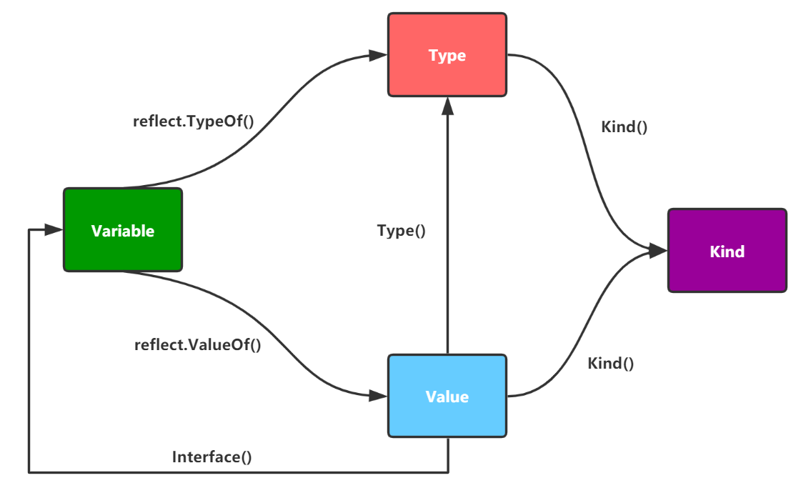

## 反射概述

### 反射是什么

`Go`的对象组成中没有类型指针，则通过对象自身是无法在运行期间获知任何类型相关信息的，而反射提供了让程序运行期间探知对象类型信息和内存结构的能力

### 反射的作用

反射是实现元编程的重要手段

反射在一定程度上改善了静态语言在动态能力上的不足的特点

### 反射的原理

反射可以在程序编译期将对象的信息，如字段名称、类型信息、结构体信息等整合到可执行文件中，并给程序提供接口访问反射信息，这样就可以在程序运行期获取类型的反射信息，并且有能力修改它们


## reflect.Kind

任何的数据类型（包括自定义数据类型）都有对应的元类型，元类型可以看作底层数据类型，比如定义了两个不同的结构体，它们的元类型都是 `Struct` 类型

元类型定义在`reflect` 包中，每一种元类型都对应一个整数编号，元类型编号使用 `reflect.Kind` 类型表示

```go
type Kind uint

const (
  Invalid Kind = iota // 不存在的无效类型
  Bool
  Int
  Int8
  Int16
  Int32
  Int64
  Uint
  Uint8
  Uint16
  Uint32
  Uint64
  Uintptr // 指针的整数类型，对指针进行整数运算时使用
  Float32
  Float64
  Complex64
  Complex128
  Array // 数组类型
  Chan // 通道类型
  Func  // 函数类型
  Interface  // 接口类型
  Map // 字典类型
  Ptr // 指针类型
  Slice // 切片类型
  String // 字符串类型
  Struct // 结构体类型
  UnsafePointer // unsafe.Pointer 类型
)
```


## reflect.Type

`reflect.Type` 是接口，该接口定义了获取类型的一切信息的方法，每一种类型都有一个相关的类型结构体来表达它的结构信息

| 常用方法                 | 说明                                       |
| ------------------------ | ------------------------------------------ |
| Method(i int) Method     | 获取挂在类型上的第 `i` 个方法              |
| NumMethod() int          | 该类型上总共挂了几个方法                   |
| Name() string            | 类型的名称                                 |
| PkgPath() string         | 所在包的名称                               |
| Kind() Kind              | 获取对应元类型                             |
| Elem() Type              | 数组，切片，通道，指针，映射内部子元素类型 |
| Field(i int) StructField | 获取结构体的第 `i` 个字段                  |


## reflect.Value

`reflect.Value` 是结构体类型，定义如下

```go
type Value struct {
  typ *rtype  // 变量的类型结构体
  ptr unsafe.Pointer // 数据指针
  flag uintptr // 标志位
}
```

该结构体包含变量的类型结构体指针、数据的地址指针和一些标志位信息

该结构体拥有下列常用方法

| 常用方法                    | 说明                                                         |
| --------------------------- | ------------------------------------------------------------ |
| Type() Type                 | 获取值对应接口的Type                                         |
| Index(i int) Value          | 获取切片、字符串、数组的具体位置的值进行读写                 |
| Interface() interface {}    | 将值以 interface{} 类型返回，可以通过类型断言转换为指定类型  |
| Int() int64                 | 将值以 int 类型返回，所有有符号整型均可以此方式返回          |
| Uint() uint64               | 将值以 uint 类型返回，所有无符号整型均可以此方式返回         |
| Float() float64             | 将值以 float64 类型返回，所有浮点数（float32、float64）均以此方式返回 |
| Bool() bool                 | 将值以 bool 类型返回                                         |
| Bytes() []bytes             | 将值以字节数组 []bytes 类型返回                              |
| String() string             | 将值以字符串类型返回                                         |
| Kind() Kind                 | 获取值的Kind                                                 |
| Elem() Type                 | 用于获取指针对应的值的Type类型                               |
| IsNil() bool                | 返回值是否为nil，用于判断指针是否为空                        |
| IsValid() bool              | 返回值是否是非类型零值，如果是类型零值则返回false，用于判定返回值是否有效 |
| FieldByName(string)  Field  | 根据名字获取值的字段                                         |
| MethodByName(string) Method | 根据名字获取值的方法                                         |

`Value` 结构体提供的很多方法，其中有不少会返回 `Value` 类型对象，这个对象的类型指向数组内部子元素的类型，对象的数据指针会指向数组指定位置子元素所在的内存


## reflect.TypeOf

`Go` 中使用 `reflect.TypeOf` 来获取任意对象的类型信息（`reflect.Type`）

### 函数签名

```go
func TypeOf(v interface{}) Type
```

### 示例代码

```go
package main

import (
  "fmt"
  "reflect"
)

func reflectType(x interface{}) {
  t := reflect.TypeOf(x)
  fmt.Printf("type: %v\n", t)
}

func main() {
  var a float32 = 3.14
  reflectType(a) // type: float32
  
  var b int64 = 100
  reflectType(b) // type: int64
}
```


## reflect.ValueOf

`Go` 中使用`reflect.ValueOf`来获取任意对象的值信息（`reflect.Value`）

### 函数签名

```go
func ValueOf(v interface{}) Value
```

### 示例代码

#### 通过反射获取值

```go
func reflectValue(x interface{}) {
  v := reflect.ValueOf(x)
  k := v.Kind()
  switch k {
  case reflect.Int64:
    // v.Int()从反射中获取整型的原始值，然后通过int64()强制类型转换
    fmt.Printf("type is int64, value is %d\n", int64(v.Int()))
  case reflect.Float32:
    // v.Float()从反射中获取浮点型的原始值，然后通过float32()强制类型转换
    fmt.Printf("type is float32, value is %f\n", float32(v.Float()))
  case reflect.Float64:
    // v.Float()从反射中获取浮点型的原始值，然后通过float64()强制类型转换
    fmt.Printf("type is float64, value is %f\n", float64(v.Float()))
  }
}
func main() {
  var a float32 = 3.14
  var b int64 = 100
  reflectValue(a) // type is float32, value is 3.140000
  reflectValue(b) // type is int64, value is 100
  // 将int类型的原始值转换为reflect.Value类型
  c := reflect.ValueOf(10)
  fmt.Printf("type c :%T\n", c) // type c :reflect.Value
}
```

#### 通过反射设置变量的值

```go
package main

import (
  "fmt"
  "reflect"
)

func reflectSetValue1(x interface{}) {
  v := reflect.ValueOf(x)
  if v.Kind() == reflect.Int64 {
    v.SetInt(200) //修改的是副本，reflect包会引发panic
  }
}
func reflectSetValue2(x interface{}) {
  v := reflect.ValueOf(x)
  // 反射中使用 Elem()方法获取指针对应的值
  if v.Elem().Kind() == reflect.Int64 {
    v.Elem().SetInt(200)
  }
}
func main() {
  var a int64 = 100
  // reflectSetValue1(a) //panic: reflect: reflect.Value.SetInt using unaddressable value
  reflectSetValue2(&a)
  fmt.Println(a)
}
```

#### isNil和isValid

```go
package main

import (
  "fmt"
  "reflect"
)

func main() {
  // *int类型空指针
  var a *int
  fmt.Println("var a *int IsNil:", reflect.ValueOf(a).IsNil
              
  // nil值
  fmt.Println("nil IsValid:", reflect.ValueOf(nil).IsValid())
              
  // 实例化一个匿名结构体
  b := struct{}{}
              
  // 尝试从结构体中查找"abc"字段
  fmt.Println("不存在的结构体成员:", reflect.ValueOf(b).FieldByName("abc").IsValid())
              
  // 尝试从结构体中查找"abc"方法
  fmt.Println("不存在的结构体方法:", reflect.ValueOf(b).MethodByName("abc").IsValid())
              
  // map
  c := map[string]int{}
              
  // 尝试从map中查找一个不存在的键
  fmt.Println("map中不存在的键：", reflect.ValueOf(c).MapIndex(reflect.ValueOf("娜扎")).IsValid())
}
```


## 相互转换关系




## 结构体的类型信息

虽然反射能够获取任何对象的类型信息和值信息，但反射一般都是用于获取结构体的类型信息

首先通过`reflect.TypeOf`获取结构体反射值对象，然后通过该对象的方法来获取和操作结构体的信息

### 结构体反射值对象(reflect.Type)的方法

| 方法                                                        | 说明                                                         |
| ----------------------------------------------------------- | ------------------------------------------------------------ |
| **(↓字段相关↓)**                                            | **(↓字段相关↓)**                                             |
| NumField() int                                              | 返回结构体成员字段数量                                       |
| Field(i int) StructField                                    | 根据索引，返回索引对应的结构体字段的信息                     |
| FieldByName(name string) (StructField, bool)                | 根据给定字符串返回字符串对应的结构体字段的信息               |
| FieldByIndex(index []int) StructField                       | 多层成员访问时，根据 []int 提供的每个结构体的字段索引，返回字段的信息 |
| FieldByNameFunc(match func(string) bool) (StructField,bool) | 根据传入的匹配函数匹配需要的字段                             |
| **(↓方法相关↓)**                                            | **(↓方法相关↓)**                                             |
| NumMethod() int                                             | 返回该类型的方法集中方法的数目                               |
| Method(int) Method                                          | 返回该类型方法集中的第 `i` 个方法                            |
| MethodByName(string)(Method, bool)                          | 根据方法名返回该类型方法集中的方法                           |

### StructField类型

`StructField`类型用来描述结构体中的一个字段的信息

定义如下

```go
type StructField struct {
  Name    string      // Name是字段的名字
  PkgPath string      // PkgPath是非导出字段的包路径，对导出字段该字段为""
  Type      Type      // 字段的类型
  Tag       StructTag // 字段的标签
  Offset    uintptr   // 字段在结构体中的字节偏移量
  Index     []int     // 用于Type.FieldByIndex时的索引切片
  Anonymous bool      // 是否匿名字段
}
```

### StructTag类型

常用方法：`Get`，用于获取tag的值

``` go
func (tag StructTag) Get(key string) string
```

### 结构体反射示例

```go
package main

type Person struct {
  Name string `define:"name"`
  Age int `define:"age"`
}

func main() {
  p := Person{
    Name: "zhangsan",
    Age: 20,
  }

  t := reflect.TypeOf(p) // 获取对象的类型信息
  
  fmt.Println(t.Name(), t.Kind()) // Person struct
  
  // 通过for循环遍历结构体的所有字段信息
  for i := 0; i < t.NumField(); i++ {
    field := t.Field(i)
    
    fmt.Printf("name:%s\n", field.Name)
    fmt.Printf("index:%d\n", field.Index)
    fmt.Printf("type:%v\n", field.Type)
    fmt.Printf("tag:%v\n", field.Tag)
    fmt.Printf("tag-json:%v\n", field.Tag.Get("json"))
    fmt.Println("================================")
  }

  // 通过字段名获取指定结构体字段信息
  if field, ok := t.FieldByName("Age"); ok {
    fmt.Printf("name:%s\n", field.Name)
    fmt.Printf("index:%d\n", field.Index)
    fmt.Printf("type:%v\n", field.Type)
    fmt.Printf("tag:%v\n", field.Tag)
    fmt.Printf("tag-json:%v\n", field.Tag.Get("json"))
    fmt.Println("================================")
  }
}
```


## 反射三大定律

1. 反射将接口变量转换成反射对象 Type 和 Value
2. 反射可以通过反射对象 Value 还原成原先的接口变量
3. 想用反射功能来修改一个变量的值的前提是这个值可以被修改


## 注意事项

反射虽然能提供方便，但反射是把双刃剑，存在下列缺点

| 缺点     | 说明                                                         |
| -------- | ------------------------------------------------------------ |
| 性能很差 | 反射的性能低下，基于反射实现的代码通常比正常代码运行速度慢一到两个数量级 |
| 可读性差 | 大量使用反射的代码通常难以理解                               |
| 稳定性差 | 反射中的错误在运行期间才会引起panic                          |


## reflect包其他方法

| 方法      | 说明                                                 |
| --------- | ---------------------------------------------------- |
| DeepEqual | 深度判断，能用于引用类型的判断，比如判断切片是否相等 |