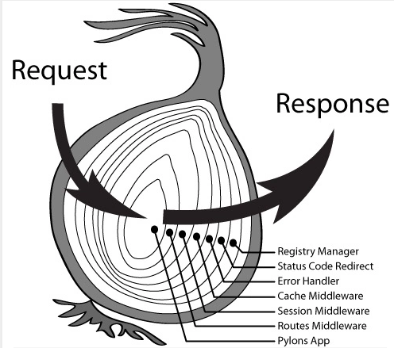
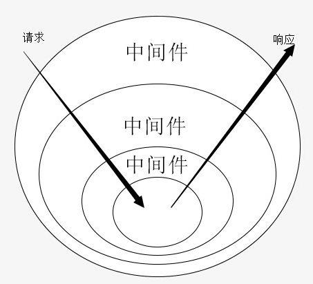

## 中间件概述

### 中间件是什么

`Gin` 的中间件是函数，类型是 `gin.HandleFunc`，类型定义为

```go
type HandleFunc func(*Context)
```

### 中间件的作用

通过定义和使用中间件可以对请求进行处理并做出响应

路由处理函数本质上也是一个中间件，即`HTTP`请求经过多个中间处理后进行响应

### 中间件的特点

`Gin` 的中间件模型是洋葱模型



**中间件是嵌套中另外一个中间件之中**，请求经过多个中间件处理后做出响应




## 定义中间件

### 常用方法

在定义中间件时，`gin.Context` 对象有4个常用方法

| 方法签名                            | 说明                                                         |
| ----------------------------------- | ------------------------------------------------------------ |
| Next()                              | 执行内部中间件                                               |
| Abort()                             | 拦截，即对于该请求不再执行中间件处理                         |
| Set(key string, value interface{})  | 在 `ctx` 中保存数据，以传递数据到内部中间件中，即跨中间件传取值 |
| Get(key string) (interface{}, bool) | 获取 `ctx` 中的数据，即读取来自外部中间件的数据              |

### 普通定义方式

中间件是 `gin.HandleFunc` 类型的函数，可以直接定义函数来定义中间件

示例代码：一个用于记录内部中间件耗时的中间件

```go
func timeCostMiddleware(ctx *gin.Context) {
  startTime := time.Now() // 获取开始时间
  
  ctx.Next() // 执行内部中间件
  
  fmt.Println(time.Since(startTime)) // 打印内部中间件耗时
}
```

### 闭包定义方式

使用闭包形式定义的中间件，能够在使用中间件前传入特定的参数从而获取特定的中间件，即对中间件做自定义化，同时也能够在使用中间件前做一些初始化操作

示例代码

```go
func authMiddleware(debug bool) gin.HandleFunc {
  // 其他初始化操作，比如写入日志
  log.Println("使用中间件")
  
  return func (ctx *gin.Context) { // 返回中间件
    // 存放具体的逻辑
    if debug {
      ctx.Abort() // 如果是 debug 模式，则中止中间件
    } else {
      // 如果不是 debug 模式，则执行其他代码
    }
  }
}
```

### 注意事项

如果中间件内部需要开启 `goroutine` ，则 `goroutine` 中只能使用 `gin.Context` 对象的拷贝，而不能使用中间件本身的`gin.Context` 对象，这么做是为了并发安全

示例代码

```go
func middleware(ctx *gin.Context) {
  // 错误使用方式
  go func() {
    fmt.Println(ctx.Request.Method) // 错误使用方式：使用了中间件本身的 Context 对象
  }
  
  ctxCopy := ctx.Copy() // 获取 Context 对象的拷贝
  
  // 正确使用方式
  go func(ctxCopy *gin.Context) {
    fmt.Println(ctxcopy.Request.Method) // 正确使用方式：使用中间件 Context 对象的拷贝
  }(ctxCopy)
}
```


## 注册中间件

使用中间件时

### engine注册中间件

通过 `gin.New` 方法获取到的 `Gin` 引擎对象，可以使用 `Use` 方法来注册中间件，这种注册方法是全局的，即所有路由都会使用到通过 `Use` 注册的中间件

`gin.Default` 方法返回的中间件默认注册了两个中间件

```go
// gin源码：gin.go
func Default() *Engine {
  engine := New() // 创建 engine
  engine.Use(Logger(), Recovery()) // 通过 Use 注册了 Logger() 和 Recovery() 两个中间件
  return engine
}
```

### 路由中使用中间件

路由处理函数本质上是一个中间件，在定义路由时，可以使用多个中间件

```go
// 普通定义形式
func m1(ctx *gin.Context) {
  fmt.Println("This is m1")
  ctx.Next()
}

// 闭包定义形式
func m2() {
  return func (ctx *gin.Context) {
    fmt.Println("This is m2")
    ctx.Next()
  }
}

engine.GET("/index", m1, m2(), func (ctx *gin.Context) {
  ctx.String(http.StatusOK, "Index")
})
```

### 路由组注册中间件

路由组注册中间件有两种方法

方法1：在创建路由组时就注册中间件

```go
userGroup := engine.Group("/shop", m1, m2())
```

方法2：路由组通过 `Use` 方法进行注册

```go
userGroup := engine.Group("/shop")
userGroup.Use(m1, m2())
```

