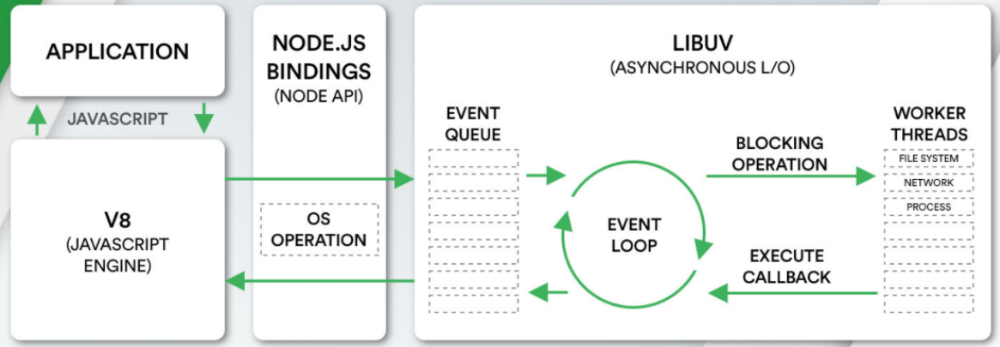

## Node.js是什么

Node.js is a JavaScript runtime built on Chrome's V8 JavaScript engine.

Node.js 是一个基于 V8 引擎的 JavaScript 运行时

## Node.js架构

Node.js本体主要涉及三种语言：

* JavaScript：用于使用 Node.js（接入层）
* C++：用于编写 V8 Engine（用于执行JavaScript代码）
* C：用于编写 LIBUV（提供了事件循环、文件系统读写、网络IO、线程池等等内容）

## Node.js应用场景

1. 用于辅助前端开发，前端库都是以 Node.js 包的形式进行管理，npm、yarn工具是前端使用最多的工具
2. 用于开发web服务器
3. 用于完成前后端渲染的同构应用
4. 用于为项目编写脚本工具
5. 通过 Electron 或 NW.js 来开发桌面应用程序