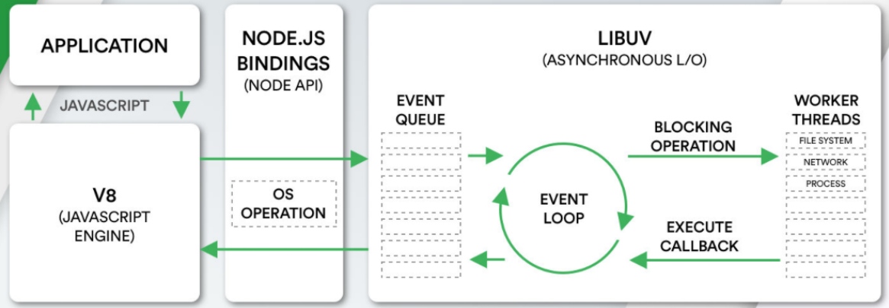

## Node架构

* libuv是一个多平台的专注于异步IO的库，它最初是为Node开发的，但是现在也被使用到Luvit、Julia、pyuv等其他地方

* libuv中主要维护了一个`EventLoop`和`worker threads`（线程池）
* EventLoop负责调用系统的一些其他操作：文件的IO、Network、child-processes等




## 阻塞IO和非阻塞IO

### 思考

如果希望在程序中对一个文件进行操作，那么就需要打开这个文件，那么JavaScript可以直接对一个文件进行操作吗？

表面看起来是可以的，但是事实上任何程序中的文件操作都是需要进行系统调用（操作系统的文件系统），这是一个操作系统的IO操作

### 阻塞式调用与非阻塞式调用

操作系统为程序提供了阻塞式调用和非阻塞式调用

| 调用方式     | 特点                                                         |
| ------------ | ------------------------------------------------------------ |
| 阻塞式调用   | 调用结果返回之前，当前线程处于阻塞态（CPU不会分配时间片），调用线程只有在得到调用结果后才会继续执行 |
| 非阻塞式调用 | 调用执行之后，当前线程不会停止执行，只需要过一段时间来检查一下有没有结果返回即可 |

在开发中的很多耗时操作，都可以基于非阻塞式调用，比如

* 网络请求本身使用了Socket通信，而Socket本身提供了select模型，可以进行非阻塞方式的工作
* 文件读写的IO操作，可以使用操作系统提供的基于事件的回调机制实现非阻塞调用

### 非阻塞IO存在的问题

#### 问题

程序并没有立即获取到结果，那么就意味着为了可以知道是否读取到了完整的数据，程序需要频繁的去确定读取到的数据是否是完整的，这个过程我们称之为**轮询**操作，那么轮询的工作由谁来完成呢？

* 如果程序的主线程频繁的去进行轮训的工作，那么必然会大大降低性能
* 并且开发中可能不止一个异步操作，比如网络的IO、数据库的IO、子进程调用

#### 解决

`libuv` 提供了一个线程池（Thread Pool）

* 线程池会负责所有相关的系统调用操作，并且会通过轮训等方式等待结果
* 当获取到结果时，就可以将对应的回调放到事件循环（某一个事件队列）中
* 事件循环就可以负责接管后续的回调工作，告知JavaScript应用程序执行对应的回调函数


## 阻塞和非阻塞，同步和异步

### 阻塞与非阻塞

**阻塞和非阻塞是对于被调用者来说的**

比如系统调用，操作系统为我们提供了阻塞调用和非阻塞调用

### 同步和非同步

**同步和异步是对于调用者来说的**

比如普通的Node程序

* 如果在执行函数（进行调用）之后，不会进行其他任何的操作，只是等待结果，这个过程就称之为同步调用
* 如果在执行函数（进行调用）之后，并不会等待结果，继续完成其他的工作，等到有回调时再去执行，这个过程就是异步调用

**Libuv采用的就是非阻塞异步IO的调用方式**


## Node事件循环

### 概述

浏览器中的EventLoop是根据HTML5定义的规范来实现的，不同的浏览器可能会有不同的实现，而Node中是由libuv实现的

事件循环像是一个桥梁，是连接着应用程序的JavaScript和系统调用之间的通道

* 无论是文件IO、数据库、网络IO、定时器、子进程，在完成对应操作后，都会将对应结果和回调函数放到事件循环（任务队列）中
* 事件循环会不断的从任务队列中取出对应的事件（回调函数）来执行

### 事件循环阶段

一次完整的事件循环称为一次**Tick**，而一次**Tick**分成很多个阶段，顺序如下

| 序号 | 阶段                           | 说明                                                         |
| ---- | ------------------------------ | ------------------------------------------------------------ |
| 1    | 定时器 Timers                  | 本阶段执行已经被 setTimeout() 和 setInterval() 的调度回调函数 |
| 2    | 待定回调 Pending Callbacks     | 对某些系统操作（如TCP错误类型）执行回调，如TCP连接时接收到 ECONNREFUSED，**不用关心** |
| 3    | idle，prepare                  | 仅系统内部使用，**不用关心**                                 |
| 4    | 轮询 Poll                      | 检索新的 I/O 事件；执行与 I/O 相关的回调                     |
| 5    | 检测 Check                     | setImmediate() 回调函数在这里执行                            |
| 6    | 关闭的回调函数 Close Callbacks | 一些关闭的回调函数，如：socket.on('close', ...)              |


## Node中任务队列

### 微任务和宏任务

Node中事件循环也分为微任务和宏任务

| 任务类型             | 说明                                                     |
| -------------------- | -------------------------------------------------------- |
| 宏任务（macro task） | setTimeout、setInterval、IO事件、setImmediate、close事件 |
| 微任务（micro task） | Promise的then回调、process.nextTick、queueMicrotask      |

### 任务队列执行顺序

| 序号 | 队列类型   | 任务队列执行顺序 | 说明                              |
| ---- | ---------- | ---------------- | --------------------------------- |
| 1    | 微任务队列 | next tick queue  | process.nextTick                  |
| 2    | 微任务队列 | other queue      | Promise的then回调、queueMicrotask |
| 3    | 宏任务队列 | timer queue      | setTimeout、setInterval           |
| 4    | 宏任务队列 | poll queue       | IO事件                            |
| 5    | 宏任务队列 | check queue      | setImmediate                      |
| 6    | 宏任务队列 | close queue      | close事件                         |


## 面试题

### 题目1

#### 问题

```js
async function async1() {
  console.log("async1 start");
  await async2();
  console.log("async1 end");
}

async function async2() {
  console.log("async2");
}

console.log("script start");

setTimeout(function() {
  console.log("setTimeout 0")
}, 0);

setTimeout(function() {
  console.log("setTimeout 1")
}, 0);

setTimeout(function () {
  console.log("setTimeout 2")
}, 300);

setImmediate(() => console.log("setImmediate"));

process.nextTick(() => console.log("nextTick 1"));

async1();

process.nextTick(() => console.log("nextTick 2"));

new Promise(function(resolve) {
  console.log("promise 1");
  resolve();
  console.log("promise 2");
}).then(function() {
  console.log("promise 3");
});

console.log("script end");
```

#### 答案

```
script start
async1 start
async2
promise 1
promise 2
script end
nextTick 1
nextTick 2
async1 end
promise 3
setTimeout 0
setTimeout 1
setImmediate
setTimeout 2
```

### 题目2

#### 问题

```js
setTimeout(() => {
  console.log("setTimeout")
}, 0);

setImmediate(() => {
  console.log("setImmediate")
})
```

#### 答案

答案有两个可能：

```
情况1
setImmediate
setTimeout

情况2
setTimeout
setImmediate
```

#### 解析

情况1：如果事件循环开启的时间(ms)是小于 setTimeout函数的执行时间的

* 意味着先开启了event-loop，但是这个时候执行到timer阶段，并没有定时器的回调被放到入 timer queue中
* 所以没有被执行，后续开启定时器和检测到有setImmediate时，就会跳过poll阶段，向后继续执行
* 这个时候是先检测 setImmediate，第二次的tick中执行了timer中的setTimeout

情况2：如果事件循环开启的时间(ms)是大于 setTimeout函数的执行时间的

* 就意味着在第一次 tick中，已经准备好了timer queue
* 所以会直接按照顺序执行即可