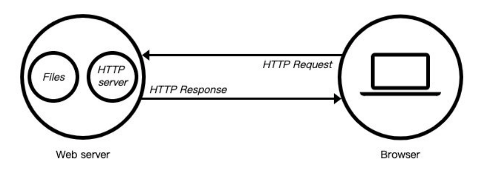

## Web服务器

### Web服务器定义

当应用程序（客户端）需要某一个资源时，可以向一个台服务器，通过Http请求获取到这个资源

提供资源的这个服务器，就是一个Web服务器



### 常见Web服务器

目前有很多开源的Web服务器：Nginx、Apache（静态）、Apache Tomcat（静态、动态）、Node.js等


##  创建服务器

### 概述

创建服务器对象，通过 `http.createServer` 来完成的

`http.createServer`会返回服务器的对象

```js
const http = require("http");

const server = http.createServer((req, res) => {
    
})
```

### 回调函数

创建Server时会传入一个回调函数，这个回调函数在被调用时会传入两个参数：

req：request请求对象，包含请求相关的信息

res：response响应对象，包含我们要发送给客户端的信息

### 本质

底层其实使用直接 new Server 对象，那么也可以自己来创建这个对象

```js
const server = new Server((req, res) => {
    res.end("Hello World");
})
```


## 监听主机和端口号

### 概述

服务器通过listen方法来开启服务器，并且在某一个主机和端口上监听网络请求

即当我们通过 ip:port的方式发送到我们监听的Web服务器上时，Web服务器就可以对其进行相关的处理；

### listen函数的三个参数

| 参数     | 说明                                                         |
| -------- | ------------------------------------------------------------ |
| 端口port | 可以不传，系统会默认分配端                                   |
| 主机host | 通常可以传入localhost、ip地址127.0.0.1、或者ip地址0.0.0.0，默认是0.0.0.0 |
| 回调函数 | 服务器启动成功时的回调函数                                   |

localhost：本质上是一个域名，通常情况下会被解析成127.0.0.1

127.0.0.1：回环地址（Loop Back Address），表达的意思其实是我们主机自己发出去的包，直接被自己接收

* 正常的数据库包经常 应用层 - 传输层 - 网络层 - 数据链路层 - 物理层
* 而回环地址，是在网络层直接就被获取到了，是不会经常数据链路层和物理层的
* 比如监听 127.0.0.1时，在同一个网段下的主机中，通过ip地址是不能访问的

0.0.0.0
* 监听IPV4上所有的地址，再根据端口找到不同的应用程序
* 比如我们监听 0.0.0.0时，在同一个网段下的主机中，通过ip地址是可以访问的

### 示例代码

```js
const server = new Server((req, res) => {
    res.end("Hello World");
})

server.listen(9000, () => {
    console.log("服务器启动成功");
})
```


## request/req请求对象

### 概述

在向服务器发送请求时，请求会携带很多信息，比如

* 本次请求的URL，服务器需要根据不同的URL进行不同的处理
* 本次请求的请求方式，比如GET、POST请求传入的参数和处理的方式是不同的
* 本次请求的headers中也会携带一些信息，比如客户端信息、接受数据的格式、支持的编码格式等
* 等等...

这些信息，Node会将它们封装到一个request的对象中，程序可以直接来处理这个request对象

### 获取请求方法

可以通过判断不同的请求方式进行不同的处理

```js
req.method
```

### 获取请求头

```js
req.header
```

### 示例代码

```js
const server = http.createServer((req, res) => {
    console.log(req.url);
    console.log(req.method);
    console.log(req.headers)
})
```


## URL处理与解析

### 概述

客户端在发送请求时，会请求不同的数据，那么会传入不同的请求地址

* 比如 http://localhost:8000/login
* 比如 http://localhost:8000/products

服务器端需要根据不同的请求地址，作出不同的响应

### 示例代码

```js
const server = http.createServer((req, res) => {
    const url = req.url;
    
    if(url === "/login") {
        res.end("1");
    } else if (url === "/products") {
        res.end("2");
    } else {
        res.end("3");
    }
})
```

### 解析URL

如果用户发送的地址中还携带一些额外的参数，比如 http://localhost:8000/login?name=why&password=123，则此时，url的值是 `/login?name=why&password=123`

解析方式1：使用内置模块url

```js
const parseInfo = url.parse(req.url);
console.log(parseInfo) // /login?name=why&password=123`
```

解析方式2：获取 query 信息

```js
const { pathname, query } = url.parse(req.url);

const queryObj = qs.parse(query);
console.log(queryObj.name);
console.log(queryObj.password);
```


## response/res响应对象

### 设置编码

```js
req.setEncoding("utf-8");
```

### 设置响应头

#### 方式1：setHeader

一次写入一个头部信息

```js
res.setHeader("Content-Type", "application/json:charset=utf8")
```

#### 方式2：writeHead

同时写入header和status

```js
res.writeHead(200, {
    "Content-Type": "application/json/;charset=utf8"
})
```

### 设置响应状态码

```js
res.statusCode = 400;
res.writeHead(200);
```

### 设置响应结果

#### 方式1：write

Write方法：这种方式是直接写出数据，但是并没有关闭流

```js
res.write("Hello World")
```

#### 方式2：end

end方法：这种方式是写出最后的数据，并且写出后会关闭流

```js
res.end("message end")
```

如果我们没有调用 end和close，客户端将会一直等待结果：所以客户端在发送网络请求时，都会设置超时时间


## 发送网络请求

### 概述

`http`模块支持发送`HTTP`请求

### 特点

只对`get`请求做了二次封装，其他`method`没有进行封装，需要基于`http.request`完成

### 示例代码

#### get请求

```js
const http = require("http");

http.get("http://localhost:8888", (res) => {
    res.on("data", (data) => {
        console.log(data.toString());
    });
    
    res.on("end", () => {
        console.log("获取到了所有的结果")
    })
});
```

#### 其他请求

```js
const http = require("http");

const req = http.request({
    method: "POST",
    hostname: "http://localhost",
    port: 8888
}, (res) => {
    res.on("data", (data) => {
        console.log(data.toString());
    });
    
    res.on("end", () => {
        console.log("获取到了所有的结果")
    })
})

req.end();
```

### 总结

虽然`http`模块能够发送`HTTP`请求，但还是推荐优秀的第三方库：`Axios`