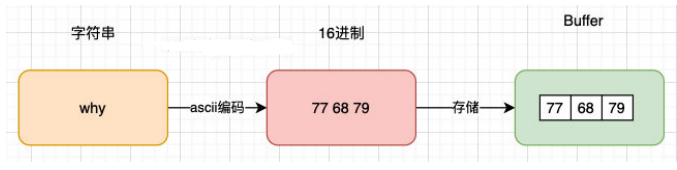

## Buffer和二进制

### 概述

计算机中所有的内容：如文字、数字、图片、音频、视频等最终都会使用二进制来表示

Node为了可以方便开发者完成更多功能，提供给了一个全局的类Buffer

### 存储方式

Buffer中存储的是二进制数据

* 可以将Buffer看成是一个存储二进制的数组
* 这个数组中的每一项，可以保存8位二进制： 00000000
* 通常会将8位合在一起作为一个单元，这个单元称之为一个字节（byte）

总结：Buffer相当于是一个字节的数组，数组中的每一项对于一个字节的大小


## Buffer和字符串

### 创建

将一个字符串放入到Buffer中，有两种写法

#### 写法1：构造函数

**不推荐**使用，因为这种写法即将被废弃

```js
const myBuffer = new Buffer("why");
console.log(myBuffer);
```

#### 写法2：工厂方法

**推荐**使用该方法：`Buffer.from`

```js
const myBuffer = Buffer.from("why");
console.log(myBuffer);
```

#### 创建的具体过程



### 对于中文

#### 默认编码：utf8

```js
const buffer = Buffer.from("中文");
console.log(buffer); // <Buffer e4 b8 ad e6 96 87>

const str = buffer.toString();
console.log(str); // 中文
```

#### 指定编码和解码

```js
const buffer = Buffer.from("中文", "utf16le");
console.log(buffer); // <Buffer e4 b8 ad e6 96 87>

const str = buffer.toString("utf8");
console.log(str); // 中文
```


## Buffer.alloc

### 概述

创建Buffer的一种方法，特点是需要指定空间，且将空间清零

### 使用示例

创建了一个8位长度的Buffer，里面所有的数据默认为00

```js
const buffer = Buffer.alloc(8);
console.log(buffer); //<Buffer 00 00 00 00 00 00 00 00>
```

可以对其进行操作

```js
buffer[0] = 'w'.charCodeAt();
buffer[1] = 100;
buffer[2] = 0x66;

console.log(buffer);
console.log(buffer[0]);
console.log(buffer[0].toString(16));
```


## Buffer和文件读取

### 文本文件的读取

```js
fs.readFile("./test.txt", (err, data) => {
    console.log(data); // <Buffer 48 65 6c 6c 6f 20 57 6f 72 6c 64>
    console.log(data.toString()); // Hello World
})
```

### 图片文件的读取

```js
fs.readFile("./zzz.jpg", (err, data) => {
    console.log(data); // <Buffer ff d8 ff e0 ... 40567 more bytes>
})
```


## Buffer的创建过程

创建Buffer时，并不会频繁的向操作系统申请内存，它会默认先申请一个8 * 1024个字节大小的内存，也就是8kb