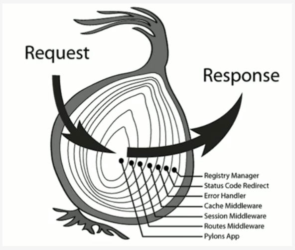

## 洋葱模型




## 中间件

### 中间件是什么

中间件就是匹配路由之前或匹配路由之后做的一系列操作

### 中间件是本质

中间件就是一个函数，接收两个参数 `ctx` 和 `next`

`ctx` 表示应用上下文，`next` 表示下一个中间件

```js
(ctx, next) => {}
```

### 中间件的要求

#### 必须保证洋葱模型，从而需要使用 async/await 语句

每个中间件必须标记async，每个next函数都必须 await，哪怕它没有异步的代码，这是为了统一和便于维护

```js
app.use(async (ctx, next) => {
    console.log(1);
    await next();
    console.log(2);
});
```

#### 为什么需要保证洋葱模型 

可以通过 next函数来保证内层的中间件已经执行完毕，即next函数可以作为分界线 

### 注册中间件

使用 app.use函数

```js
const app = new Koa();

function test() {
    console.log("test");
}

app.use(test);
```

### 常用中间件

| 名称           | 用途             |
| -------------- | ---------------- |
| koa-router     | 路由             |
| koa-parameter  | 参数校验         |
| koa-json-error | 错误处理         |
| koa-body       | 解析HTTP Body    |
| koa-jwt        | jwt库            |
| koa-static     | 提供静态资源服务 |

### ctx常用属性

| 属性                        | 说明               |
| --------------------------- | ------------------ |
| ctx.method                  | 获取请求的方法     |
| ctx.request                 | 获取请求对象       |
| ctx.response                | 获取响应对象       |
| ctx.request.header          | 获取请求头         |
| ctx.path                    | 获取请求的路径     |
| ctx.request.query           | 获取请求的query    |
| ctx.params                  | 获取动态路由参数   |
| ctx.request.body            | 获取请求body       |
| ctx.status                  | 设置响应状态码     |
| ctx.set(key, value)         | 设置响应的Header   |
| ctx.body                    | 设置响应           |
| ctx.throw(状态码, 错误原因) | 抛出错误，中止处理 |

