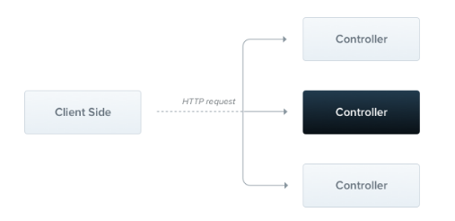

## 概述

Nest中有三个核心概念：

* Module（模块）
* Controller（控制器）
* Provider（控制器）

传统的服务器架构是MVC（Model-View-Controller），但随着前端的发展，前后端分离逐渐成为主流，MVC架构也慢慢没落，服务端主要负责逻辑与提供API，从而发展出新的架构模式


## 核心概念介绍

### Module

Module用于划分业务模块，每个模块都有一组紧密相关的功能，一个完整的后端应用可以划分为多个模块

每个 Nest 应用程序至少有一个模块，即根模块，根模块是 Nest 开始安排应用程序树的地方

当应用程序很小时，根模块可以是应用程序中唯一的模块，但对于大型的应用，应该根据业务划分为多个模块

Module拥有它自己的 Provider和Controller


### Controller

Controller的作用是通过路由功能，负责处理传入的 **请求** 和向客户端返回 **响应**



### Provider

Nest.js 采用AOP编程模式，而Provider就是进行注入的代码

Nest.js中Provider包括但不限于下列种类：

* service
* repository
* factory
* helper

它们都可以通过 `constructor` 注入依赖关系，Provider 只是一个用 `@Injectable()` 装饰器注释的类


## 分析初始代码

### main.ts

```typescript
import { NestFactory } from "@nestjs/core" // 引入 Nest 工厂方法
import { AppModule } from "./app.module"   // 引入 AppModule

async function bootstrap() {
  const app = await NestFactory.create(AppModule) // 根据 AppModule 创建 App
  await app.listen(3000) // 启动 App，监听3000端口
}

bootstrap() // 执行启动函数
```

### app.module.ts

```typescript
import { Module } from "@nestjs/common"          // 引入 Module 装饰器
import { AppController } from "./app.controller" // 引入 AppController
import { AppService } from "./app.service"       // 引入 AppService

@Module({ // 使用 Module 装饰器定义 Module
  imports: [],
  controllers: [AppController], // 定义 Module 拥有的 Controller
  providers: [AppService],      // 定义 Module 拥有的 Provider (IOC)
})
export class AppModule {}
```

### app.controller.ts

```typescript
import { Controller, Get } from "@nestjs/common" // 引入装饰器
import { AppService } from "./app.service"       // 引入AppService

@Controller() // 使用装饰器，定义Controller
export class AppController {
  // 通过constructor注入AppService (AOP)
  constructor(private readonly appService: AppService) {}

  @Get() // 通过装饰器定义路由
  getHello(): string { // 路由对应的处理函数
    return this.appService.getHello()
  }
}
```

### app.service.ts

```typescript
import { Injectable } from "@nestjs/common" // 引入装饰器

@Injectable() // 使用 Injectable 装饰器，定义 Provider
export class AppService {  // 定义Service
  getHello(): string {
    return "Hello World!"
  }
}
```