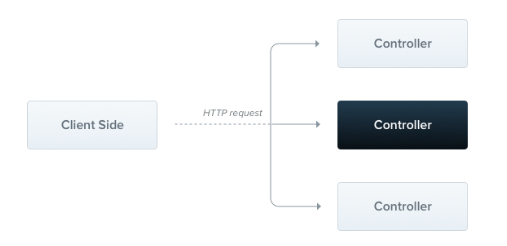

## 初识Controller

### 概念

控制器负责处理传入的 **请求** 和向客户端返回 **响应**

控制器的目的是接收应用的特定请求，路由机制控制哪个控制器接收哪些请求

通常每个控制器有多个路由，不同的路由可以执行不同的操作



### 实现原理

为了创建一个基本的控制器，使用类和装饰器，装饰器将类与所需的元数据相关联，并使 `Nest` 创建路由映射

### 基本使用

#### Controller命名规范

在 Nest 中，Controller的命名应该遵循下列的约定

```shell
[模块名].controller.ts
```

比如

```shell
user.controller.ts # 用户模块服务

order.controller.ts # 订单模块服务
```

#### 创建Controller创建

可以手动创建，也可以通过命令行工具CLI创建

```shell
nest generate controller <controller-name>
# 简写
nest g co <controller-name>
```

#### 使用 `@Controller` 装饰

使用 `@Controller` 装饰一个类，则它成为 Controller

`@Controller`可以接受一个路由前缀

```typescript
import { Controller, Get } from '@nestjs/common';

@Controller('cats') // 路由前缀 cats
export class CatsController {
  @Get()
  findAll(): string {
    return 'This action returns all cats';
  }
}
```


## 路由

### RESTful装饰器

| RESTful装饰器 | 说明             |
| ------------- | ---------------- |
| @Get          | Get请求装饰器    |
| @Post         | Post请求装饰器   |
| @Put          | Put请求装饰器    |
| @Patch        | Patch请求装饰器  |
| @Delete       | Delete请求装饰器 |
| @Option       | Option请求装饰器 |

都可以接收一个具体的路径

```typescript
@Controller('cats')
export class CatsController {
  @Get('profile') // 对应的路径为 /cats/profile
  findAll(): string {
    return 'This action returns all cats';
  }
}
```

### 路由通配符

路由装饰器中的参数除了可以写普通路径外，还可以写匹配模式

```typescript
@Get('ab*cd')
findAll() {
  return 'This route uses a wildcard';
}
```

### 子域路由

`@Controller` 装饰器可以接受一个 `host` 选项，以要求传入请求的 `HTTP` 主机匹配某个特定值

```typescript
@Controller({ host: 'admin.example.com' })
export class AdminController {
  @Get()
  index(): string {
    return 'Admin page';
  }
}
```

可以使用`@HostParam()` 装饰器访问以这种方式声明的主机参数

```typescript
@Controller({ host: ':account.example.com' })
export class AccountController {
  @Get()
  getInfo(@HostParam('account') account: string) {
    return account;
  }
}
```

注意：因为 `Fastify` 缺乏对嵌套路由器的支持，当使用子域路由时，应该使用(默认) `Express` 适配器


## 请求

### 请求体

使用 `@Headers` 装饰器，有两种使用方式（有参和无参）

```typescript
@Get('demo')
demoHandler(@Headers() header) {
    return header["Content-Type"]
}

@Get('demo')
demoHandler(@Headers("Content-Type") contentType) {
    return contentType
}
```

### 路由参数

路由参数的装饰器都是装饰在参数上的

#### @Query

获取query参数，使用 `@Query`，有两种使用方式（有参和无参）

```typescript
@Get('demo')
demoHandler(@Query('version') version) {
  if (version && version === '5') {
    return { version };
  }
}

@Get('docs')
demoHandler(@Query() query) {
  if (query.version && query.version === '5') {
    return { version };
  }
}
```

#### @Param

获取param参数，使用 `@Param`，一共有两种使用方式（有参/无参）

```typescript
@Get(':id/:name')
demoHandler(@Param() params) {
  return `id：${params.id}，name:${params.name}`;
}

@Get(':name')
demoHandler(@Param('name') name) {
  return `name：${name}`;
}
```

### 请求体

#### DTO

在获取请求体前，需要先定义出`DTO`(数据传输对象)

`DTO`是一个对象，它定义了如何通过网络发送数据。我们可以通过使用 `TypeScript`接口或简单的类来完成

推荐使用类，因为类是 `ES6`标准的一部分，因此它们在编译后的 `JavaScript`中保留为实际实体，而接口在转换过程中被删除

```typescript
export class CreateCatDto {
  readonly name: string;
  readonly age: number;
  readonly breed: string;
}
```

#### @Body

```typescript
@Post()
async create(@Body() createCatDto: CreateCatDto) {
  return 'This action adds a new cat';
}
```

### 请求方IP

使用 `@Ip` 获取请求方的 IP 地址

```typescript
@Get('demo')
demoHandler(@Ip() ip) {
    return ip
}
```

### 原始请求

因为 nest 本质是对 node 的封装，所以底层是存在 node http 库的 `req` 对象的

可以通过 `@Req` 或 `@Request`装饰器获取，这两个装饰器是一样的，是别名关系

```typescript
@Get()
demo(@Req() req) {
  return req.ip()
}
```


## 响应

### 状态码

默认情况下，响应的状态码总是**200**，除了 POST 请求外，此时它是**201**

可以通过在使用 `@HttpCode` 装饰器来自定义状态码

```typescript
@Get()
@HttpCode(204)
demo() {
  return 'demo';
}
```

### 响应头

要指定自定义响应头，可以使用 `@Header()` 修饰器或类库特有的响应对象

```typescript
@Get()
@Header('Cache-Control', 'none')
demo() {
  return 'demo';
}
```

### 重定向

使用 `@Redirect` 进行重定向，签名为

```typescript
@Redirect(url: string, code?: number)
```

使用示例

```typescript
@Get('demo')
@Redirect('https://demo.com', 302)
getDocs(@Query('demo') version) {
  if (version && version === '5') {
    return { url: 'https://demo' };
  }
}
```

### 原始响应

因为 nest 本质是对 node 的封装，所以底层是存在 node http 库的 `res` 对象的

可以通过 `@Res` 或 `@Response`装饰器获取，这两个装饰器是一样的，是别名关系

```typescript
@Get()
demo(@Res() res) {
  return res.json({
      message: "demo"
  });
}
```

注意事项：在方法处理程序中注入 `@Res()`或 `@Response()` 时，将 `Nest`置于该处理程序的特定于库的模式中，并负责管理响应，此时，必须通过调用响应对象(例如，`res.json(…)`或 `res.send(…)`)发出某种响应，否则HTTP服务器将挂起


## 完整示例

```typescript
import { Controller, Get, Query, Post, Body, Put, Param, Delete } from '@nestjs/common';
import { CreateCatDto, UpdateCatDto, ListAllEntities } from './dto';

@Controller('cats')
export class CatsController {
  @Post()
  create(@Body() createCatDto: CreateCatDto) {
    return 'This action adds a new cat';
  }

  @Get()
  findAll(@Query() query: ListAllEntities) {
    return `This action returns all cats (limit: ${query.limit} items)`;
  }

  @Get(':id')
  findOne(@Param('id') id: string) {
    return `This action returns a #${id} cat`;
  }

  @Put(':id')
  update(@Param('id') id: string, @Body() updateCatDto: UpdateCatDto) {
    return `This action updates a #${id} cat`;
  }

  @Delete(':id')
  remove(@Param('id') id: string) {
    return `This action removes a #${id} cat`;
  }
}
```


