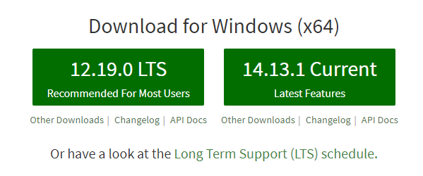

## Node.js版本介绍

Node.js 分为两大类型版本：LTS 和 Current

* LTS：Long Term Support，长时间支持版本，适合用于生产环境

* Current：最新 Node.js 版本，包含新特性，但不稳定，不适合用于生产环境


## Node.js安装

进入Node.js 的 [官方网站](https://nodejs.org) 进行下载即可




## Node.js版本管理工具

### 使用场景

在某些情况下，可能需要切换不同版本的 Node.js，如果每次都卸载再重新安装就太麻烦了，所以出现了Node.js版本管理工具

### 工具1：n

#### 介绍

全称：Interactively Manage Your Node.js Versions

注意：n 不支持 Windows 平台

#### 下载安装

```shell
npm install -g n
yarn global add n
```

#### 使用

```shell
# 查看工具n的版本/检查是否安装成功
n --version
# 安装最新 LTS
n lts
# 安装最新 Current
n lastest
# 查看所有版本/切换版本
n
```

### 工具2：nvm

#### 介绍

全称：Node Version Manager

注意：nvm不支持 Windows 平台，但可以使用 nvm-windows 工具 

#### 下载安装

```shell
npm intall -g nvm
yarn global add nvm
```

#### 使用

```shell
# 查看是否安装成功
nvm version

# 设置镜像
nvm node_mirror https://npm.taobao.org/mirrors/node/
nvm npm_mirror https://npm.taobao.org/mirrors/npm/

# 查看可以安装的Node.js版本
nvm list available

# 安装特定版本
nvm install x.y.z

# 安装最新 lts
nvm install lts

# 安装最新  release
nvm install release

# 查看已安装版本
nvm list

# 切换版本
nvm use x.y.z

# 卸载特定版本
nvm uninstall x.y.z
```

### 工具3：nvm-windows

#### 介绍

与 nvm 用法相同，专门支持 windows 的 nvm

#### 下载安装

[下载安装地址](https://github.com/corebutler/nvm-windows/releases)

#### 使用

```shell
# 查看是否安装成功
nvm version

# 设置镜像
nvm node_mirror https://npm.taobao.org/mirrors/node/
nvm npm_mirror https://npm.taobao.org/mirrors/npm/

# 查看可以安装的Node.js版本
nvm list available

# 安装特定版本
nvm install x.y.z

# 安装最新 lts
nvm install lts

# 安装最新  release
nvm install release

# 查看已安装版本
nvm list

# 切换版本
nvm use x.y.z

# 卸载特定版本
nvm uninstall x.y.z
```