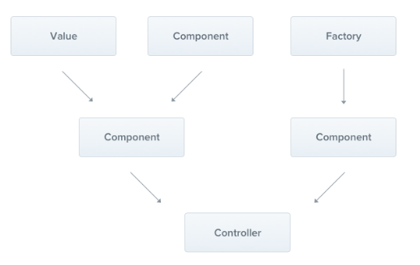

## 初识Provider

### Provider概念

Nest 提供了 IOC 容器和功能，即 Nest 会自己管理类的实例，而如果想让一个类被IOC容器管理，则需要该类为 Provider

### Provider理解

Provider本质上就是能被IOC容器管理的类




## Provider使用

### 基础使用

#### Service命名规范

在 Nest 中，Service的命名应该遵循下列的约定

```shell
[模块名].service.ts
```

比如

```shell
user.service.ts # 用户模块服务

order.service.ts # 订单模块服务
```

#### 创建Service

可以手动创建，也可以通过命令行工具CLI创建

```shell
nest generate service <service-name>
# 简写
nest g s <service-name>
```

#### 使用 `@Injectable` 装饰服务

```typescript
import { Injectable } from '@nestjs/common';
import { Cat } from './interfaces/cat.interface';

@Injectable()
export class CatsService {
  private readonly cats: Cat[] = [];

  create(cat: Cat) {
    this.cats.push(cat);
  }

  findAll(): Cat[] {
    return this.cats;
  }
}
```

#### 使用构造函数进行注入 (constructor)

```typescript
import { Controller, Get, Post, Body } from '@nestjs/common';
import { CreateCatDto } from './dto/create-cat.dto';
import { CatsService } from './cats.service';
import { Cat } from './interfaces/cat.interface';

@Controller('cats')
export class CatsController {
  constructor(private catsService: CatsService) {}

  @Post()
  async create(@Body() createCatDto: CreateCatDto) {
    this.catsService.create(createCatDto);
  }

  @Get()
  async findAll(): Promise<Cat[]> {
    return this.catsService.findAll();
  }
}
```

#### 基于属性的注入 (@Inject)

一般情况下，都是通过构造函数进行注入的，但有些时候基于属性的注入可能会有用

例如，如果顶级类依赖于一个或多个 providers，那么通过从构造函数中调用子类中的 `super()` 来传递它们就会非常烦人了

因此，为了避免出现这种情况，可以在属性上使用 `@Inject()` 装饰器

```typescript
import { Injectable, Inject } from '@nestjs/common';

@Injectable()
export class HttpService<T> {
  @Inject('HTTP_OPTIONS')
  private readonly httpClient: T;
}
```

### 可选提供者

有时候，Provider不是必须的，则可以使用`@Optional` 装饰器来代表可选

```typescript
import { Injectable, Optional, Inject } from '@nestjs/common';

@Injectable()
export class HttpService<T> {
  constructor(
    @Optional() @Inject('HTTP_OPTIONS') private readonly httpClient: T
  ) {}
}
```


## 自定义Provider

### providers数组的完整写法

```typescript
@Module({
  controllers: [CatsController],
  providers: [CatsService],
})

// 更完整写法为

@Module({
  controllers: [CatsController],
  providers: [
    {
      provide: CatsService, // 令牌
      useValue: CatsService // 注入内容
    },
    {
      provide: CatsService, // 令牌
      useClass: CatsService // 注入内容
    },
    {
      provide: CatsService, // 令牌
      useFactory: CatsService // 注入内容
    },
    {
      provide: CatsService, // 令牌
      useExisting: CatsService // 注入内容
    },
  ]
})
```

使用字符串或符号作为 `DI` 令牌（除了使用字符串作为令牌之外，还可以使用Symbol

```typescript
import { connection } from './connection';

@Module({
  providers: [
    {
      provide: 'CONNECTION', // Symbol.for("connection")
      useValue: connection,
    },
  ],
})
export class AppModule {}
```

对应的使用方法

```typescript
@Injectable()
export class CatsRepository {
  constructor(@Inject('CONNECTION') connection: Connection) {}
}
```

### 默认提供者 (@Injectable)

被 `@Injectable` 装饰器装饰的类就是 Provider

```typescript
// cats.service.ts

import { Injectable } from '@nestjs/common';
import { Cat } from './interfaces/cat.interface';

@Injectable()
export class CatsService {
  private readonly cats: Cat[] = [];

  findAll(): Cat[] {
    return this.cats;
  }
}
```

然后就可以在module中注册

```typescript
// app.module.ts

import { Module } from '@nestjs/common';
import { CatsController } from './cats/cats.controller';
import { CatsService } from './cats/cats.service';

@Module({
  controllers: [CatsController],
  providers: [CatsService],
})
export class AppModule {}
```

最后在其他地方使用（注入）

```typescript
// cats.controller.ts

import { Controller, Get } from '@nestjs/common';
import { CatsService } from './cats.service';
import { Cat } from './interfaces/cat.interface';

@Controller('cats')
export class CatsController {
  constructor(private readonly catsService: CatsService) {}

  @Get()
  async findAll(): Promise<Cat[]> {
    return this.catsService.findAll();
  }
}
```

### 值提供者 (useValue)

`useValue` 语法对于注入常量值、将外部库放入 `Nest` 容器或使用模拟对象替换实际实现非常有用

```typescript
import { CatsService } from './cats.service';

const mockCatsService = {
  /* mock implementation
  ...
  */
};

@Module({
  imports: [CatsModule],
  providers: [
    {
      provide: CatsService,
      useValue: mockCatsService,
    },
  ],
})
export class AppModule {}
```

### 类提供者 (useClass)

`useClass`语法允许您动态确定令牌应解析为的类

例如，假设我们有一个抽象（或默认）的 `ConfigService` 类，根据当前环境希望 Nest 提供配置服务的不同实现

```typescript
const configServiceProvider = {
  provide: ConfigService,
  useClass:
    process.env.NODE_ENV === 'development'
      ? DevelopmentConfigService
      : ProductionConfigService,
};

@Module({
  providers: [configServiceProvider],
})
export class AppModule {}
```

### 工厂提供者 (useFactory)

`useFactory` 语法允许动态创建提供程序，实工厂函数的返回实际的 `provider` 

工厂功能可以根据需要简单或复杂，一个简单的工厂可能不依赖于任何其他的提供者，更复杂的工厂可以自己注入它需要的其他提供者来计算结果

```typescript
const connectionFactory = {
  provide: 'CONNECTION',
  useFactory: (optionsProvider: OptionsProvider) => {
    const options = optionsProvider.get();
    return new DatabaseConnection(options);
  },
  inject: [OptionsProvider], // 参数数组
};

@Module({
  providers: [connectionFactory],
})
export class AppModule {}
```

* 工厂函数可以接受(可选)参数
* `inject` 属性接受一个提供者数组，在实例化过程中，`Nest` 将解析该数组并将其作为参数传递给工厂函数

### 别名提供者 (useExisting)

`useExisting` 语法允许您为现有的提供程序创建别名，这将创建两种访问同一提供者的方法

下面的示例中，基于字符串的令牌 `AliasedLoggerService` 是基于类的令牌 `LoggerService` 的别名

假设有两个不同的依赖项，一个用于 `AlilasedLoggerService` ，另一个用于 `LoggerService` 

如果两个依赖项都用单例作用域指定，它们将解析为同一个实例

```typescript
@Injectable()
class LoggerService {
  /* implementation details */
}

const loggerAliasProvider = {
  provide: 'AliasedLoggerService',
  useExisting: LoggerService, // 这个是令牌名称
};

@Module({
  providers: [LoggerService, loggerAliasProvider],
})
export class AppModule {}
```

### 非服务提供者

虽然提供者经常提供服务，但他们并不限于这种用途，提供者可以提供任何值

例如，提供程序可以根据当前环境提供配置对象数组

```typescript
const configFactory = {
  provide: 'CONFIG',
  useFactory: () => {
    return process.env.NODE_ENV === 'development'
      ? devConfig
      : prodConfig;
  },
};

@Module({
  providers: [configFactory],
})
export class AppModule {}
```

### 异步提供者

在完成一些异步任务之前，应用程序必须等待启动状态

例如在与数据库的连接建立之前，不希望开始接受请求，在这种情况下你应该考虑使用异步 `provider`

其语法是使用 `useFactory` 配合 `async/await`

```typescript
{
  provide: 'ASYNC_CONNECTION',
  useFactory: async () => {
    const connection = await createConnection(options);
    return connection;
  },
}
```

注入：与任何其他提供程序一样，异步提供程序通过其令牌被注入到其他组件

```typescript
@Inject('ASYNC_CONNECTION')
```

