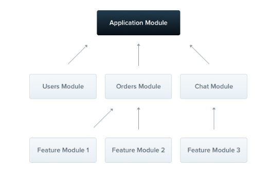

## Module概述

### Module概念

模块是被 `@Module()` 装饰器所装饰的类

 `@Module()` 装饰器提供了元数据，Nest 用它来组织应用程序结构



### Module组成

`@Module()` 装饰器接受一个描述模块属性的对象，该对象属性值如下

| 属性        | 值类型 | 值说明                                             |
| ----------- | ------ | -------------------------------------------------- |
| controllers | 数组   | 必须创建的一组控制器                               |
| providers   | 数组   | 由 Nest 进行 DI 注入，并且可以至少在整个模块中共享 |
| imports     | 数组   | 导入模块的列表，这些模块导出了此模块中所需提供者   |
| exports     | 数组   | 由本模块提供并应在其他模块中可用的提供者的子集     |

默认情况下，模块具有封装功能，模块与模块之间具有隔离性，可以将从模块导出的提供程序视为模块的公共接口或API

### 示例

```typescript
// demo.module.ts

import { Module } from "@nestjs/common"
import { DemoController } from "./demo.controller.ts"
import { DemoService } from "./demo.service.ts"

@Module({
    controllers: [DemoController],
    providers: [DemoService],
})
export class DemoModule {}
```


## Module使用

### 模块的命名约定

在 Nest 中，module的命名应该遵循下列的约定

```shell
[模块名].module.ts
```

比如

```shell
user.module.ts # 用户模块

order.module.ts # 订单模块
```

### 创建模块

创建模块有两种方式

| 创建模块方式 | 优点                                                 | 缺点                   |
| ------------ | ---------------------------------------------------- | ---------------------- |
| 手动创建文件 | 能够更加清除一个module的组成                         | 很麻烦，需要写重复代码 |
| 通过CLI创建  | 快速创建标准的module，并自动注入在App Module中import | 无                     |

命令行CLI创建的方法

```shell
nest generate module <module-name>
```

nest提供了简写别名方式

```shell
nest g mo <module-name>
```

### 模块共享

在 Nest 中，默认情况下，模块是**单例**，因此可以轻松地在多个模块之间共享**同一个**Provider实例

实际上，每个模块都是一个**共享模块**，一旦创建就能被任意模块重复导入和使用

### 模块导入

模块代表某个具体功能，而模块之间需要配合使用，而使用的前提是需要进行模块的导入

示例：存在用户模块和订单模块，现在App模块想要使用这两个模块，就需要将其导入

```typescript
// app.module.ts

import { Module } from "@nest/common"
import { UserModule } from "src/user/user.module.ts"
import { OrderModule } from "src/order/order.module.ts"

@Module({
    imports: [UserModule, OrderModule]
})
export class AppModule {}
```

导入之后，AppModule就能使用UserModule和OrderModule提供的能力了

### 模块导出

模块可以导出它们的内部提供者， 而且它们可以再导出自己导入的模块

这个功能能够对Module进行聚合，比如UtilModule由几个小功能的子Module组成（如处理网络请求、配置处理、通用函数库等），则UtilModule能够对它们进行聚合，对外暴露为一个统一的Module

```typescript
// util.module.ts

import { Module } from "@nest/common"
import { NetworkModule } from "src/network/network.module.ts"
import { ConfigModule } from "src/config/config.module.ts"
import { CommonModule } from "src/common/common.module.ts"

@Module({
    imports: [NetworkModule, ConfigModule, CommonModule],
    exports: [NetworkModule, ConfigModule, CommonModule]
})
export class UtilModule {}
```


## Module进阶使用

### 依赖注入

提供者也可以注入到模块(类)中（例如，用于配置目的）

```typescript
// config.module.ts

import { Module } from "@nestjs/common"
import { ConfigController } from "src/config/config.controller.ts"
import { ConfigService } from "src/config/config.service.ts"

@Module({
  controllers: [ConfigController],
  providers: [ConfigService],
})
export class ConfigModule {
  constructor(private readonly configService: ConfigService) {}
}
```

但是由于循环依赖，模块类不能注入到提供者中

### 全局模块

如果一个模块是全局模块，需要导入到其他所有模块中，那么一个一个地导入是相当麻烦且难以维护的

因此，Nest 提供了一个 `@Global` 装饰器，被 `@Global` 所装饰的 Module，会自动导入到其他所有的 Module中

```typescript
// demo.module.ts

import { Module, Global } from "@nestjs/common"
import { DemoController } from "./demo.controller.ts"
import { DemoService } from "./demo.service.ts"

@Global()
@Module({
    controllers: [DemoController],
    providers: [DemoService],
})
export class DemoModule {}
```

注意：使一切全局化并不是一个很好的解决方案，虽然全局模块可用于减少必要模板文件的数量，但 `imports` 数组仍然是使模块 API 透明的最佳方式


## 动态模块

### 概念

Nest 的模块系统包括一个称为动态模块的强大功能，它能够提供自定义模块的能力（比如根据特定的配置，动态决定 providers和controllers等属性）

定义动态模块，需要提供静态方法以及返回 DynamicModule

静态方法可以同步或异步（返回Promise）地返回动态模块

### 简单示例

```typescript
// database.module.ts

import { Module, DynamicModule } from "@nestjs/common"
import { createDatabaseProviders } from "src/database.providers.ts"
import { Connection } from "src/connection.provider.ts"

@Module({
  providers: [Connection],
})
export class DatabaseModule {
  static forRoot(entities = [], options?): DynamicModule {
    const providers = createDatabaseProviders(options, entities)
    return {
      module: DatabaseModule,
      providers: providers,
      exports: providers,
    }
  }
}
```

此模块 `Connection` 在默认情况下定义提供的方法，但还可以根据传递给方法的 `entities` 和 `options` 对象 `forRoot()` 来对 provider 进行修改

如果要在全局范围内注册动态模块，请将 `global` 属性设置为 `true`

```typescript
import { Module, DynamicModule } from "@nestjs/common"
import { createDatabaseProviders } from "src/database.providers.ts"
import { Connection } from "src/connection.provider.ts"

@Module({
  providers: [Connection],
})
export class DatabaseModule {
  static forRoot(entities = [], options?): DynamicModule {
    const providers = createDatabaseProviders(options, entities)
    return {
      global: true,
      module: DatabaseModule,
      providers: providers,
      exports: providers,
    }
  }
}
```

#### 使用方式

```typescript
import { Module } from "@nestjs/common"
import { DatabaseModule } from "src/database/database.module.ts"
import { User } from "src/users/entities/user.entity.ts"

@Module({
  imports: [DatabaseModule.forRoot([User])],
})
export class AppModule {}
```

如果要依次重新导出动态模块，则可以 `forRoot()` 在导出数组中省略方法调用

```typescript
import { Module } from "@nestjs/common"
import { DatabaseModule } from "src/database/database.module.ts"
import { User } from "src/users/entities/user.entity.ts"

@Module({
  imports: [DatabaseModule.forRoot([User])],
  exports: [DatabaseModule]
})
export class AppModule {}
```

### 官方完整示例

https://github.com/nestjs/nest/tree/master/sample/25-dynamic-modules/src

#### main.ts

```typescript
import { NestFactory } from '@nestjs/core';
import { AppModule } from './app.module';

async function bootstrap() {
  const app = await NestFactory.create(AppModule);
  await app.listen(3000);
  console.log(`Application is running on: ${await app.getUrl()}`);
}
bootstrap();
```

#### app.module.ts

```typescript
import { Module } from '@nestjs/common';
import { AppController } from './app.controller';
import { AppService } from './app.service';
import { ConfigModule } from './config/config.module';

@Module({
  imports: [ConfigModule.register({ folder: './config' })],
  controllers: [AppController],
  providers: [AppService],
})
export class AppModule {}
```

#### app.controller.ts

```typescript
import { Controller, Get } from '@nestjs/common';
import { AppService } from './app.service';

@Controller()
export class AppController {
  constructor(private readonly appService: AppService) {}

  @Get()
  getHello(): string {
    return this.appService.getHello();
  }
}
```

#### app.service.ts

```typescript
import { Injectable } from '@nestjs/common';
import { ConfigService } from './config/config.service';

@Injectable()
export class AppService {
  private helloMessage: string;

  constructor(configService: ConfigService) {
    this.helloMessage = configService.get('HELLO_MESSAGE');
  }

  getHello(): string {
    return this.helloMessage;
  }
}
```

#### config/config.module.ts

```typescript
import { DynamicModule, Module } from '@nestjs/common';
import { ConfigService } from './config.service';
import { ConfigOptions } from "./interfaces/config-options.interface"

@Module({})
export class ConfigModule {
  static register(options: ConfigOptions): DynamicModule {
    return {
      module: ConfigModule,
      providers: [
        {
          provide: 'CONFIG_OPTIONS',
          useValue: options,
        },
        ConfigService,
      ],
      exports: [ConfigService],
    };
  }
}
```

#### config/config.service.ts

```typescript
import { Inject, Injectable } from '@nestjs/common';
import * as dotenv from 'dotenv';
import * as fs from 'fs';
import * as path from 'path';
import { ConfigOptions, EnvConfig } from './interfaces';

@Injectable()
export class ConfigService {
  private readonly envConfig: EnvConfig;

  constructor(@Inject('CONFIG_OPTIONS') options: ConfigOptions) {
    const filePath = `${process.env.NODE_ENV || 'development'}.env`;
    const envFile = path.resolve(__dirname, '../../', options.folder, filePath);
    this.envConfig = dotenv.parse(fs.readFileSync(envFile));
  }

  get(key: string): string {
    return this.envConfig[key];
  }
}
```

#### config/interfaces/index.ts

```typescript
export * from './envconfig.interface';
export * from './config-options.interface';
```

#### config/interfaces/envconfig.interface.ts

```typescript
export interface EnvConfig {
  [key: string]: string;
}
```

#### config/interfaces/config-options.interface.ts

```typescript
export interface ConfigOptions {
  folder: string;
}
```

**虽然挺绕的，但核心就一句话：通过动态决定配置文件的名称，来动态决定ConfigService的返回值**