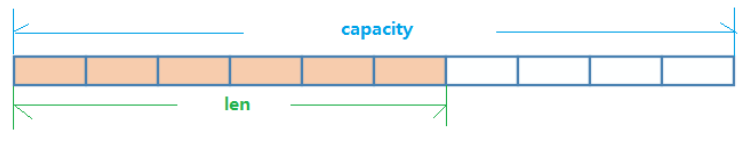

## string

### 结构

```
key --> value

age --> 20
```

### 特点

string最大大小为512MB

string类型是二进制安全的，意味着Redis的string可以包含任何数据，比如jpg图片或者序列化的对象

### API

| 命令                        | 功能                                                         | 备注                                                         |
| --------------------------- | ------------------------------------------------------------ | ------------------------------------------------------------ |
| set key value               | 新建/修改key-value                                           | 不管key是否存在都可以                                        |
| setnx key value             | 新建key-value                                                | 当key不存在才能执行                                          |
| setxx key value             | 修改key-value                                                | 当key存在才能执行                                            |
| setex key value second      | 设置 key 超时秒数                                            |                                                              |
| setpx key value millisecond | 设置 key 超时毫秒数                                          |                                                              |
| ==========                  | ==========                                                   | ==========                                                   |
| get key                     | 获取key对应的value                                           | 不存在key，返回nil                                           |
| getset key value            | 先获取key的value，再更新                                     | 如果key不存在，则返回nil，然后创建key-value                  |
| ==========                  | ==========                                                   | ==========                                                   |
| incr key                    | 自增1                                                        | 如果key不存在，则创建并返回1；如果不能自增，则报错；原子操作 |
| incrby key n                | 自增整数n                                                    | 如果key不存在，则创建并返回n；如果不能自增，则报错；原子操作 |
| incrfloat key n             | 自增浮点数n                                                  | 如果key不存在，则创建并返回n；如果不能自增，则报错；原子操作 |
| decr key                    | 自减1                                                        | 如果key不存在，则创建并返回-1；如果不能自减，则报错；原子操作 |
| decrby key n                | 自减整数n                                                    | 如果key不存在，则创建并返回-n；如果不能自减，则报错；原子操作 |
| decrfloat key n             | 自减浮点数n                                                  | 如果key不存在，则创建并返回-n；如果不能自减，则报错；原子操作 |
| ==========                  | ==========                                                   | ==========                                                   |
| append key value            | 追加value到原值末尾                                          | 如果key不存在，则新建                                        |
| strlen key                  | 获取key对应value长度                                         |                                                              |
| del key                     | 删除key-value                                                |                                                              |
| ==========                  | ==========                                                   | ==========                                                   |
| mget key1 key2 ...          | 批量获取key-value                                            | 如果key不存在，返回nil；<br />原子性，有一个失败则都失败     |
| mset k1 v1 k2 v2 ...        | 批量设置key-value                                            | 如果不存在则创建；如果存在则修改；<br />原子性，有一个失败则都失败 |
| msetnx k1 v1 k2 v2 ...      | 同时设置一个或多个 key-value 对，当且仅当所有给定 key 都不存在 | 原子性，有一个失败则都失败                                   |
| ==========                  | ==========                                                   | ==========                                                   |
| getrange key start end      | 获得范围内的子串，类似 substring                             | 前闭后开                                                     |
| setrange key start end      | 用 value 覆写 key 所存储的字符串的值                         | 前闭后开                                                     |
| setrange key index value    | 设置指定下标对应的值                                         |                                                              |

### 数据结构

String的数据结构为简单动态字符串(Simple Dynamic String,缩写SDS)

String是可以修改的字符串，内部结构实现上类似于Java的ArrayList，采用预分配冗余空间的方式来减少内存的频繁分配




如图中所示，内部为当前字符串实际分配的空间capacity一般要高于实际字符串长度len

当字符串长度小于1M时，扩容都是加倍现有的空间，如果超过1M，扩容时一次只会多扩1M的空间


## hash

### 结构

```
key --> field | value

user --> id   | 1
         age  | 20
         name | alice
```

### 特点

hash类型可以看做small redis

适合用来存储对象

### API

| 格式                                                    | 功能                               | 备注                                                         |
| ------------------------------------------------------- | ---------------------------------- | ------------------------------------------------------------ |
| hset key field value                                    | 设置key对应field的vlaue            | 如果key不存在，则新建field-value                             |
| hsetnx key field value                                  | 当不存在field时进行设置            | 如果file存在，则不执行                                       |
| hmset key field1 value1 field2 value2 ... fieldN valueN | 批量设置field-value                | 果field不存在，则创建新field-value                           |
| hget key field                                          | 获取key对应field的value            | 如果field不存在，则返回(nil)                                 |
| hmget key field1 field2 ... fieldN                      | 批量返回filed对应的value           | 如果key不存在，则返回nil                                     |
| hgetall key                                             | 返回hash key对应所有的field和value |                                                              |
| hexists key field                                       | 判断是否存在field                  | 不存在，返回0；存在，返回1                                   |
| hdel key field                                          | 删除key对应的field-value           | 如果key不存在，则返回0                                       |
| hlen key                                                | 获取field的数量                    | 如果key不存在，则返回0                                       |
| hkeys key                                               | 获取所有的field                    |                                                              |
| hvals key                                               | 获取所有的value                    |                                                              |
| hincr key file                                          | 使field对应value自增1              | field不存在，创建新field-value，其value为1；如果不能自增则报错 |
| hdecr key file                                          | 使field对应value自减1              | field不存在，创建新field-value，其value为-1；如果不能自减少则报错 |
| hincrby key field num                                   | 使field对应value自增num            | field不存在，创建新field-value，其value为num；如果不能自增则报错 |
| hincrby key field num                                   | 使field对应value自减num            | field不存在，创建新field-value，其value为-num；如果不能自减少则报错 |
| hincrbyfloat key field floatnum                         | 使field对应value自增floatnum       | field不存在，则创建field-value，其value为floatnum；如果不能自增则报错 |

### 数据结构

hash类型对应的数据结构是两种：ziplist（压缩列表），hashtable（哈希表）

当field-value长度较短且个数较少时，使用ziplist，否则使用hashtable


## list

### 结构

```
key --> element1, element2, ..., elementN

username --> alice, mneumi, jack
```

### 特点

元素可以重复，有序

### API

| 格式                                     | 功能                                            | 备注                                                     |
| ---------------------------------------- | ----------------------------------------------- | -------------------------------------------------------- |
| lpush key value1 value2 ... valueN       | 从列表左插入值(1~N个)                           | 没有则创建                                               |
| rpush key value1 value2 ... valueN       | 从列表右侧插入值(1~N个)                         | 没有则创建                                               |
| linsert key before\|after value newValue | 从列表第一个value的前\|后插入新元素newValue     |                                                          |
| lpop key                                 | 从列表左侧弹出第一个item                        |                                                          |
| rpop key                                 | 从列表右侧弹出第一个item                        |                                                          |
| lrem key count value                     | 根据count的值，从列表中删除count个等于value的项 | count>0，从左到右；count<0，从右到左；couont=0，删除所有 |
| ltrim key start end                      | 按照索引范围修剪列表                            | 保留[start,end]的元素                                    |
| lrange key start end                     | 获取列表中指定索引范围所有的item                | 查找[start,end]的元素                                    |
| lindex key index                         | 获取列表中指定索引的item                        | 支持反向索引，即负数                                     |
| llen key                                 | 获取列表的长度                                  |                                                          |
| lset key index newValue                  | 修改列表中index下标的元素为newValue             | 支持反向索引，即负数                                     |
| blpop key timeout                        | 阻塞timeout秒后弹出左侧元素                     |                                                          |
| brpop key timeout                        | 阻塞timeout秒后弹出右侧元素                     |                                                          |
| rpoplpush key1 key2                      | 从 key1 列表右边吐出一个值，插到 key2 列表左边  |                                                          |

### 数据结构

List的底层数据结构为快速链表quickList

* 首先在列表元素较少的情况下会使用一块连续的内存存储，这个结构是ziplist，也即是压缩链表——它将所有的元素紧挨着一起存储，分配的是一块连续的内存
* 当数据量比较多的时候才会改成双向循环链表，对两端的操作性能很高，通过索引下标的操作中间的节点性能会较差，且因为普通的链表需要的附加指针空间太大，会比较浪费空间（需要存储prev，next等信息）

Redis将双向循环链表和ziplist结合起来组成了quicklist，也就是将多个ziplist使用双向指针串起来使用——这样既满足了快速的插入删除性能，又不会出现太大的空间冗余


## set

### 结构

```
key --> element1, elements2, ..., elementN

subject --> chinese, music, art, maths 
```

### 特点

元素不重复，无序

因为底层是哈希表，所以添加，删除，查找的复杂度都是O(1)

### API

| 格式                         | 功能                                     | 备注                                 |
| ---------------------------- | ---------------------------------------- | ------------------------------------ |
| sadd key element             | 向集合中添加元素element                  | 如果element已存在，则该操作被忽略    |
| spop key                     | 从集合中随机弹出一个元素                 |                                      |
| srem key element             | 将集合中key的element删除                 |                                      |
| scard key                    | 获取集合中元素个数                       |                                      |
| sismember key item           | 判断item是否为集合中的元素               |                                      |
| srandmember key              | 随机取出集合中的一个元素                 | 是取出不是弹出，即不会破坏的原有集合 |
| smembers key                 | 获取集合中所有的元素                     |                                      |
| smove source dest value      | 把集合中一个值从一个集合移动到另一个集合 |                                      |
| sdiff set1 set2              | 求两个集合的差集                         |                                      |
| sunion set1 set2             | 求两个集合的并集                         |                                      |
| sinter set1 set2             | 求两个集合的交集                         |                                      |
| sdiffstore newSet set1 set2  | 求两个集合的差集，结果组成新集合         |                                      |
| sinterstore newSet set1 set2 | 求两个集合的交集，结果组成新集合         |                                      |
| sunionstore newSet set1 set2 | 求两个集合的并集，结果组成新集合         |                                      |

### 数据结构

Set数据结构是dict字典，字典是用哈希表实现的


## zset

### 结构

```
key --> score | value

ranking --> 2  | 小明
            5  | 小红
            12 | 阿强
```

### 特点

元素不重复，有序

score单独可以重复，value单独可以重复

score-value不能重复

### API

| 格式                                                         | 功能                                                       | 备注                                                        |
| ------------------------------------------------------------ | ---------------------------------------------------------- | ----------------------------------------------------------- |
| zadd key score1 ele1 score2 ele2 ...                         | 添加score-element                                          |                                                             |
| zcard key                                                    | 返回集合中元素的个数                                       |                                                             |
| zrem key element                                             | 删除集合中指定索引的element                                |                                                             |
| zincrby key increScore element                               | 将集合中element的score增加increScore                       | 当increScore为负数时，实现减少的功能                        |
| zcore key element                                            | 获取集合中element的score                                   |                                                             |
| zrank key element                                            | 获取集合中指定元素的排名，从小到大                         |                                                             |
| zrange key start end [withscores]                            | 获取集合中排行从start到end的元素，从小到大                 | 以score从小到达进行排序；加上withscores会返回element的score |
| zrangebyscore key minScore maxScore                          | 获取集合中score位于[minScore,maxScore]之间的元素，从小到大 |                                                             |
| zcount key minScore maxScore                                 | 获取集合中score处于[minScore,maxScore]之间的element个数    |                                                             |
| zremrangebyrank key start end                                | 删除指定排名内的元素                                       |                                                             |
| zremrangebyscore key minScore maxScore                       | 删除指定分数内的元素                                       |                                                             |
| zrevrank key element                                         | 类似zrank，区别：从大到小                                  |                                                             |
| zrevrange key start end [withscores]                         | 类似zrange，区别：从大到小                                 |                                                             |
| zrevrangebyscore key maximum [withscores] [limit offset count] | 类似zrangebyscore，区别：从大到小                          |                                                             |
| zinterstore                                                  |                                                            |                                                             |
| zunionstore                                                  |                                                            |                                                             |

### 数据结构

zset底层使用了两个数据结构

* 哈希表，哈希表的作用就是关联元素value和权重score，保障元素value的唯一性，可以通过元素value找到相应的score值
* 跳跃表，跳跃表的目的在于给元素value排序，根据score的范围获取元素列表