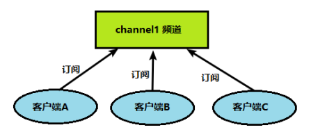
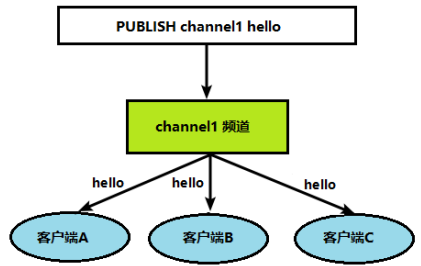

## 发布订阅

### 概述

发布订阅是一种消息通信模式：发送者 (pub) 发送消息，订阅者 (sub) 接收消息

发布者：publisher；订阅者：subscriber；频道：channel

Redis 客户端可以订阅任意数量的频道

### Redis的发布订阅

客户端能够订阅频道



当给频道发布消息后，消息就会发送给订阅的客户端



### 示意图


## 命令

### 发布消息

publish channel message

```shell
publish vrs "hello world"
```

### 订阅频道

#### 普通订阅

subscribe [channel]...

```shell
subscribe vrs
```

#### 通过模式订阅

psubscribe [pattern]

```shell
psubscribe v*s
```

### 取消订阅

#### 普通取消

unsubscribe [channel]...

```shell
unsubscribe vrs
```

#### 通过模式取消

punsubscribe [pattern]

```shell
punsubscribe v*s
```

### 列出频道

#### 列出至少有一个订阅者的频道

pubsub channels

```shell
pubsub channels
```

#### 列出指定频道订阅者的数量

pubsub numsub [channel]...

```shell
pubsub numsub vrs
```


## 注意事项

Redis中发布的消息没有持久化，客户端只能收到订阅后发布的消息