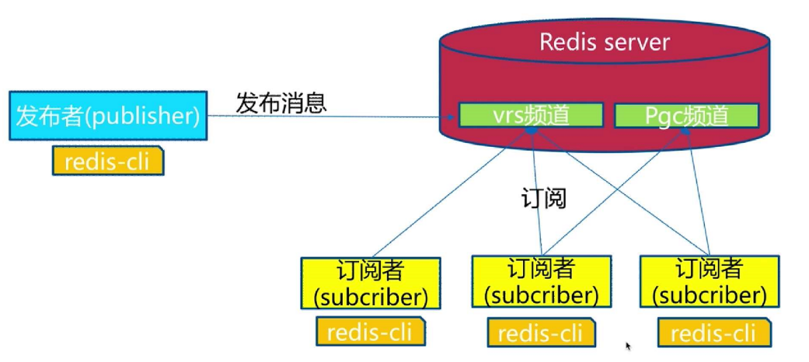

## 概述

### 术语

发布者：publisher

订阅者：subscriber

频道：channel

### 示意图




## 命令

### 发布消息

publish channel message

```shell
publish vrs "hello world"
```

### 订阅频道

#### 普通订阅

subscribe [channel]...

```shell
subscribe vrs
```

#### 通过模式订阅

psubscribe [pattern]

```shell
psubscribe v*s
```

### 取消订阅

#### 普通取消

unsubscribe [channel]...

```shell
unsubscribe vrs
```

#### 通过模式取消

punsubscribe [pattern]

```shell
punsubscribe v*s
```

### 列出频道

#### 列出至少有一个订阅者的频道

pubsub channels

```shell
pubsub channels
```

#### 列出指定频道订阅者的数量

pubsub numsub [channel]...

```shell
pubsub numsub vrs
```