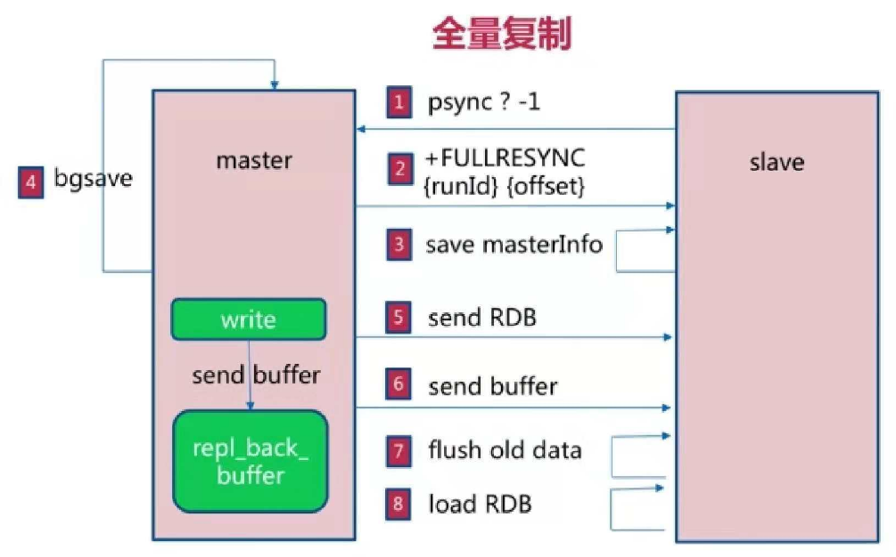
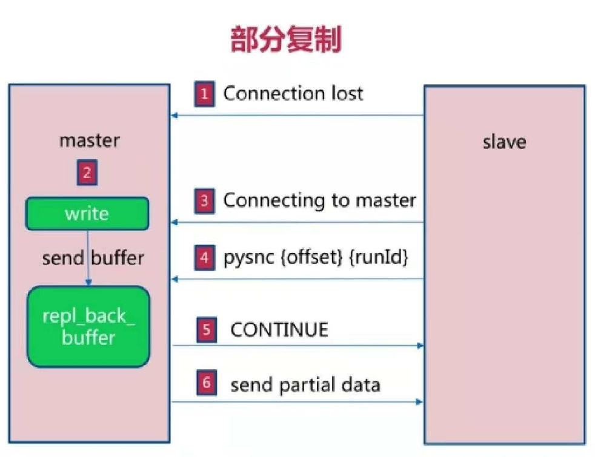

## 初识主从复制

### 概述

用于建立一个和主数据库完全一样的数据库环境，称为从数据库

### 作用

数据备份，读写分离


## 使用主从复制

### 通过slaveof命令

创建从节点

```bash
redis-cli> slaveof 127.0.0.1 6379
```

取消从节点

```bash
redis-cli> slaveof no one
```

### 通过配置

| 配置项                  | 配置说明             |
| ----------------------- | -------------------- |
| slaveof ip port         | 设置主节点的ip和端口 |
| slave-read-only yes\|no | 从节点是否只读       |

### 两种方式比较

| 方式 | 优点     | 缺点       |
| ---- | -------- | ---------- |
| 命令 | 无需重启 | 不便于管理 |
| 配置 | 统一配置 | 需要重启   |


## 复制方式

### 全量复制



### 部分复制



 

## 故障转移

### Master节点故障

1. 选举出其中一个从节点，令它 slaveof no one
2. 令该节点成为新的主节点
3. 其他从节点同步于它

### Slave节点故障

1. 恢复后重新成为主节点的从节点

2. 找另外的节点成为主节点的从节点

### redis-sentinel的引出

1. 主从复制的故障恢复很麻烦，恢复需要人工操作，需要丰富的经验和技术
2. 为解决主从复制故障恢复的问题，提高redis的高可用性，官方推出了redis-sentinel


## 主从复制注意事项

- 一个master可以有多个slave，而一个slave只能有一个master
- 数据流向是单向的：master --> slave
- 当一个节点成为从节点后，该节点上原来的数据全部被清除
- slaveof no one 后从节点的数据并没有删除 ，只是Master节点的新的数据不会再同步到从节点