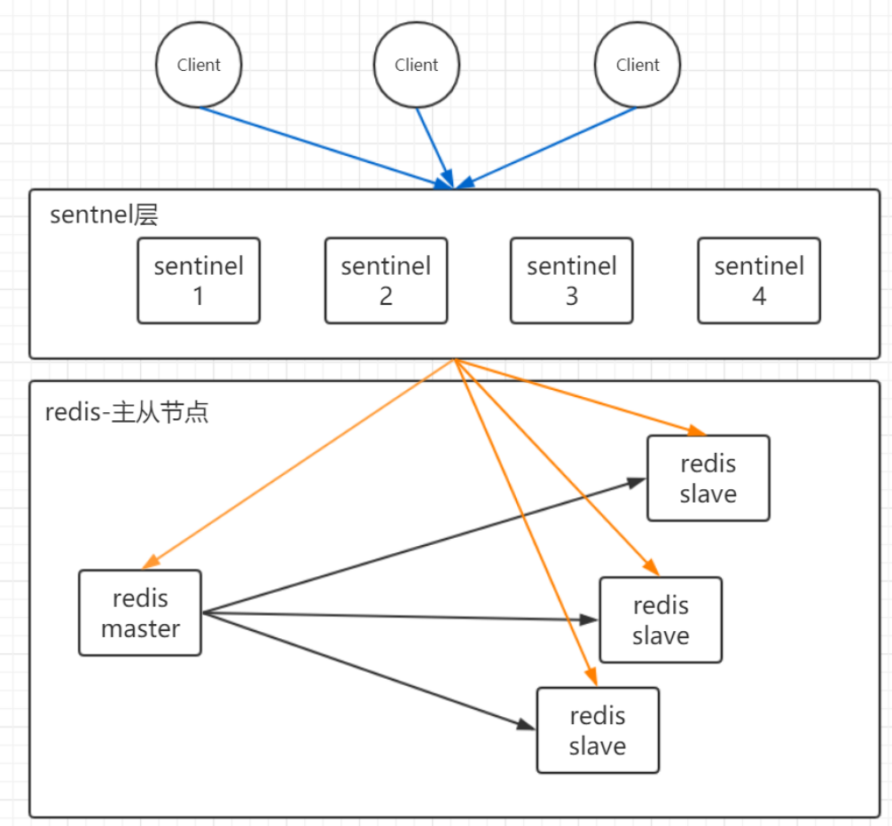

## 主从复制存在的问题与解决

### 问题

当Redis发生故障时，需要手动进行故障转移

Reids的写能力和存储能力受限

### 解决

Redis官方推出redis-sentinel，可以自动实现主从复制的故障恢复，并可用于实现redis的高可用


## redis-sentinel

### 概念

sentinel是特殊的redis，不存储数据，支持的命令很有限，默认端口 26379，架构图如下



### 故障转移流程

1. sentinel层中多个sentinel发现master节点发生异常
2. sentinel层选举中一个sentinel作为领导者
3. sentinel领导者选举出一个slave节点为新的master节点
4. sentinel层通知其他的slave成为新master节点的slave
5. sentinel层通知客户端主从节点发生了改变
6. 等待旧master复活成为新master的slave

### 配置与使用

先设置好主从复制，即一个master，以及一个或多个slave

启动redis-sentinel

```shell
redis-sentinel redis-sentinel-26381.conf
```

查看sentinel状态

```shell
redis-cli -h 127.0.0.1 -p 26389 info sentinel
```

sentinel配置

| 配置项                                          | 配置说明                                   |
| ----------------------------------------------- | ------------------------------------------ |
| daemonize yes\|no                               | 是否以守护进程方式启动sentinel             |
| port                                            | sentinel占用端口                           |
| dir                                             | sentinel工作目录                           |
| logfile                                         | sentinel日志文件名                         |
| pidfile                                         | sentinel进程文件名                         |
| sentinel monitor mymaster 127.0.0.1 7000 2      | 主节点主机和端口，多少个sentinel认为有问题 |
| sentinel down-after-milliseconds mymaster 30000 | 30秒不通，则认为有问题                     |
| sentinel parallel-syncs mymaster 1              | 故障恢复时，一次复制1个                    |
| sentinel failover-timeout mymaster 180000       |                                            |


## redis-sentinel的原理

### 主观下线和客观下线

| 下线     | 说明                                              |
| -------- | ------------------------------------------------- |
| 主观下线 | 一个sentinel节点认为某个redis节点失败             |
| 客观下线 | 超过指定数目的sentinel节点都认为某个Redis节点失败 |

### 三个定时任务

| 定时任务                                         | 说明                                                         |
| ------------------------------------------------ | ------------------------------------------------------------ |
| 每10秒每个sentinel对master和slave执行info命令    | 掌控整个体系中的Redis节点，以及它们的关系                    |
| 每2秒每个sentinel通过master节点的channel交换信息 | 通过\__sentinel__:hello频道交互，交互对节点的"看法"和自身信息 |
| 每1秒每个sentinel向其他sentinel和redis执行ping   | 心跳检测，判断其他的sentinel和redis是否还正常工作            |

### 领导者选举

1. 每个做客观下线的sentinel节点向其他sentinel节点发送命令**sentinel is-master-down-by-add**，请求成为领导者
2. 受到命令的sentinel节点如果没有同意其他sentinel节点发送的命令，那么将同意改请求，否则拒绝
3. 如果sentinel发现自己的票数已经超过半数，则将成为领导者
4. 如果此过程中有多个sentinel成为领导者，则等待一段时间后重新进行选举

### 新master节点的选择

这个操作由sentinel领导者完成，选择标准如下

1. 如果redis节点有设置slave-priority，则选择最高那个，否则下一步
2. 选择复制偏移量最大的redis节点，如果不存在，则下一步
3. 选择runid最小那个redis节点


