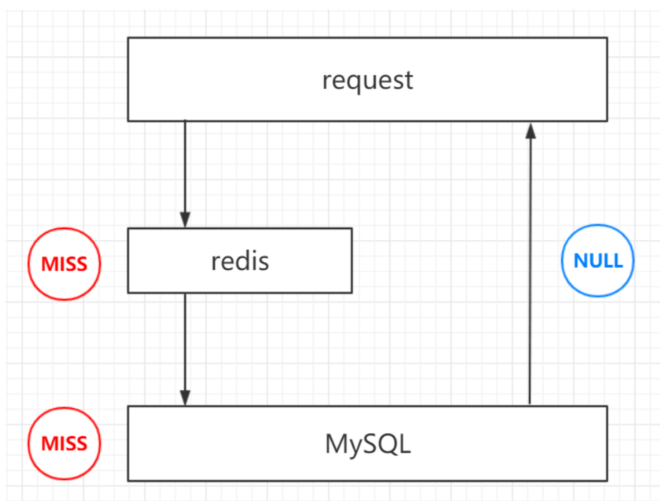
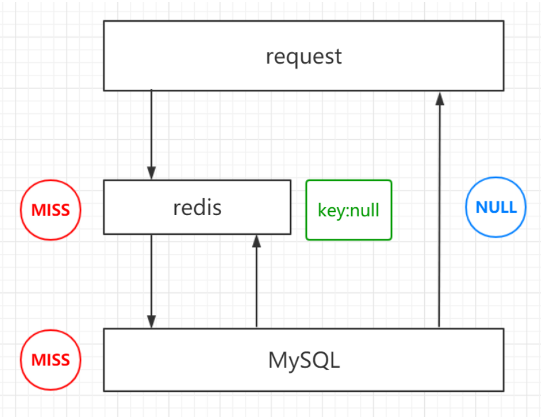

## 缓存收益与成本

| 项   | 说明                                                |
| ---- | --------------------------------------------------- |
| 收益 | 加速读写；降低后端、持久层的负载和压力              |
| 成本 | 可能导致数据不一致；代码运维成本；redis节点运维成本 |

## 缓存粒度与更新策略

### 缓存粒度

缓存中数据存储的规模：分为全部存储和部分存储

| 存储方式 | 通用性 | 占用空间 | 代码维护 |
| -------- | ------ | -------- | -------- |
| 部分存储 | 弱     | 少       | 难       |
| 全部存储 | 强     | 多       | 易       |

### 更新策略

| 策略             | 一致性 | 维护成本 | 介绍                     |
| ---------------- | ------ | -------- | ------------------------ |
| LRU/LIRS算法剔除 | 最差   | 底       | 剔除最近最少使用的数据   |
| 超时剔除         | 较差   | 底       | 定时删除、惰性删除       |
| 主动更新         | 最好   | 高       | 持久层更新，缓存层也更新 |

## 缓存穿透

### 概念

大量的请求不命中，既不命中redis也不命中持久层 ，示意图如下

### 产生原因与发现

业务代码有问题，使用户请求一些不存在或不能访问的数据

恶意攻击，比如故意访问不存在的资源

查看日志记录，分析响应请求的时间

### 解决方法

#### 方法1：接口层增加校验

进行用户鉴权校验，id做基础校验，比如id<=0直接拦截

#### 方法2：缓存空对象

原理：当请求一个不存在的数据时，在redis层存储一个空对象，设置较短的过期时间

优点：实现简单

缺点：占用更多的空间；可能导致数据不一致

#### 方法3：布隆过滤器

原理：使用布隆过滤器，将存在的数据都存入布隆过期器中，以判断是否存在数据

缺点：很难设计和使用

## 缓存击穿

### 概念

缓存击穿是指在缓存中没有，而在数据库中有的数据（一般由于缓存过期），这时由于并发用户特别多，导致数据库访问量多大，引起数据库宕机等后果

### 解决方法

方法1：设置热点数据永不过期

方法2：使用互斥锁，避免过多线程去访问数据库

## 缓存雪崩

### 概念

由于缓存层宕机或者缓存同一时间段大部分过期，导致前端流量全部涌向持久层，从而造成连锁反应，持久层也宕机了

缓存雪崩类似于缓存击穿，区别在于缓存击穿针对的是某一条数据，而缓存雪崩针对的是多条数据

### 解决方法

方法1：使用redis-sentinel和redis-cluster增强redis的高可用性

方法2：设置随机过期时间，避免过多缓存同时过期

## 缓存无底洞

### 概念

当缓存集群中机器过多，且数据部分太分散时，如果客户端的一个命令，需要从多个节点中获取数据才能完成，那么可能由于网络传输的问题，导致机器越多，执行越慢

### 解决方法

方法1：减少网络请求的次数

方法2：降低网络请求带来的消耗，比如加入连接池等等

## 热点key重建

### 热点key重建概念

* 当一个数据突然成为热点时（比如微博的热点），且整个数据之前并没有在缓存时
* 由于服务器是高并发的，所以可能会有多个线程都进行**将热点数据写入缓存**的操作
* 这样很多的重复操作会带来非常大的性能消耗

### 热点key解决方法

使用互斥锁

* 原理：一个线程在准备重建时进行加锁，则其他线程不能再重建
* 缺点：可能导致大量的线程在等待

永远不过期策略

### 两种方法对比

| 方案           | 优点                 | 缺点                           |
| -------------- | -------------------- | ------------------------------ |
| 互斥锁         | 思路简单；保持一致性 | 存在死锁风险；可能很多线程等待 |
| 永远不过期策略 | 杜绝很多线程等待问题 | 不保证一致性                   |

