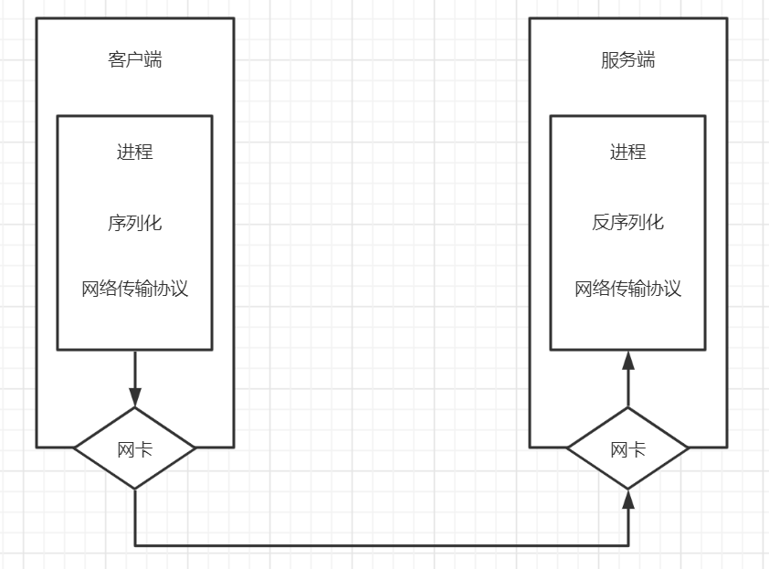

## 初识RPC

RPC，Remote Procedure Call，远程过程调用

简单理解就是一个网络节点请求另外一个网络节点的服务

对应RPC的是本地过程调用，函数调用是最常见的本地过程调用

## RPC面临的问题

### Call ID 和函数的映射

在本地调用中，函数体是直接通过函数指针指定的，编译器会自动负责寻址并调用

在远程调用中，这种方案是不行的，因为两个进程的地址空间是完全不一样的，所以在RPC中，所有的函数都必须有自己的ID，且这个在所有进程中都是唯一确定的，即需要实现 `Call ID`和函数映射

客户端与服务端都需要维护一个**函数 <--> Call ID**的映射表

* 当客户端需要进行RPC时，查表找到Call ID
* 服务端接收到请求后，查表找出 Call ID 对应的函数并执行和返回

### 序列化和反序列化

客户端和服务端进行通信时，需要将请求参数和请求的响应做序列化和反序列化操作，从而使其能够通过网络传输

序列化和反序列化操作需要考虑压缩体积和压缩性能

常用的协议有：JSON，XML，Protobuf等

### 网络传输

远程过程调用，所有的数据都需要通过网络传输，因为需要有网络传输协议

网络传输协议需要考虑性能和兼容性等等

常用的网络协议：HTTP，TCP，UDP等

### 流程示例图

 

### 流程总结

客户端RPC流程

1. 将调用映射为 `Call ID`
2. 将 `Call ID` 和参数序列化
3. 将序列化结果通过网络传输给服务端
4. 等待服务端返回
5. 如果服务端返回成功，则将响应结果反序列化

服务端RPC流程

1. 本地维护一个 `Call ID` 和函数的映射表
2. 等待请求
3. 等到请求后，将请求参数反序列化，得到 `Call ID`
4. 通过 `Call ID` 找到对应的函数并调用
5. 将函数执行结果序列化
6. 将序列化结果通过网络返回给客户端
