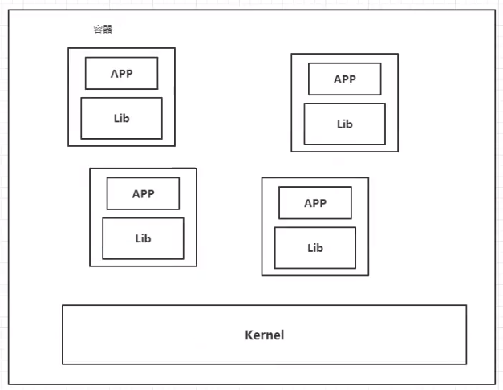
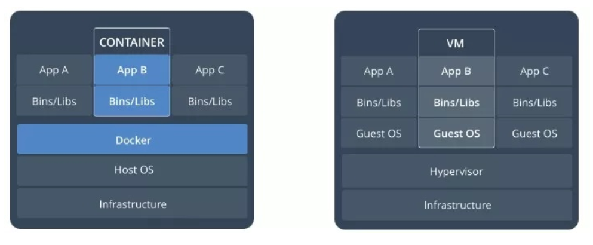

## Docker概述

### 	Docker为什么出现

一款产品：开发--上线，两套环境！应用环境，应用配置！

开发 -- 运维。问题：我在我的电脑上可以运行！版本更新，可能导致服务不可用！对于运维来说，考验十分大

环境配置十分麻烦，每一个机器都要部署环境（集群Redis，ES，Hadoop）！费时费力

发布一个项目（jar +  (Redis + MySQL jdk ES) ，项目能不能都带上环境安装打包

之前在服务器配置一个应用环境 Redis，MySQL，jdk，ES，Hadoop，配置太麻烦，而且不能跨平台（Windows开发，发布到Linux）

传统：开发jar，运维来部署

现在：开发打包部署上线，一套流程搞完

**核心：打包时带上环境（镜像）**

**核心：镜像放到仓库（比如 apk 放到 应用商店）**

**核心思想**：Docker核心思想，打包装箱，每个箱子都是隔离的（容器隔离，沙箱机制）

Docker通过隔离机制，可以将服务器利用到极致（不用担心冲突问题）

### Docker历史

#### 2010年

几个搞IT的年轻人，就在美国成立了一家公司`dotCloud`，做一些 pass 的云计算服务，有一些 LXC 相关的容器技术！他们将自己技术（容器化技术）命名就是 Docker! Docker刚刚诞生时，没有引起行业的注意！活不下去！于是就开源了

#### 2013年

Docker开源，越来越多人注意到 Docker 的优点，然后就火了（开源后，每个月更新一个版本）

#### 2014月4月9日

Docker 1.0 发布

Docker为啥这么火？因为**十分轻巧**

在容器技术出来之前，我们都是使用虚拟机技术

虚拟机：在windows上安装一个vmware，通过这个软件我们可以虚拟一台或多台电脑！笨重！

虚拟机是虚拟化技术，Docker也是虚拟化技术

```
vm: linux centos原生镜像（一台电脑） 隔离，需要开启多个虚拟机，启动很慢！
docker：镜像（最核心的环境，4m + jdk + mysql）十分轻巧，运行镜像就可以了！小巧！，启动很快！
```

到现在，几乎所有开发人员都需要学会 Docker

### 聊聊Docker

Docker基于 Go 开发

官网：https://www.docker.com/

文档地址：https://docs.docker.com/

Docker的文档是超级详细的

仓库地址：https://hub.docker.com/


### Docker能做什么

缺点：

* 资源占用十分多
* 启动很慢
* 冗余步骤很慢

> Docker技术




比较Docker与虚拟机技术的不同

* 传统虚拟机：虚拟出一条硬件，运行一个完整的操作系统，然后在这个系统上安装和运行软件
* 容器内的应用直接运行在宿主机的内容，容器是没有自己的内核的，也没有虚拟硬件，所以就轻便了
* 每个容器是互相隔离的，每个容器内都有一个属于自己的文件系统，互相隔离，互不影响

容器化技术不是模拟一个完成的操作系统


### DevOps（开发，运维）

**更快速的交付和部署**

传统：一堆帮助文档，安装程序

Docker：打包镜像，发布测试，一键运行

**更便捷的升级和扩缩容**

使用 docker之后，我们部署应用和搭积木一样

**更简单的系统运维**

在使用docker后，我们的开发，测试环境是高度一致的

**更高效的计算资源利用**

Docker 是内核级的虚拟化，可以在一个物理机上运行很多的容器实例

服务器性能能够压榨到极致


### Docker是什么

1. `Docker`是一个开源的应用容器引擎，解决应用软件跨环境迁移的问题
2. `Docker`诞生于2013年初，基于`Go`语言实现，由`dotCloud`公司（后改名`Docker Inc`）出品

### Docker特点

1. 容器使用沙箱机制，不同的容器之间相互隔离
2. 容器性能开销极低，速度和资源消耗都优于虚拟机

### Docker版本

`Docker`从17.03版本后分为 `CE`（Community Edition）和 `EE` (Enterprise Edition) 两个版本


## Docker安装

保证系统内核大于等于3

```shell
uname -a
Linux DESKTOP-E1QHVK9 4.19.128-microsoft-standard
```

判断是否安装成功

```shell
docker version
```

### Hello World

```shell
docker run hello-world
```

找不到，开始从远程开始拉取

### 查看下载的Hello-World镜像

### Docker的卸载


## Docker与虚拟机区别

容器是在`Linux`系统上运行的一个独立进程，其并与其他容器共享主机的内核，不占用其他任何可执行文件的内存，非常轻量

虚拟机运行的是一个完成的操作系统，通过虚拟机管理程序对主机资源进行虚拟访问，相比之下需要的资源更多



| 对比项     | Docker             | VM             |
| ---------- | ------------------ | -------------- |
| 启动       | 秒级               | 分钟级         |
| 硬盘使用量 | MB级               | GB级           |
| 性能       | 接近原生           | 弱于原生       |
| 系统支持量 | 单机支持上千个容器 | 单机支持几十个 |