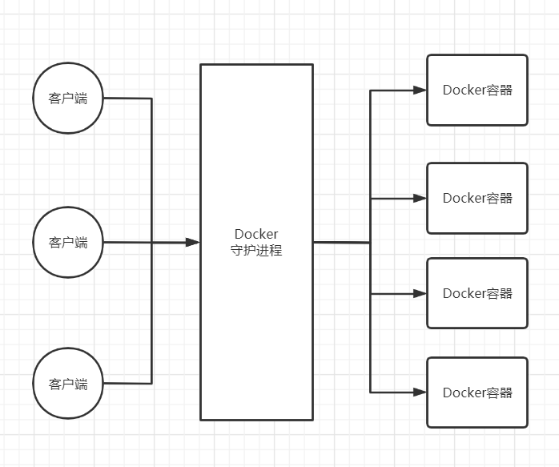

## 初识Docker

### Docker是什么

`Docker`是一个开源的应用容器引擎，解决应用软件跨环境迁移的问题

`Docker`诞生于2013年初，基于`Go`语言实现，由`dotCloud`公司（后改名`Docker Inc`）出品

### Docker能做什么

| 功能                 | 说明                                                         |
| -------------------- | ------------------------------------------------------------ |
| 更快速的交付和部署   | 传统：一堆帮助文档，安装程序<br />Docker：打包镜像，发布测试，一键运行 |
| 更便捷的升级和扩缩容 | 使用 docker之后，部署应用和搭积木一样                        |
| 更简单的系统运维     | 使用docker后，开发，测试环境是高度一致的                     |
| 更高效的计算资源利用 | Docker 是内核级的虚拟化，服务器性能能够压榨到极致            |

### Docker特点

容器使用沙箱机制，不同的容器之间相互隔离

容器性能开销极低，速度和资源消耗都优于虚拟机

### Docker版本

`Docker`从17.03版本后分为 `CE`（Community Edition）和 `EE` (Enterprise Edition) 两个版本


## Docker安装与卸载

> 官方文档：https://docs.docker.com/

### 安装

保证系统内核大于等于3

```shell
uname -a
Linux DESKTOP-E1QHVK9 4.19.128-microsoft-standard
```

判断是否安装成功

```shell
docker version
```

Hello World

```shell
docker run hello-world
```

### 卸载


## Docker工作模型

### 概述

Docker是一个 Client - Server 结构的系统，Docker的守护进程运行在主机上，通过Socket从客户端连接

DockerServer接收到DockerClient的命令，就会执行命令

### 示意图




## Docker与虚拟机

### 对比

容器是在`Linux`系统上运行的一个独立进程，其并与其他容器共享主机的内核，不占用其他任何可执行文件的内存，非常轻量

虚拟机运行的是一个完成的操作系统，通过虚拟机管理程序对主机资源进行虚拟访问，相比之下需要的资源更多

| 对比项     | Docker             | VM             |
| ---------- | ------------------ | -------------- |
| 启动       | 秒级               | 分钟级         |
| 硬盘使用量 | MB级               | GB级           |
| 性能       | 接近原生           | 弱于原生       |
| 系统支持量 | 单机支持上千个容器 | 单机支持几十个 |

### Docker优点

docker有着比虚拟机更少的抽象层

docker利用的是宿主机的内核，而vm需要用 Guest OS

所以新建一个容器时，不需要像虚拟机一样重新加载一个操作系统内核，即虚拟机加载OS是分钟级别的，而Docker是秒级别的


