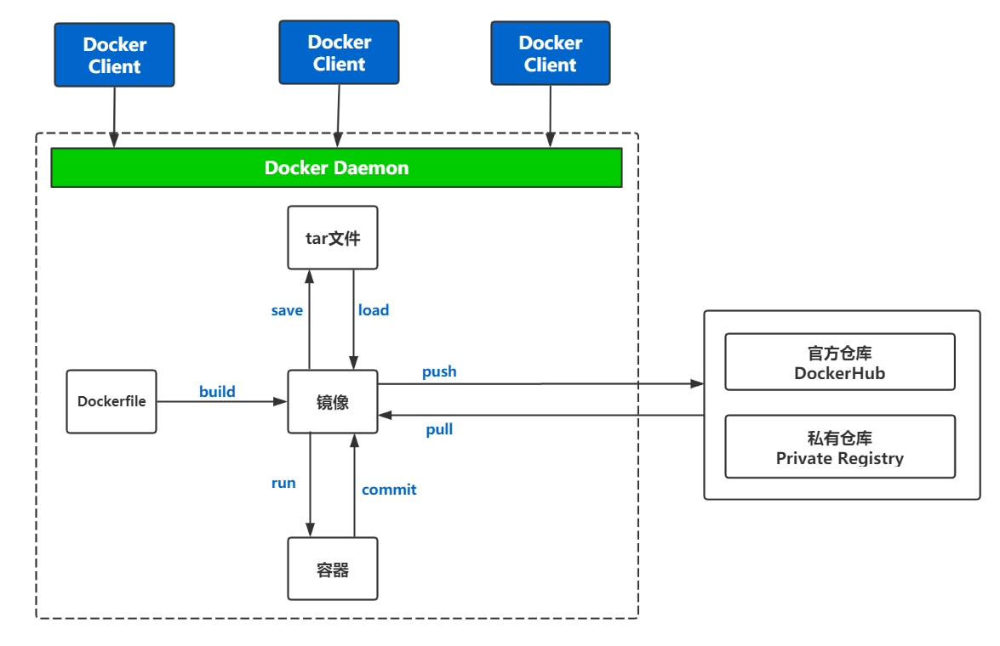

## 	Docker组成图

## Docker组成术语

| 术语           | 说明                                                         |
| -------------- | ------------------------------------------------------------ |
| 镜像 image     | 镜像是一个只读模板，是一堆只读层的统一视角，镜像用于创建容器，通过镜像可以创建为多个容器 |
| 容器 container | 根据镜像创建的运行实例，类似于进程，可以将容器理解为一个简易的 Linux 操作系统 |
| 仓库 registry  | 镜像存放中心，分为官方仓库和私有仓库                         |
| dockerfile     | 描述镜像构建方式，用于构建镜像                               |
| tar文件        | 镜像进行压缩打包后的文件，该文件用于镜像的传输               |

**统一文件系统**（`union file system`）技术能够将不同的层整合成一个文件系统，为这些层提供了一个统一的视角，这样就隐藏了多层的存在，在用户的角度看来，只存在一个文件系统