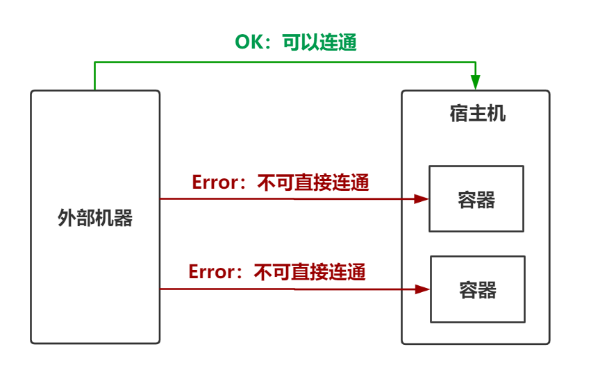
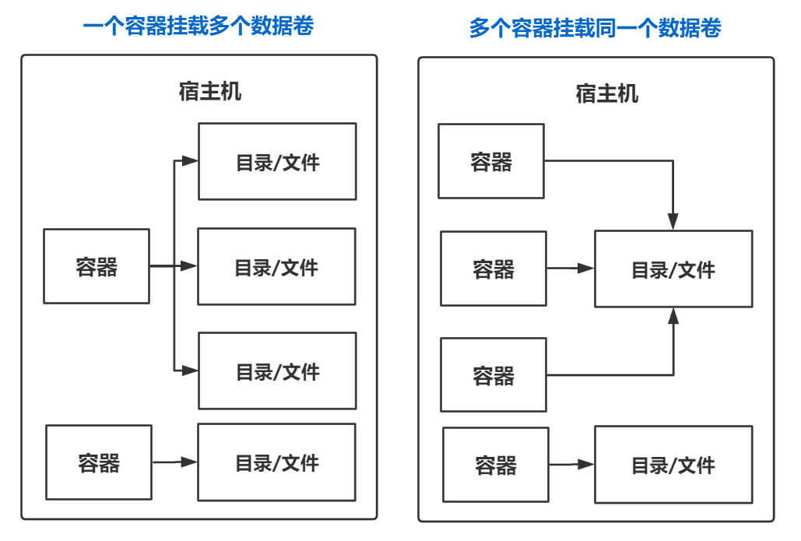
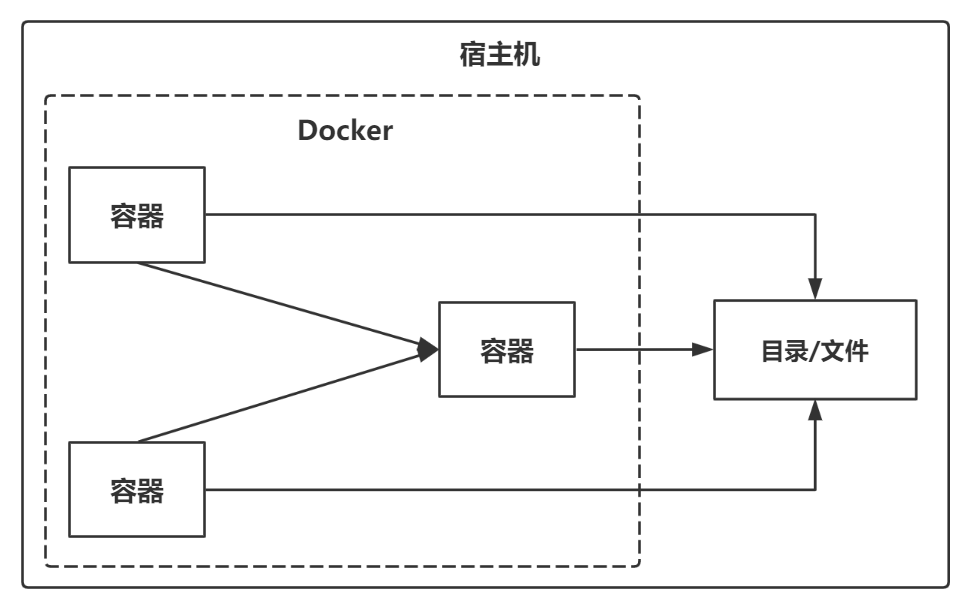

## 数据卷概念及作用

### 思考

1. Docker容器删除后，在容器中产生的数据还在吗？

2. Docker容器可以和外部机器直接交换文件吗？

3. 容器之间如何进行数据交换？



### 数据卷介绍

数据卷是宿主机器中的一个目录或文件，当容器与数据卷目录绑定后，容器和数据卷中的修改都会立即同步给对方

一个数据卷可以被多个容器同时挂载，一个容器也可以挂载多个数据卷



### 数据卷作用

* 容器数据持久化到宿主机器（容器数据同步到数据卷）
* 外部机器与容器之间的通信（外部机器访问数据卷）
* 容器之间交换数据（多个容器挂载同一个数据卷）


## 配置数据卷

### 方式1：创建容器时配置数据卷

```shell
docker run ... -v [宿主机目录/文件:容器内目录/文件] ...
```

* 目录必须是绝对路径，如果目录不存在则会自动创建
* 一个容器可以挂载多个数据卷
* 一个数据卷可以被多个容器挂载

### 方式2：使用数据卷容器

可以使用数据卷容器来简化容器挂载数据卷的操作



创建数据卷容器

```shell
docker run ... --name c_volumn -v [容器内目录/文件] ...
```

创建容器时连接数据卷容器

```shell
docker run ... --volumnes-from c_volumn ...
```