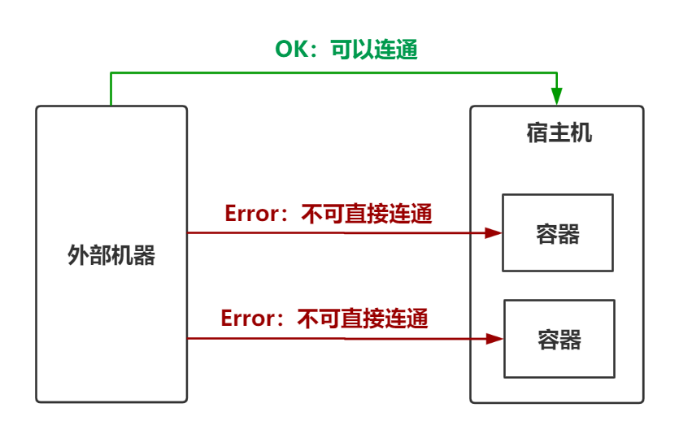
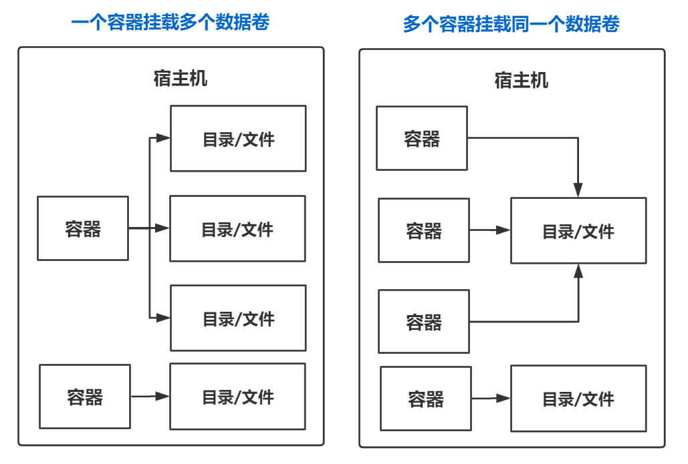
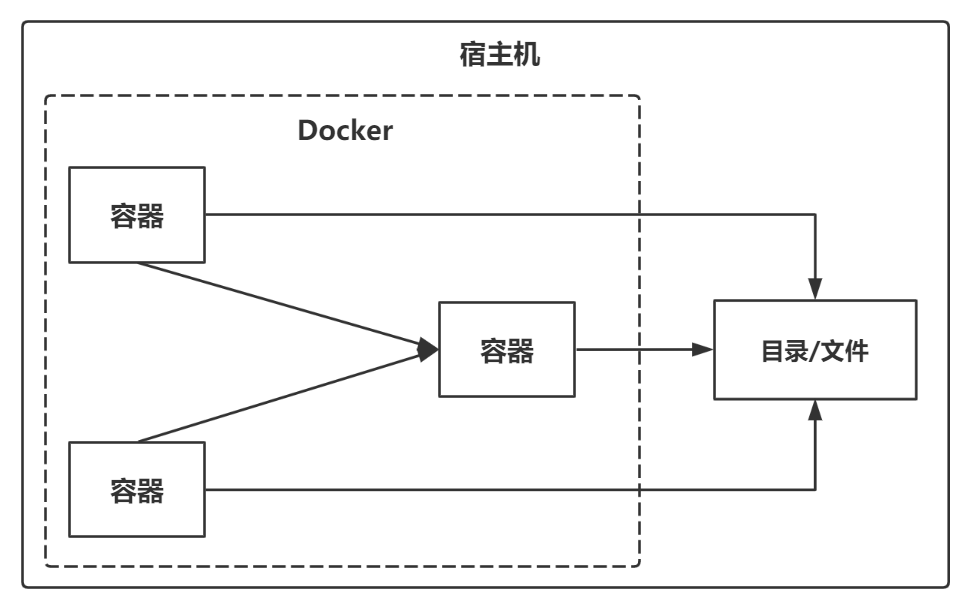

## 数据卷概念及作用

### 思考

1. Docker容器删除后，在容器中产生的数据还在吗？

2. Docker容器可以和外部机器直接交换文件吗？

3. 容器之间如何进行数据交换？



### 数据卷概念

数据卷是宿主机器中的一个目录或文件，当容器与数据卷目录绑定后，容器和数据卷中的修改都会立即同步给对方

一个数据卷可以被多个容器同时挂载，一个容器也可以挂载多个数据卷

**总结一句话：容器的持久化和同步操作！容器之间也是可以数据共享的**



### 数据卷作用

* 容器数据持久化到宿主机器：容器数据同步到数据卷
* 外部机器与容器之间的通信：外部机器访问数据卷
* 容器之间交换数据：多个容器挂载同一个数据卷


## 配置数据卷

### 方式1：具名挂载

```shell
docker run ... -v [宿主机目录/文件:容器内目录/文件]:[读写权限] ...
```

* 目录必须是绝对路径，如果目录不存在则会自动创建
* 一个容器可以挂载多个数据卷
* 一个数据卷可以被多个容器挂载

关于读写权限

| 读写权限 | 说明               |
| -------- | ------------------ |
| ro       | 只读               |
| rw       | 可读可写（默认值） |

### 方式2：匿名挂载

```shell
docker run ... -v [容器内目录/文件]:[读写权限] ...
```

* 所有的匿名挂载，宿主机目录都为：`/var/lib/docker/volumes/xxx/_data`

### 方式3：数据卷容器挂载

可以使用数据卷容器来简化容器挂载数据卷的操作



创建数据卷容器

```shell
docker run ... --name c_volumn -v [容器内目录/文件] ...
```

创建容器时连接数据卷容器

```shell
docker run ... --volumnes-from c_volumn ...
```

### 方式4：dockerfile挂载

通过关键字**VOLUME**

```dockerfile
FROM centos

VOLUME ["volume1", "volume02"] # 匿名挂载

CMD echo "---end---"

CMD /bin/bash
```


## 案例

MySQL数据使用数据卷进行持久化

```shell
docker pull mysql:5.7

docker run \
-d \
-p 3310:3306 \
-v /home/mysql/conf:/etc/mysql/conf.d \ 
-v /home/mysql/data:/var/lib/mysql \
--name mysql \
-e MYSQL_ROOT_PASSWORD 123456 \            # -e 表示要配置环境
mysql:latest
```

