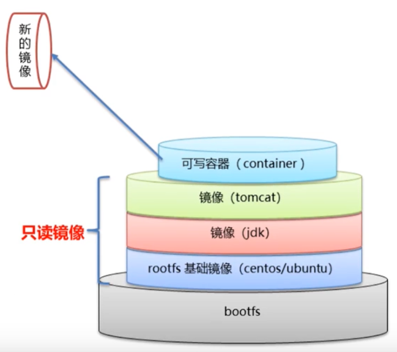

## Docker镜像原理

### 问题

1. 镜像的本质是什么？
2. Docker中Centos镜像为什么只有200MB，而要给Centos操作系统的iso文件却又几个G？
3. Docker中一个tomcat镜像为什么有500MB，而一个tomcat安装包只有70多M？

### Linux文件系统

Linux文件系统由`bootfs`和`rootfs`两部分组成

`bootfs`：包含引导加载程序和内核

`rootfs`：root文件系统，比如Linux系统中的 `/dev`，`/bin`，`/etc`等目录和文件

不同的发行版 `bootfs`基本一样，而`rootfs`不同

### UnionFS 联合文件系统

Docker镜像实际是由一层一层的文件系统叠加而来，这种技术称为联合文件系统（UnionFS）

联合文件系统技术能够将不同的层整合为一个文件系统，为这些层提供一个联合的是视角，这样就隐藏了多层的存在，从用户的角度看来，只存在一个文件系统

一个镜像可以在另外一个镜像上面，位于下面的镜像称为父镜像，最底层的镜像称为基础镜像

1. 最底层是 `bootfs`，使用的是宿主机的 `bootfs`
2. 第二层是 `rootfs`，称为`base image`
3. 第三层及往上则是叠加其他的镜像文件

当从一个镜像创建容器时，Docker会在最顶层加载一个读写文件系统作为容器



### 解答

1. 镜像的本质是什么?

   镜像的本质是一个分层的文件系统

2. Docker中Centos镜像为什么只有200MB，而要给Centos操作系统的iso文件却又几个G？

   因为Centos的iso镜像文件包括bootfs和rootfs，而docker的centos镜像复用了操作系统的bootfs，只有rootfs和其他镜像层，所以体积小很多

3. Docker中一个tomcat镜像为什么有500MB，而一个tomcat安装包只有70多M？

   因为docker中镜像是分层的，tomcat虽然只有70多MB，但它需要依赖父镜像（jdk）和基础镜像（basic image），所以整个对外暴露出的tomcat镜像大小有500多MB


## 镜像制作

### 获得镜像的途径

| 途径                   | 说明                                     |
| ---------------------- | ---------------------------------------- |
| 从远程库下载           | 一般用于获取第三方官方镜像，最常用最实用 |
| 容器转为镜像           | 一般用于创建自己的镜像，不常用           |
| 通过dockerfile构建镜像 | 一般用于发布自己的镜像，常用             |

### 从远程库下载

一般通过 `docker pull` 命令从 `Docker Hub` 中下载

### 容器转为镜像

#### 概述

这种方式数据卷不会保存

| 命令                                 | 说明                     |
| ------------------------------------ | ------------------------ |
| docker commit 容器id 镜像名称:版本号 | 版本号省略时为 `lastest` |

#### 示意图


### 通过Dockerfile构建镜像

见下文


## Dockerfile

### 概述

Dockerfile是一个文件，包含了一条条的指令，用来制作Docker镜像

每一条指令构建一层镜像，最终构建出一个新的镜像

### 构建命令

```shell
docker build -t 镜像名 . # . 表示当前目录下存在 dockerfile 文件
```

### 关键字

| 关键字      | 作用                     | 备注                                       |
| ----------- | ------------------------ | ------------------------------------------ |
| FROM        | 指定父镜像               | 指定dockfile基于哪个镜像进行构建           |
| MAINTAINER  | 作者信息                 | 标注这个dockfile的作者                     |
| LABEL       | 标签                     | 指定信息可以在 docker image中查看          |
| RUN         | 构建时执行命令           | `RUN ["command","param1","param2"]`        |
| CMD         | 容器启动时命令           | `CMD ["command","param1","param2"]`        |
| ENTRYPOINT  | 入口                     | 一般在制作一些执行就关闭的容器中会使用     |
| COPY        | 复制文件                 | build的时候复制文件到镜像中，仅仅限于本机  |
| ADD         | 添加文件                 | build的时候添加文件到镜像中，可以远程      |
| ENV         | 环境变量                 | 设置环境变量                               |
| VOLUMN      | 定义外部可以挂载的数据卷 |                                            |
| EXPOSE      | 暴露端口                 |                                            |
| WORKDIR     | 工作目录                 | 指定容器内部工作目录                       |
| USER        | 指定执行用户             |                                            |
| HEALTHCHECK | 健康检查                 |                                            |
| ONBUILD     | 触发器                   |                                            |
| STOPSIGNAL  | 发送信号量到宿主机       | 该指令设置将发送到容器的系统调用信号以退出 |
| SHELL       | 指定执行脚本的shell      | 指运行CMD和RUN指令中的shell                |

### CMD和ENTRYPOINT区别

| 关键字     | 区别                                               |
| ---------- | -------------------------------------------------- |
| CMD        | 指定这个容器启动时要执行的命令，只有最后一条会生效 |
| ENTRYPOINT | 指定这个容器启动时要执行的命令，**可以追加命令**   |


## Dockerfile案例

### 案例1

功能：默认登录路径为 `/usr`，自动安装 `vim`

Dockerfile文件

```dockerfile
FROM centos:7
MAINTAINER mneumi<mneumi@email.com>
RUN yum install -y vim
WORKDIR /usr
CMD /bin/bash
```

构建镜像

```shell
docker build -t diycentos . # 注意最后有 . 这个符号
```

启动镜像

```shell
docker run -d --name mycentos
```

访问测试

```shell
docker exec -it mycentos /bin/bash
```

### 案例2

功能：制作tomcat镜像

Dockerfile文件

```dockerfile
FROM centos
MAINTAINER mneumi<mneumi@email.com>

COPY readme.txt /usr/local/readme.txt

ADD jdk-8u11-linux-x64.tar.gz /usr/local/ # 会自动进行解压
ADD apache-tomcat-9.0.22.tar.gz /usr/local/

RUN yum -y install vim

ENV MYPATH /usr/local
WORKDIR $MYPATH

ENV JAVA_HOME /usr/local/jdk1.8.0_11
ENV CLASSPATH $JAVA_HOME/lib/dt.jar:$JAVA_HOME/lib/tools.jar
ENV CATALINA_HOME /usr/local/apache-tomcat-9.0.22
ENV CATALINA_BASE /usr/local/apache-tomcat-9.0.22
ENV PATH $PATH:$JAVA_HOME/bin:$CATALINA_HOME/lib:$CATALINA_HOME/bin

EXPOSE 8080

CMD /usr/local/apache-tomcat-9.0.22/bin/startup.sh && tail -F /usr/localapache-tomcat-9.0.22/bin/logs/catalina.out
```

构建镜像

```shell
docker build -t diytomcat . # 注意最后有 . 这个符号
```

启动镜像

```shell
docker run \
-d -p 9090:8080 --name diytomcat \
-v /home/mneumi/build/tomcat/test:/usr/local/apache-tomcat-9.0.22/webapps/test \
-v /home/mneumi/build/tomcat/tomcatlog/:/usr/local/apache-tomcat-9.0.22/logs
```

访问测试

```shell
curl http://localhost:9090
```


## 发布镜像到Docker Hub

官网：https://hub.docker.com

注册帐号，确定帐号可以登录

```shell
docker login -u 用户名 -p 密码
```

使用命令 tag，添加版本号

```shell
docker tag f8559daf1fc2 kuangsheng/tomcat:1.0
```

在服务器上提交自己的镜像

```shell
docker push kuangsheng/diytomcat:1.0
```

提交时也是按照层级提交的

