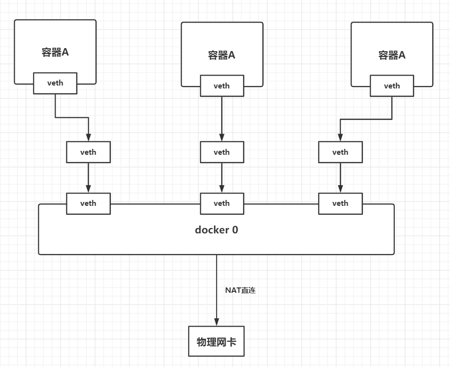

## 理解docker0

### ifconfig命令

```shell
ifconfig

docker0: flags=4099<UP,BROADCAST,MULTICAST>  mtu 1500
        inet 172.17.0.1  netmask 255.255.0.0  broadcast 172.17.255.255
        ether 02:42:5a:06:de:47  txqueuelen 0  (Ethernet)
        RX packets 0  bytes 0 (0.0 B)
        RX errors 0  dropped 0  overruns 0  frame 0
        TX packets 0  bytes 0 (0.0 B)
        TX errors 0  dropped 0 overruns 0  carrier 0  collisions 0
```

### docker如何处理容器网络访问?

docker安装成功后，操作系统会给docker一个网卡`docker0`

每启动一个docker容器，docker就会自动给容器分配一个ip，使用的技术是`veth-pair` 技术，共用网卡`docker0`

```shell
# 启动一个reids
docker run -d -P --name my_redis redis

# 查看容器内部的网络地址
docker inspect my_redis
"IPAddress": "172.17.0.2"

# 尝试本机ping容器
ping 172.17.0.2

PING 172.17.0.2 (172.17.0.2) 56(84) bytes of data.
64 bytes from 172.17.0.2: icmp_seq=1 ttl=64 time=0.057 ms
64 bytes from 172.17.0.2: icmp_seq=2 ttl=64 time=0.044 ms
64 bytes from 172.17.0.2: icmp_seq=3 ttl=64 time=0.054 ms
64 bytes from 172.17.0.2: icmp_seq=4 ttl=64 time=0.057 ms
```




## 容器互联（方式1：link）

### 场景

假设编写了一个微服务，database url=ip，项目不重启，数据库ip更换了，如何实现访问？——使用名字，而不是ip

### 解决

使用 `--link`参数

```shell
# 默认情况下，是无法ping通的
docker exec -it tomcat01 ping tomcat02
ping: tomat02: Name or service not known

docker exec -it tomcat02 ping tomcat01
ping: tomat01: Name or service not known
```

```shell
# 使用 --link 参数
docker run -d -P --name tomcat 03 --link tomcat02 tomcat

# 是可以ping通的
docker exec -it tomcat03 ping tomcat02
PING tomcat02 (172.18.0.3) 56(84) bytes of data.
64 bytes from tomcat02 (172.18.0.3): icmp_seq=1 ttl=64 time=0.057 ms
64 bytes from tomcat02 (172.18.0.3): icmp_seq=2 ttl=64 time=0.044 ms
64 bytes from tomcat02 (172.18.0.3): icmp_seq=3 ttl=64 time=0.054 ms
64 bytes from tomcat02 (172.18.0.3): icmp_seq=4 ttl=64 time=0.057 ms
```

### 原理

直接修改了 `tomcat03` 的 `hosts` 文件

```
docker exec -it tomcat03 cat /etc/hosts

127.0.0.1 localhost
172.18.03 tomcat 02 312856684cd4
```


## 容器互联（方式2：自定义网络）

### 查看当前的docker网络状态

```shell
docker network ls

NETWORK ID          NAME                DRIVER              SCOPE
07c112746e74        bridge              bridge              local
febf2de0342d        host                host                local
9b7e7ccfdd3f        none                null                local
```

### 网络模式

| 网络模式  | 说明                                             |
| --------- | ------------------------------------------------ |
| bridge    | 桥接模式（docker默认，自己创建也使用桥接模式）   |
| none      | 不配置网络                                       |
| host      | 和宿主机共享网络                                 |
| container | 容器内网络连通（用的少，不推荐使用，局限性很大） |

### 测试

```shell
# 直接启动的命令 --net bridge，而这个就是docker0
docker run -d -P --name tomcat01 tomcat
docker run -d -P --name tomcat01 --net bridge tomcat

# docker0特点：默认，容器名不能访问，--link可以打通，但比较麻烦

# 自定义网络
docker network create --driver bridge --subnet 192.168.0.0/16 --gateway 192.168.0.1 mynet
docker network ls
```

### 使用

```shell
docker run -d -P --name tomcat-net-01 --net mynet tomcat

docker run -d -P --name tomcat-net-02 --net mynet tomcat

docker exec -it tomcat-net-01 ping tomcat-net-02
docker exec -it tomcat-net-01 ping 192.168.0.2
```
