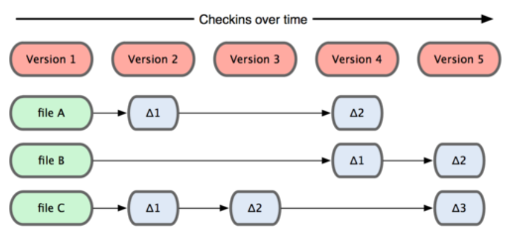
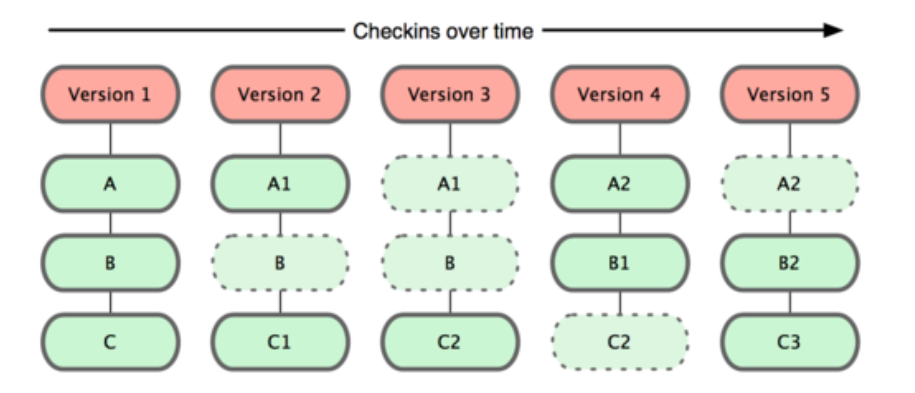
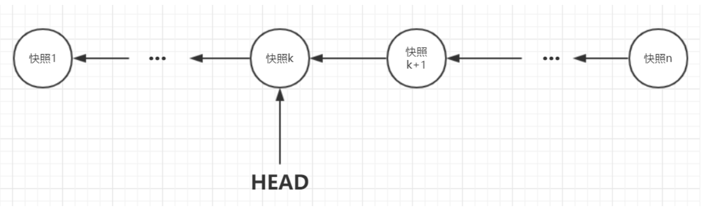
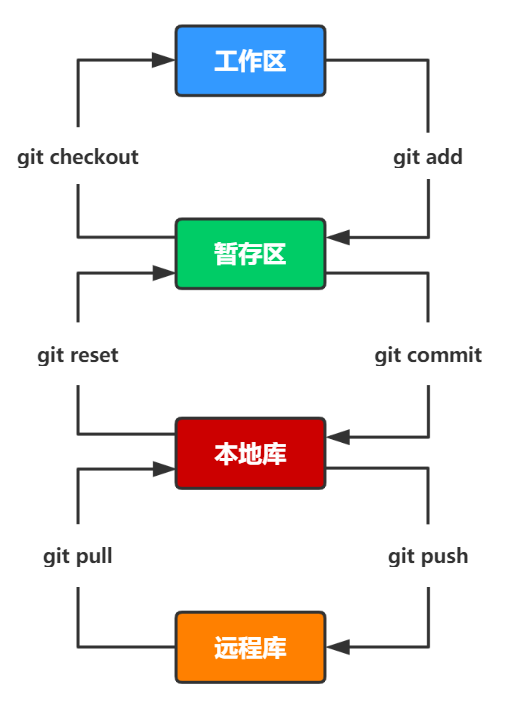

## Git版本概念

### 直接记录快照，而非差异比较

Git 和其他版本控制系统的主要差别在于，Git 只关心文件数据的整体是否发生变化，而大多数其他版本控制系统则只关心文件内容的具体差异

这类系统（如 CVS，Subversion，Perforce，Bazaar 等）每次记录有哪些文件作了更新，以及都更新了哪些行的什么内容

Git 并不保存这些前后变化的差异数据，实际上 Git 更像是把变化的文件作快照后，记录在一个微型的文件系统中，每次提交更新时，它会纵览一遍所有文件的指纹信息并对文件作一快照，然后保存一个指向这次快照的索引

### 版本快照和索引值

Git用快照的方式管理数据，每次提交时Git都会对全部文件制作一个对应的快照，并用哈希算法(sha-1)生成唯一的标识值，称为版本号

Git中有个 `HEAD` 指针指向某个版本号，表示当前工作区中是哪一个快照(版本)，**一个commit对应一个版本**

为了高效，如果文件没有被修改，Git不再生成新的快照，而是保存一个链接，链接指向之前的快照

**HEAD 指针始终指向一个 commit（版本）**

快照示意图

### 快照原理

`git`中快照的基本思想与`immutable.js`思想类似，即每个快照都是不可变对象

每次产生新的快照时，**并不需要把原来的旧对象重新复制一遍**，而是`git`内部维护一个树形结构，新对象的修改只会添加某些节点，与旧对象共用相同的部分

## Git四个工作区域

### 工作区

工作区是指平时存放项目代码的地方

默认情况下，`git`命令行中文本颜色为**红色**

### 暂存区

用于临时存放文件的改动，事实上它只是一个文件，保存即将提交到文件列表信息

默认情况下，`git`命令行中文本颜色为**绿色**

### 本地库

本地区（或版本库），就是安全存放数据的位置，这里面有提交到所有版本的数据

其中HEAD指向最新放入仓库的版本

### 远程仓库

远程仓库，托管代码的服务器

### 关系图如下

