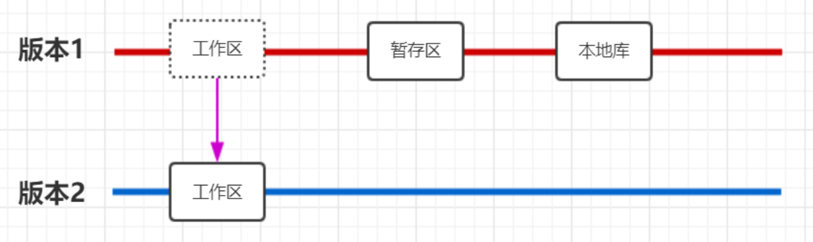
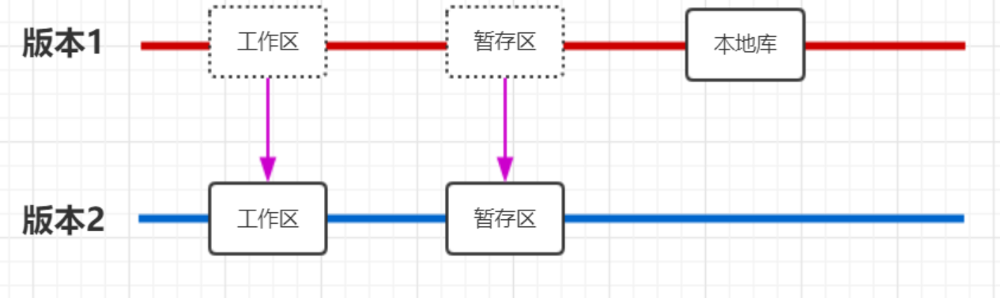
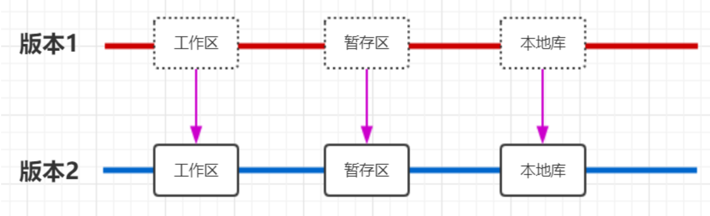
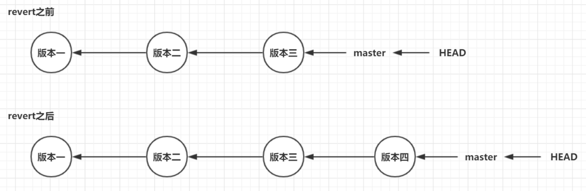

## checkout命令

### 功能

用于改变**HEAD指针**指向

### 命令格式

```shell
git checkout [版本号/标签名/远程分支名]
```

### 头指针分离

使用`checkout`命令有可能会发生**头指针分离**的情况

#### 定义

头指针分离（detached HEAD），指的是 HEAD 指针直接指向提交记录的情况

在正常情况下，HEAD 指针应该指向某一个分支的最新版本

#### 会发生头指针分离的操作

1. `git checkout 标签名`
2. `git checkout 远程分支名`
3. `git checkout 版本的hash`

上述的操作，都会导致 HEAD 指针会指向某一个提交记录，即发生头指针分离

#### 风险

在处于**头指针分离**的情况下，可以添加版本（commit），但这些提交会被Git**丢弃掉（默认Git会保存30天）**

#### 解决方案

可以**创建一个分支**用于指向（承载）它们

```shell
git branch [新分支名] [游离版本的hash值]
```

#### 使用示例

初始情况：一共有三个commit，都是线性的

```shell
$ git log
commit 3fe5f947ecfab075e926b1aef6129d8a86ef9aea (HEAD -> master)
Author: mneumi 
Date:   Fri Sep 25 09:39:51 2020 +0800

    third

commit 1961104ff1df8960c959e6cf2b2fb8333ddc91ff
Author: mneumi 
Date:   Fri Sep 25 09:39:37 2020 +0800

    second

commit ff5f076b9d98cf4d3ccbfca5fbb516116b691c2d
Author: mneumi 
Date:   Fri Sep 25 09:39:21 2020 +0800

    first
```

使用`checkout`命令，让`HEAD`指针第二个版本（即 `1961104f` 版本）

注意看第二段提示信息，Git告知现在已经处于头指针分离状态

```shell
$ git checkout 1961104f
Note: switching to '1961104f'.

You are in 'detached HEAD' state. You can look around, make experimental
changes and commit them, and you can discard any commits you make in this
state without impacting any branches by switching back to a branch.

If you want to create a new branch to retain commits you create, you may
do so (now or later) by using -c with the switch command. Example:

  git switch -c <new-branch-name>

Or undo this operation with:

  git switch -

Turn off this advice by setting config variable advice.detachedHead to false

HEAD is now at 1961104 second
```

添加新的commit，查看commit log，并查看branch情况

```shell
# commit log
$ git log
commit 675dc0e441f9008f170438c2ebcc2c98875e83fe (HEAD)
Author: mneumi 
Date:   Fri Sep 25 09:43:50 2020 +0800

    detached HEAD commit

commit 1961104ff1df8960c959e6cf2b2fb8333ddc91ff
Author: mneumi 
Date:   Fri Sep 25 09:39:37 2020 +0800

    second

commit ff5f076b9d98cf4d3ccbfca5fbb516116b691c2d
Author: mneumi 
Date:   Fri Sep 25 09:39:21 2020 +0800

    first
    
# branch
$ git branch
* (HEAD detached from 1961104)
  master
```

如果现在我们切换到别的分支，那么此时分离头指针指向的版本会将被丢弃

所以Git会进行警告，并告知分离头指针所指向的版本号（此处为`675dc0e`）

```shell
$ git checkout master
Warning: you are leaving 1 commit behind, not connected to
any of your branches:

  675dc0e detached HEAD commit

If you want to keep it by creating a new branch, this may be a good time
to do so with:

 git branch <new-branch-name> 675dc0e

Switched to branch 'master'
```

注意：如果上忘记记录上一步操作的操作中提示的游离版本哈希值（`675dc0e`），可以通过`git reflog`查看

```shell
$ git reflog
675dc0e HEAD@{1}: commit: detached HEAD # 就是这一句中 675dc0e
9e2e421 HEAD@{2}: checkout: moving from master to 9e2e4211ae
e559c56 (HEAD -> master) HEAD@{3}: commit: third
9e2e421 HEAD@{4}: commit: second
fca8203 HEAD@{5}: commit (initial): first
```

如果不想保留分离头指针所指向的版本，则不理会即可，Git会**自动进行清理**

如果想要保留分离头指针所指向的版本，则创建一个分支用于承载它

```shell
$ git branch learn-detached-head 675dc0e
```

查看此时的日志和分支情况

```shell
# 分支
$ git branch
  learn-detached-head
* master

# 日志
$ git log --graph --all
* commit 675dc0e441f9008f170438c2ebcc2c98875e83fe (learn-detached-head)
| Author: mneumi 
| Date:   Fri Sep 25 09:43:50 2020 +0800
|
|     detached HEAD commit
|
| * commit 3fe5f947ecfab075e926b1aef6129d8a86ef9aea (HEAD -> master)
|/  Author: mneumi 
|   Date:   Fri Sep 25 09:39:51 2020 +0800
|
|       third
|
* commit 1961104ff1df8960c959e6cf2b2fb8333ddc91ff
| Author: mneumi 
| Date:   Fri Sep 25 09:39:37 2020 +0800
|
|     second
|
* commit ff5f076b9d98cf4d3ccbfca5fbb516116b691c2d
  Author: mneumi 
  Date:   Fri Sep 25 09:39:21 2020 +0800

      first
```


## reset命令

### 功能

用于**撤销**操作

### 命令格式

```shell
git reset --[hard|mixed|soft] [版本号]
```

### 切换方法

| 切换方法   | 命令                                     | 说明                                 |
| ---------- | ---------------------------------------- | ------------------------------------ |
| 通过版本号 | git reset --[hard\|mixed\|soft] [版本号] | 通过提交历史命令查看快照对应的版本号 |
| 通过HEAD^  | git reset --[hard\|mixed\|soft] HEAD^^   | 一个^表示回退一个版本                |
| 通过HEAD~  | git reset --[hard\|mixed\|soft] HEAD~n   | n表示回退n个版本                     |

### hard|mixed|soft说明

--soft：工作区移动，暂存区，本地库都不移动



--mixed：工作区，暂存区都移动，本地库不移动



--hard：工作区，暂存区，本地库都移动




## revert命令

### 命令格式

```shell
git revert -n [版本号]
```

作用：用于**反转**某一个版本，以达到撤销特定版本的目的

使用场景：如果想撤销某一版本，但是又想保留该版本后面的版本，同时记录下这整个版本变动流程，就可以用这种方法

特点：使用`git revert`后会生成新的commit(新的版本号)

例子：对于三个版本（版本一、版本二、 版本三），突然发现版本二有bug，想要撤销版本二，但又不想影响撤销版本三的提交，就可以用 git revert 命令来反做版本二，生成新的版本四，这个版本四里会保留版本三的东西，但撤销了版本二的东西



### reset和revert区别

* `git revert` 是用一次新的 `commit` 来回滚之前的 `commit`，`git reset` 是回滚到之前的指定的 `commit`
* `git reset` 是把HEAD向后移动了一下，而 `git revert` 是 `HEAD` 继续前进，只是新的 `commit` 的内容和要`revert` 的内容正好相反，能够抵消要被 `revert` 的内容
* 重要的区别是**是否需要特定版本之后版本**和**是否会生成新的commit**

