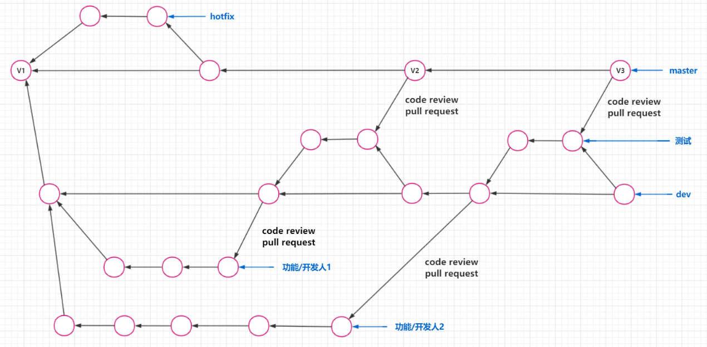

## 分支介绍

### 定义

在版本中，能够创建多个副本，在各个副本上可以进行的操作，最后副本可以与主体进行合并

### 示意图



### 分支优点

多线操作，多任务同时推进，提高开发效率

开发过程中，如果副本开发失败，则可以直接删除副本，不会对主体造成影响


## 分支操作

::: warning 注意事项

在创建分支时，一定要先查看当前位于哪个分支上，因为创建分支，是基于当前分支的一个快照（复制）

merger分支时，一定要先查看当前位于哪个分支上，因为merge分支，是将目标分支合并到当前所处分支

:::

| 操作                   | 命令                                    | 说明                                                         |
| ---------------------- | --------------------------------------- | ------------------------------------------------------------ |
| 查看所有本地分支       | git branch -v                           | 带*号的表示是当前选中分支                                    |
| 查看所有远程分支       | git branch -r                           |                                                              |
| 查看所有本地和远程分支 | git branch -a                           |                                                              |
| 创建分支               | git branch [分支名称]                   | **在创建分支前需要注意此时git处于哪个分支**<br/>**因为创建出来的分支会是当前分支的一个快照（即工作区，缓存区和本地库相同）** |
| 分支重命名             | git branch -m [旧分支名称] [新分支名称] |                                                              |
| 切换分支               | git checkout [分支名称]                 |                                                              |
| 合并分支               | git merge [被合并的分支名]              | 将**被合并分支**合并到当前分支                               |
| 放弃分支合并           | git merge --abort                       |                                                              |
| 删除本地分支           | git branch -d [分支名称]                | 注意不能处理将被删除分支上，要先切换到别的分支               |


## 分支冲突

### 冲突概念

当分支1修改了一个地方为A，而分支2修改了一个地方为B，则在合并过程中就会发生冲突

git并不知道以哪个为准，所以git会进入分支冲突处理状态，由人工进行冲突的解决

### 冲突位置

发生冲突的文件，git会标注冲突位置

```
>>>>>>>>>> 分支1
分支1的冲突内容
================
分支2的冲突内容
<<<<<<<<<< 分支2
```

### 冲突解决步骤：

1. 人工修改\>>>>>>>与<<<<<<<< 之间的冲突内容

2. git add [filename] 添加修改文件名

3. git commit -m "信息"


## 合并分支的两种方法

### 方法1：git merge

优点：简单易学，方便易用

缺点：log可能会很乱，看起来很复杂

### 方法2：git rebase

优点：log清晰，结构简单

缺点：比较难学难用


## 快速合并

### Fast-Forward

#### 定义

当前分支`A`合并另一分支`B`时，如果满足下列条件

1. `A`中不存在`B`中没有的版本（即`B`完全领先`A`）
2. `A`与`B`没有发生冲突（满足第1点，自然满足该点）

则会直接将`分支B`的版本移动到`分支A`，而不会产生新的版本（commit），这过程叫做`Fast-Forward`

#### 特点、优点与缺点

特点：使用`Fast-Forward`时

1. 不会产生新的commit
2. 日志中不会保留合并分支（`feature`）的信息

优点：不会产生新的commit，减少版本的数量，日志更加清爽

缺点：日志中没有保留合并分支（`feature`）的信息

#### 示例

现有两个分支：`master`和`feature`，提交历史如下，两条分支之间是**feature完全领先master且不存在冲突**

```shell
$ git log --graph --all
  * commit 2b25c1578acff85d2275d0fef0f971928521eae8 (feature)
  | Author: mneumi 
  | Date:   Fri Sep 25 10:40:21 2020 +0800
  |
  |     feature 3
  |
  * commit 0a66682eb74557d847ac588f31665a11b8e97263
  | Author: mneumi 
  | Date:   Fri Sep 25 10:40:06 2020 +0800
  |
  |     feature 2
  |
  * commit 729f3523888c23c136f4b12cc777814d67134dad
  | Author: mneumi 
  | Date:   Fri Sep 25 10:39:47 2020 +0800
  |
  |     feature 1
  |
  * commit 7f96e64e987f4e2ce2005f867d00d82bc5157c08
  | Author: mneumi 
  | Date:   Fri Sep 25 10:39:20 2020 +0800
  |
  |     init feature
  |
 /
* commit 7318f0625bb5127489270d71043f15803f47a6d9 (HEAD -> master)
  Author: mneumi 
  Date:   Fri Sep 25 10:38:43 2020 +0800

      init master
```

先将分支`feature`合并到`master`中

```shell
# 切换到 master 分支
$ git checkout master

# 合并 feature 分支
$ git merge feature
Updating 7318f06..2b25c15
Fast-forward                     # 使用了 Fast-Forward
 feature.js | 3 +++
 1 file changed, 3 insertions(+)
 create mode 100644 feature.js
```

查看日志：可以观察到合并操作没有产生新的commit，而是复用了`feature`的commit，也没有保留`feature`分支的信息，这就称为`Fast-Forward`

```shell
$ git log --graph --all
* commit 2b25c1578acff85d2275d0fef0f971928521eae8 (HEAD -> master, feature)
| Author: mneumi 
| Date:   Fri Sep 25 10:40:21 2020 +0800
|
|     feature 3
|
* commit 0a66682eb74557d847ac588f31665a11b8e97263
| Author: mneumi 
| Date:   Fri Sep 25 10:40:06 2020 +0800
|
|     feature 2
|
* commit 729f3523888c23c136f4b12cc777814d67134dad
| Author: mneumi 
| Date:   Fri Sep 25 10:39:47 2020 +0800
|
|     feature 1
|
* commit 7f96e64e987f4e2ce2005f867d00d82bc5157c08
| Author: mneumi 
| Date:   Fri Sep 25 10:39:20 2020 +0800
|
|     init feature
|
* commit 7318f0625bb5127489270d71043f15803f47a6d9
  Author: mneumi 
  Date:   Fri Sep 25 10:38:43 2020 +0800

      init master
```

### --no-ff参数

#### 定义

`--no-ff`能够禁用`Fast-Forward`的功能，就算在满足`Fast-Forward`合并的条件下，也不会进行`Fast-Forward`

#### 作用

使用`--no-ff`模式，能够在日志中保留合并分支（`feature`）的信息

#### 例子

现有两个分支：`master`和`feature`，提交历史如下，两条分支之间是**feature完全领先master且不存在冲突**

```shell
$ git log --graph --all
  * commit 2b25c1578acff85d2275d0fef0f971928521eae8 (feature)
  | Author: mneumi 
  | Date:   Fri Sep 25 10:40:21 2020 +0800
  |
  |     feature 3
  |
  * commit 0a66682eb74557d847ac588f31665a11b8e97263
  | Author: mneumi 
  | Date:   Fri Sep 25 10:40:06 2020 +0800
  |
  |     feature 2
  |
  * commit 729f3523888c23c136f4b12cc777814d67134dad
  | Author: mneumi 
  | Date:   Fri Sep 25 10:39:47 2020 +0800
  |
  |     feature 1
  |
  * commit 7f96e64e987f4e2ce2005f867d00d82bc5157c08
  | Author: mneumi 
  | Date:   Fri Sep 25 10:39:20 2020 +0800
  |
  |     init feature
  |
 /
* commit 7318f0625bb5127489270d71043f15803f47a6d9 (HEAD -> master)
  Author: mneumi 
  Date:   Fri Sep 25 10:38:43 2020 +0800

      init master
```

切换到`master`分支，使用`-no-ff`参数合并`feature`

```shell
$ git checkout master

$ git merge --no-ff feature
# 此时，会弹出提示框，要求为生成的新commit指定message
# 此处，设置message为 use --no-ff mode
Merge made by the 'recursive' strategy.
 feature.js | 3 +++
 1 file changed, 3 insertions(+)
 create mode 100644 feature.js
```

查看日志：可以观察到，合并后产生了一个新的commit，其信息为`use --no-ff mode`，且`feature`的信息被保留在日志中，即保留整个提交链的完整性

```shell
$ git log --graph --all
*   commit b2f794fc254f6f5017849fddbfd87b025ebf303d (HEAD -> master)
|\  Merge: 7318f06 2b25c15
| | Author: mneumi 
| | Date:   Fri Sep 25 11:17:21 2020 +0800
| |
| |     use --no-ff mode
| |
| * commit 2b25c1578acff85d2275d0fef0f971928521eae8 (feature)
| | Author: mneumi 
| | Date:   Fri Sep 25 10:40:21 2020 +0800
| |
| |     feature 3
| |
| * commit 0a66682eb74557d847ac588f31665a11b8e97263
| | Author: mneumi 
| | Date:   Fri Sep 25 10:40:06 2020 +0800
| |
| |     feature 2
| |
| * commit 729f3523888c23c136f4b12cc777814d67134dad
| | Author: mneumi 
| | Date:   Fri Sep 25 10:39:47 2020 +0800
| |
| |     feature 1
| |
| * commit 7f96e64e987f4e2ce2005f867d00d82bc5157c08
|/  Author: mneumi 
|   Date:   Fri Sep 25 10:39:20 2020 +0800
|
|       init feature
|
* commit 7318f0625bb5127489270d71043f15803f47a6d9
  Author: mneumi 
  Date:   Fri Sep 25 10:38:43 2020 +0800

      init master
```

### --ff-only参数

#### 定义

只允许满足`Fass-Forward`的合并进行

#### 如何保证一定满足快速合并条件

使用 `rebase` 操作即可保证满足`Fast-Forward` 的条件