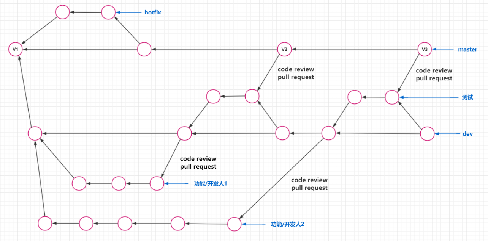
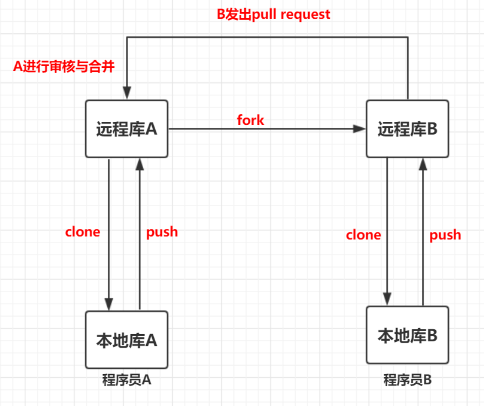

## 团队协作关注点

### 代码托管平台

| 代码托管平台 | 优点                                                      | 缺点                                                         |
| ------------ | --------------------------------------------------------- | ------------------------------------------------------------ |
| Github       | 功能完备 **全球使用人数最多**                        | 免费版对团队人数有限制 连接速度较慢 纯英文环境 不能私有化部署 |
| Gitee        | **速度快** 功能完备                                  | 免费版对团队人数有限制 不能私有化部署                   |
| Gitlab       | 功能完备 **能够私有化部署** **自带有CI/CD功能** | 部分强大功能收费 私有化部署需要成本                     |

### 工作流选择

| 工作流   | 适合团队类型                             |
| -------- | ---------------------------------------- |
| 主干开发 | 开发团队具有强大的系统设计和开发能力     |
| git flow | 有预定的发布周期，需要执行严格的发布流程 |

### 集成策略选择

| 集成策略        | 优点                             | 缺点                                       |
| --------------- | -------------------------------- | ------------------------------------------ |
| merge           | 操作方便，上手简单               | 如果分支过多，会造成提交日志混乱，难以阅读 |
| rebase          | 能够让提交历史保持线性，清晰易读 | 上手难度大，有操作风险                     |
| rebase + squash | 能够让提交历史保持线性，清晰易读 | 上手难度大，有操作风险，会丢失中间提交信息 |

### 保证代码质量

| 项            | 方案                                                    |
| ------------- | ------------------------------------------------------- |
| 项目文档      | 使用 `wiki` 功能                                        |
| 需求、Bug管理 | 使用 `issus/议题` 和 `Project/看板` 功能                |
| code review   | 禁止直接 `push` 代码到主分支，启用 `pull request`       |
| 持续集成      | 使用 `jenkins`，`travis ci`，`circle ci` 等持续集成方案 |
| 代码测试覆盖  | 使用 `codecov` 或自建方案                               |

## 同团队协作流程

使用`gitflow`工作流，`gitflow`工作流的分支如下

| 分支名        | 说明                                                         |
| ------------- | ------------------------------------------------------------ |
| master分支    | 线上版本，稳定版本                                           |
| dev分支       | 开发分支，所有的新开发分支和测试分支都是基于该分支           |
| 功能/开发分支 | 由dev分支拆分出来，完成开发后需要提交`pull request`请求合并到dev分支，经过`review`后合并到dev分支 |
| 测试分支      | 由dev分支拆分出来，测试过程中修复bug后，合并到dev分支，并提交`pull request`请求合并到master分支，经过`review`后合并到master分支 |
| hotfix分支    | 线上代码出现紧急bug时，在该分支上进行修复，修复后合并到master分支 |

示意图

## 跨团队协作流程

背景：A开发一个项目，有本地库和远程库，B想以非团队成员的方式参与项目的开发

流程：

1. B将A的项目 `fork` 到自己的远程库中，再从自己的远程库将项目clone下来
2. B更新 `fork` 仓库中代码后 `push` 到B自己的远程库，在B自己的远程库中通过 `pull request` 请求合并代码
3. A看到 `pull request` 并 `review` 通过后，将B的新代码合并到自己的项目分支中；如果 `review` 不通过则可以关闭掉这个 `pull request`

示意图

