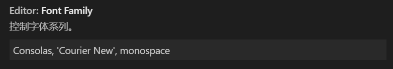

# Visual Studio Code

## 简介

### VS Code 是什么

VS Code 全程 Visual Studio Code，是Microsoft在2015年4月30日Build 开发者大会上正式宣布的项目

VS Code是一个运行于 Mac OS X、Windows和 Linux 之上的，针对于编写现代 Web 和云应用的跨平台源代码编辑器

### VS Code 特点

* 开源，免费
* 跨平台
* 扩展性强


## 下载安装启动

### 下载

[官方地址下载地址](https://code.visualstudio.com/)

### 安装

打开下载好的安装包，根据提示安装即可，无难度

### 启动

普通启动：双击打开VS Code即可打开

命令行启动：在命令行中使用下列命令可以启动VS Code

```shell
code [需要使用VS Code打开的文件夹路径]
```


## 扩展

### 打开扩展面板

按 `ctrl` + `shift` + `X` 即可打开扩展面板，或者点击最左侧的按钮也可打开扩展面板


### 语言扩展

在扩展面板中搜索语言名，如`chinese`, `german` 等即可安装相应语言的扩展


### 界面风格

在扩展面板中搜索`theme`，即可查找界面风格扩展

推荐下列的风格扩展包

| 风格           | 说明     |
| -------------- | -------- |
| Ayu            | 主题扩展 |
| Monokai Pro    | 主题扩展 |
| One Dark Pro   | 主题扩展 |
| Material Theme | 主题扩展 |

### 其他扩展

| 扩展                             | 说明                         |
| -------------------------------- | ---------------------------- |
| Vetur                            | Vue.js开发插件               |
| Code Runner                      | 支持多种语言的代码的立即执行 |
| Code Spell Checker               | 用于检测代码语法             |
| VS Color Picker                  | 选择颜色                     |
| auto-close-tag                   | 自动结束HTML标签             |
| auto-rename-tag                  | 自动重命名HTML标签名         |
| carbon-now-sh                    | 生成漂亮的代码截图           |
| Highlight Matching               | 高亮匹配的标签               |
| Setting Sync                     | 同步配置                     |
| Live Server                      | 浏览器自动刷新               |
| Prettier                         | 代码格式化                   |
| IntelliSense for CSS class names | 自动提示 CSS 类名            |


## 配置

### 打开配置

按 `ctrl` + `,` 即可打开配置面板

### 快捷键配置

按 `ctrl` + `k` + `s` 即可查看并修改快捷键


### 其他配置

#### 显示/隐藏行号 [搜索`行号`]


#### tab缩进的空格数量 [搜索 `tab size`]


#### 字体设置 [搜索 `字体`]



### 代码片段

#### 配置代码片段

1. 点击`文件` => `首选项` => `用户片段`

2. 在弹出的面板中选择扩展的语言

3. 参数说明

   | 参数        | 说明                                                         |
   | ----------- | ------------------------------------------------------------ |
   | prefix      | 这个参数是使用代码段的快捷入口,比如这里的log在使用时输入log会有智能感知 |
   | body        | 这个是代码段的主体.需要设置的代码放在这里,字符串间换行的话使用\r\n换行符隔开.注意如果值里包含特殊字符需要进行转义. <br />多行语句的以,隔开 |
   | $1          | 这个为光标的所在位置                                         |
   | $2          | 使用这个参数后会光标的下一位置将会另起一行,按tab键可进行快速切换,还可以有$3,$4,$5..... |
   | description | 代码段描述,在使用智能感知时的描述                            |

4. 操作实例

   实现一个输入`hv`，即可输出`Hello {代输入值}`的代码片段

   ```json
   {
   	"Print to console": {
   		"prefix": "hv",
   		"body": [
   			"Hello $1",
   		],
   		"description": "输出 Hello {代输入值}"
   	}
   }
   ```

#### 简易写代码片段网站

https://snippet-generator.app

### 配置共享

#### 配置上传

1. 安装插件 `setting sync`
2. 登录Github账号
3. 选择用于存储配置信息的gist
4. 按`ctrl` + `shift` + `p` 打开命令面板，输入 `sync`，选择 `更新上传`，即可实现配置的上传

#### 配置下载

1. 安装插件 `setting-sync`
2. 登录Github账号
3. 选择存储配置信息的gist
4. 按`ctrl` + `shift` + `p` 打开命令面板，输入 `sync`，选择 `下载配置`，即可实现配置的下载

#### 使用公共配置

1. 按`ctrl` + `shift` + `p` 打开命令面板，输入 `sync`，选择 `重置扩展设置`，实现插件的初始化
2. 按`ctrl` + `shift` + `p` 打开命令面板，输入 `sync`，选择 `下载配置`
3. 不需要登录Github，而是点击`Download Public Gist`，输入配置的gist号即可使用公共配置

