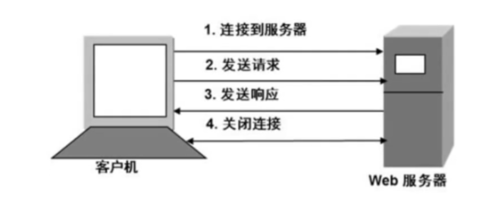
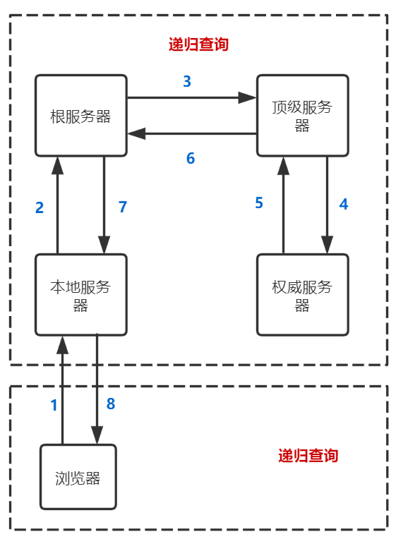
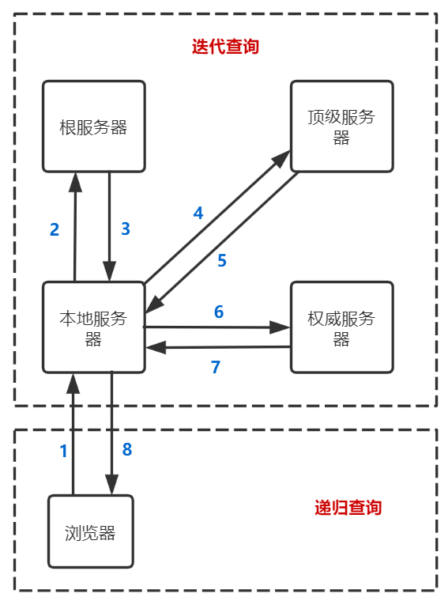
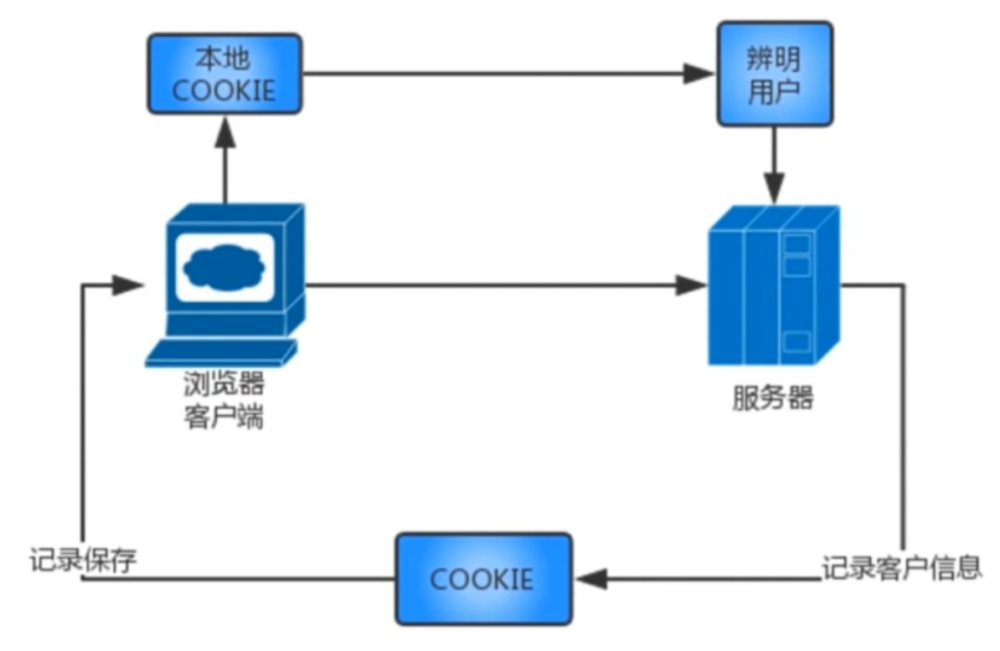
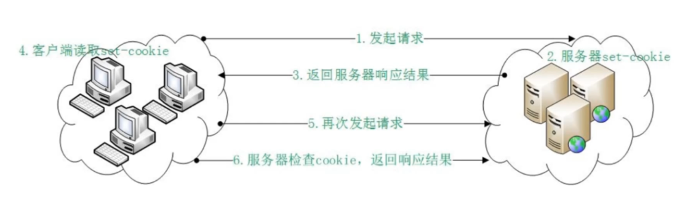
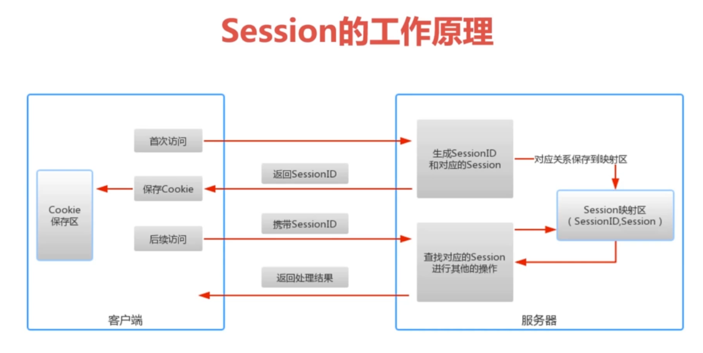

## HTTP是什么

`HTTP` 是 `HyperText Transfer Protocol` 的简写，译名为 `超文本传输协议`

`HTTP`协议是应用层协议，其底层基于`TCP`协议

## HTTP发展历程

创始人：`CERN`组织（欧洲核子研究组织）的 `Tim BernersLee`

| 版本     | 公布时间  | 特点                                                       |
| -------- | --------- | ---------------------------------------------------------- |
| HTTP/0.9 | 1990年    | 非正式标准；只支持GET，只支持短连接，只支持传输超文本      |
| HTTP/1.0 | 1996年5月 | RFC1945，默认非持久连接，需要设置 `Connection: Keep-Alive` |
| HTTP/1.1 | 1997年1月 | RFC2616，使用最广泛的版本，默认持久连接                    |
| HTTP/2.0 | 2015年    | 普及率不高                                                 |

## HTTP请求方法

| 方法    | 说明                                                 | 支持的版本           |
| ------- | ---------------------------------------------------- | -------------------- |
| GET     | 获取资源，长度有限制（不同浏览器可能不同）           | 1.0、1.1             |
| POST    | 传输实体主体，长度不限制，安全性较高                 | 1.0、1.1             |
| PUT     | 更新一个已知资源                                     | 1.0、1.1             |
| PATCH   | PUT方法的补充，用来对已知资源进行局部更新            | 1.0、1.1             |
| HEAD    | 获得报文首部，不获取报文实体，常用于测试链接是否可用 | 1.0、1.1             |
| DELETE  | 删除资源                                             | 1.0、1.1             |
| OPTIONS | 询问支持的方法                                       | 1.1                  |
| TRACE   | 追踪路径，回显服务器收到请求，常用于诊断和测试       | 1.1                  |
| CONNECT | 要求用隧道协议连接代理                               | 1.1                  |
| LINK    | 建立和资源之间的联系                                 | 1.0（1.1中已被废弃） |
| UNLINK  | 断开连接关系                                         | 1.0（1.1中已被废弃） |

POST、PUT、PATCH区别：

* POST是不幂等的，PUT和PATCH是幂等的
* PUT是替换资源整体，PATCH是对PUT的补充，是更新资源的局部

> 幂等：如果一个HTTP方法在使用相同的数据进行第二次调用时，不会对服务器状态造成任何改变，那么这个方法就是幂等的
>
> 幂等的方法：PUT，PATCH，DELETE

OPTIONS 方法

* 检测服务器所支持的请求方法

* CORS中的预检请求

## HTTP工作模式

### 客户端/服务端模型

一次HTTP的传输需要两个参与者：客户端和服务端，其中客户端发送请求，服务端处理请求并进行响应

## HTTP特点

### 灵活

`HTTP`协议允许传输任意类型的数据，传输内容的类型由请求首部的 `Content-Type` 进行描述

### 快速简单

简单：客户端发送请求时，只需要发送请求方法和请求路径即可

快速：由于`HTTP`协议非常简洁，所以`HTTP`协议运行非常高效

### 无状态

无状态是指对于事务的处理没有记忆能力，即每个请求之间是独立的，`HTTP`协议并不会记录每个请求之间的关系，以及每个请求处理的结果

解决方案：`Cookie` 和 `Session`（见下文介绍）

### 短连接、持久连接、管道化

`HTTP/1.0` 协议在完成一次请求的响应后会主动断开连接，这是由于早期的网页主要用于展示，其交互的内容很少，所以获取完响应后就断开连接，减少服务器的压力，这称为短连接

> 短连接的特点：每进行一次 HTTP 通信就要断开一次 TCP 连接

但随着互联网的发展，网页的交互内容越来越多，为了避免多次的重复连接，需要持久连接，在 `HTTP/1.0`  中通过设置请求首部的 `Connection: Keep-Alive` 来使用持久连接，而在 `HTTP/1.1` 中默认是使用持久连接的

> 持久连接的特点：只要任意一端没有明确提出断开连接，则保持 TCP 连接状态

持久连接使得多数请求以管道化（pipelining）方式发送成为可能。以前发送请求后需等待并收到响应，才能发送下一个请求，而管线化技术 出现后，不用等待响应亦可直接发送下一个请求

## HTTP的安全策略

* 使用HTTPS

* 使用鉴权

* 使用限流

## URI，URL，URN的区别和联系

URI：uniform resource identifier，统一资源标识符，它能够唯一标识资源

URL：uniform resource locator，统一资源定位符，它能够唯一定位资源

URN：uniform resource  name，统一资源命名，它能够定义资源的名称

区别与联系：URL和URN是URI的子类，即每个 URL 都是 URI，但不一定每个 URI 都是 URL

## DNS解析服务

### 什么是DNS

DNS全称是 `Domain Name System`，即域名系统，他能够将给出域名对应的IP地址

### 为什么需要DNS解析服务？

网络通讯一般都是基于TCP/IP协议簇的，而TCP/IP协议簇是基于IP地址的，所以计算机在网络上进行通讯时只能识别形如`202.1111.222.100`的IP地址，而不能识别域名

但我们容易记住域名而不是IP地址，所以就需要有个可以将域名解析为对应IP地址的工具，这个工具就是DNS解析，它能够接收需要进行查询的域名，并返回该域名对应的IP地址

### DNS服务器分类

DNS服务器一般分为四种：根DNS服务器，顶级DNS服务器，权威DNS服务器，本地域名服务器

### 根DNS服务器数量、组成和位置：

数量：全球一共13个根DNS服务器

组成：主根DNS服务器（1个）和辅助根DNS服务器（12个）

位置：主根服务器位于美国，9个辅助根服务器在美国，2个辅助根服务器在欧洲，1个辅助根服务器在日本

### DNS查询方式

DNS查询方式分为：递归查询和迭代查询

递归查询：DNS服务器帮你去查

迭代查询：DNS服务器告诉去哪里查，但不会帮忙去查

### 浏览器进行DNS解析的步骤

1. 查询本地缓存、Hosts配置文件和路由器缓存
2. 查询本地DNS服务器
3. 由本地DNS服务器向上层DNS服务器查询

## Cookie

### Cookie概述

Cookie是一种解决HTTP无状态的方案，它本质是存储在客户端本地的一小段文本信息，当客户端向服务器发出请求时，会在请求首部的`Cookie`字段中将Cookie信息一起发送给服务器

### Cookie工作流程

## Session

### Session概述

Session是另一种记录客户端状态的机制，客户端浏览访问服务器时，服务器会把客户端信息以某种形式记录在服务器上，并把该信息对应的查询键SessionID保存到客户端上

客户端再次访问时，告诉服务器它的SessionID，然后服务器根据SessionID查找该客户端的状态即可

### Session工作原理

### 客户端保存和提交Session ID的方式

Cookie，URL重写，隐藏表单

### Sesssion和Cookie的对比

| 对比项       | 说明                                                         |
| ------------ | ------------------------------------------------------------ |
| 存放位置不同 | Cookie存放在客户端，Session存放在服务器端                    |
| 安全性不同   | Session存放在服务器端，比较安全， 而Cookie存放在客户端，存在被篡改的风险 |
| 有效期不同   | Session存放在服务器端，如果长时间保存全部Session，会对服务器造成很大的存储压力，而客户端只需要保存一份Cookie，可以长时间保存 |