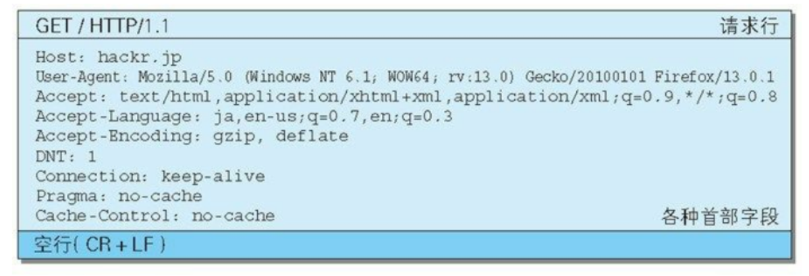

## HTTP报文

### 报文概述

用于 `HTTP` 协议交互的信息被称为 `HTTP` 报文

客户端的 `HTTP` 报文称为请求报文，服务器端的 `HTTP` 报文称为响应报文

`HTTP` 报文可以分为报文首部（报文头）和报文主体两块，报文首部和报文主体之间使用换行符 (`CR+LF`) 作为分隔


### 请求报文结构


请求行的组成是：`请求方法 请求URI HTTP协议版本` 



### 响应报文结构


状态行的组成是：`HTTP协议版本 状态码 状态码描述`


## 报文首部概述

### 数量

`HTTP/1.1` 版本规定了 47 种报文字段，加上非标准的报文字段，大概有60多种报文字段

### 分类

报文首部分为四类：

* 通用报文首部
* 请求报文首部
* 响应报文首部
* 实体报文首部


## 通用报文首部

| 首部字段名        | 说明                       |
| ----------------- | -------------------------- |
| Cache-Control     | 控制缓存的行为             |
| Connection        | 逐跳首部、连接的管理       |
| Date              | 创建报文的日期时间         |
| Pragma            | 报文指令                   |
| Trailer           | 报文末端的首部一览         |
| Transfer-Encoding | 指定报文主体的传输编码方式 |
| Upgrade           | 升级为其他协议             |
| Via               | 代理服务器的相关信息       |
| Warning           | 错误通知                   |


## 请求报文首部

| 首部字段名          | 说明                                          |
| ------------------- | --------------------------------------------- |
| Accept              | 用户代理可处理的媒体类型                      |
| Accept-Charset      | 优先的字符集                                  |
| Accept-Encoding     | 优先的内容编码                                |
| Accept-Language     | 优先的语言（自然语言）                        |
| Authorization       | Web认证信息                                   |
| Expect              | 期待服务器的特定行为                          |
| From                | 用户的电子邮箱地址                            |
| Host                | 请求资源所在服务器                            |
| If-Match            | 比较实体标记（ETag）                          |
| If-Modified-Since   | 比较资源的更新时间                            |
| If-None-Match       | 比较实体标记（与 If-Match 相反）              |
| If-Range            | 资源未更新时发送实体 Byte 的范围请求          |
| If-Unmodified-Since | 比较资源的更新时间（与If-Modified-Since相反） |
| Max-Forwards        | 最大传输逐跳数                                |
| Proxy-Authorization | 代理服务器要求客户端的认证信息                |
| Range               | 实体的字节范围请求                            |
| Referer             | 对请求中 URI 的原始获取方                     |
| TE                  | 传输编码的优先级                              |
| User-Agent          | HTTP 客户端程序的信息                         |


## 响应报文首部

| 首部字段名         | 说明                         |
| ------------------ | ---------------------------- |
| Accept-Ranges      | 是否接受字节范围请求         |
| Age                | 推算资源创建经过时间         |
| ETag               | 资源的匹配信息               |
| Location           | 令客户端重定向至指定URI      |
| Proxy-Authenticate | 代理服务器对客户端的认证信息 |
| Retry-After        | 对再次发起请求的时机要求     |
| Server             | HTTP服务器的安装信息         |
| Vary               | 代理服务器缓存的管理信息     |
| WWW-Authenticate   | 服务器对客户端的认证信息     |


## 实体报文首部

| 首部字段名       | 说明                         |
| ---------------- | ---------------------------- |
| Allow            | 资源可支持的HTTP方法         |
| Content-Encoding | 实体主体使用的编码方式       |
| Content-Language | 实体主体的自然语言           |
| Content-Length   | 实体主体的大小（单位：字节） |
| Content-Location | 替代对应资源的URI            |
| Content-MD5      | 实体主体的报文摘要           |
| Content-Range    | 实体主体的位置范围           |
| Content-Type     | 实体主体的媒体类型           |
| Expires          | 实体主体过期的日期时间       |
| Last-Modified    | 资源的最后修改日期时间       |


## 非标准首部

| 首部字段名 | 说明                                       | 首部类型     |
| ---------- | ------------------------------------------ | ------------ |
| Set-Cookie | 开始状态管理所使用的Cookie信息             | 响应首部字段 |
| Cookie     | 服务器接收到的Cookie信息                   | 请求首部字段 |
| DNT        | Do Not  Trace，为1时，表示拒绝个人信息搜集 | 请求首部字段 |


## 常用报文首部

### Allow

作用：设置支持的`HTTP`方法

可选值：`GET, POST, PUT, PATCH, DELETE, HEAD, TRACE, OPTIONS`

示例：

```
Allow: POST, GET, DELETE
```

### Content-Type

作用：描述报文主体媒体类型

| 常用可选值                        | 说明                     |
| --------------------------------- | ------------------------ |
| text/html                         | html格式文本             |
| text/plain                        | 纯文本                   |
| text/xml                          | xml格式文本              |
| image/gif                         | gif图片                  |
| image/jpeg                        | jpeg图片                 |
| image/png                         | png图片                  |
| application/json                  | json数据格式             |
| application/xml                   | xml数据格式              |
| application/pdf                   | pdf数据格式              |
| application/x-www-form-urlencoded | 表单数据格式             |
| application/octet-stream          | 二进制流数据(如文件下载) |

示例：

```
Content-Type: application/json
```

### Accept

作用：客户端可以接收和解析的数据类型

可选值：与 `Content-Type`相同

示例：

```
Accept: */* 表示全部类型数据都能接收和解析
```

### Accept-Language

作用：客户端声明自己接收的语言

权重：q=小数，范围[0, 1]，越大权重越高，如果为0则表示不接受

示例：

```
Accept-Language: zh-cn,zh;q=1,en-us,en;q=0.3
```

### Accept-Charset

作用：客户端声明自己想要接收的字符集

权重：q=小数，范围[0, 1]，越大权重越高，如果为0则表示不接受

示例：

```
Accept-Charset: utf-8
```

### Accept-Encoding

作用：客户端声明自己的支持的编码方法，常用于压缩

权重：q=小数，范围[0, 1]，越大权重越高，如果为0则表示不接受

可选值：`gzip, compress, deflate, identity`

示例：

```
Accept-Encoding: gzip;q=1.2, compress;q=0.5
```

### Connection

作用：用于设置是否开启持久连接

可选值：`Keep-Alive(开启持久连接)，close(关闭持久连接)`

说明：如果关闭持久连接，则每完成`HTTP`请求，会断开底层的`TCP`连接

示例：

```
Connection: Keep-Alive
```

### User-Agent

作用：描述客户端的操作系统与浏览器的名称和版本

示例：

```
User-Agent: Mozilla/5.0 (Windows NT 10.0; Win64; x64) AppleWebKit/537.36 (KHTML, like Gecko) Chrome/73.0.3683.103 Safari/537.36
```

### Host

作用：用于指定请求资源所在的主机和端口号

说明：一般由请求提取出来，不用手动设置

### Referer

作用：用于描述该请求是从哪里链接过来的